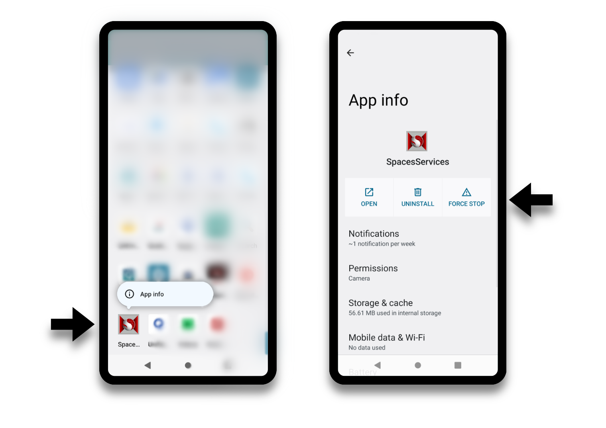

# 已知问题

## 常见已知问题

已知有一些问题可能会影响开发工作流程。这些问题是常见的已知问题，将在 Snapdragon Spaces SDK 或 `Snapdragon Spaces Services` 运行时的未来版本中解决。可能会遇到的一些问题是与开发工具有关的。请参阅相应的工具 **已知问题** 以获得更多支持。
- [Unity 的已知问题](./Unity/KnownIssues.md)
- [虚幻引擎的已知问题](./unreal/KnownIssues.md)

### 应用将无法在 Snapdragon Spaces 0.6.0 版本的眼镜上显示

Snapdragon Spaces Services 应用程序对相机权限有了新要求。

- 在 App Launcher 中找到 **Snapdragon Spaces Services**应用程序
- 按住（长按）**Snapdragon Spaces Services**，选择 “App info”。
- 进入 “权限”  -> 确认 “Allowed” 下有相机选项。如果没有，点击并设置为“仅在使用应用程序时允许”。更多细节请参照 [运行 Snapdragon Spaces 应用程序]() 。

>**注意**
>
>这一问题已在 0.6.1 版本中修复，但是仍需要授予相机权限才能启用手部跟踪功能。

### 应用程序关闭

因为应用程序主要在查看器（Viewer）上启动运行，所以不会显示在安卓系统的多任务视图/最近的应用程序列表中，在应用程序此时应当关闭的情况下，这种结果并不理想。对于如期关闭应用程序的情形，`Snapdragon Spaces` Unity 开发工具包的示例展示了两种不同的方式：

- 长按主机控制器的菜单按钮 2 秒钟（在 `SampleController.cs` 脚本中实现）。
- 在主菜单场景中添加专用的 UI 按钮。

否则，关闭应用程序的唯一选项是通过强制停止，具体细节在下一节中会进行叙述。

### 应用程序启动

在某些情况下，该应用程序可能无法在查看器 Viewer 上正常启动。 为了排除问题，需要强制停止应用程序和 Snapdragon Spaces Services 运行。您需长按 app launcher 中的应用程序图标，直到出现包含显示 `App Info` 的菜单。打开  App Info 视图后，确认 **相机** 在 `Permissions`中，然后可以通过单击 `强制停止` 来关闭应用程序。

以下原因可能会导致应用程序启动失败：

- 在主机设备重新启动后第一次启动应用程序
- 在 `Snapdragon Spaces Services` 与之前的应用程序断连并进行清理之前，您过快关闭了一个 Spaces 应用程序，并打开了另一个应用程序。

### 破坏向后兼容性

使用 Hit Testing、Plane Detection 或 Spatial Meshing 的 0.12.1 或更早版本构建的应用程序不再与 Snapdragon Spaces Runtime 0.13.0 版兼容。为确保使用这些感知功能的应用程序继续运行，请确保应用程序和 Snapdragon Spaces Services 的版本相同。 升级应用程序的 SDK 版本和运行时版本时无需更改代码。

### 应用程序冻结

#### 手柄事件

锁定与解锁主机设备、或任何其他的应用程序中断，将会导致应用程序被暂停，Viewer 视野中将会出现空白或黑屏。您可以通过强制停止应用程序来解决这一问题。

#### 眼镜断连

如果在运行 Spaces 应用时断开眼镜，它会导致手机暂时锁定。这可以通过等待几秒钟，然后按照强制退出 Spaces Service 的步骤来解决。若想得到最佳开发者体验，请遵循 [应用程序关闭](#应用程序关闭) 的步骤。
