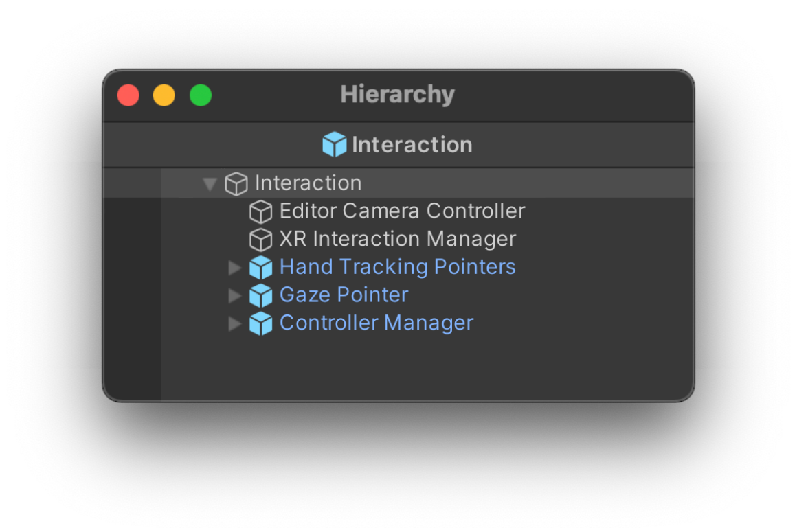
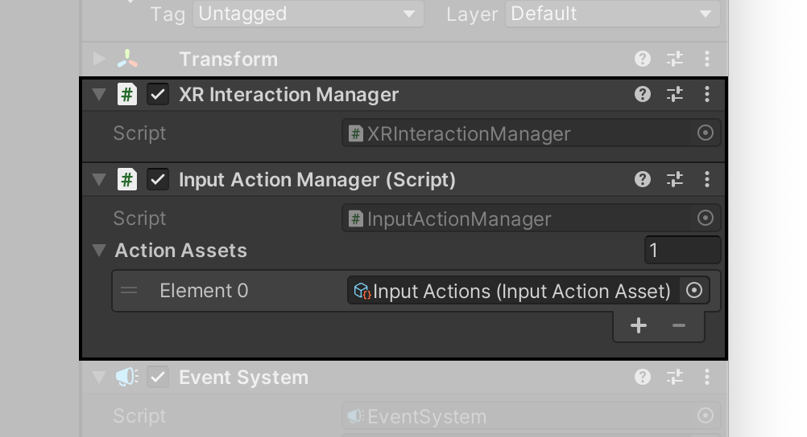
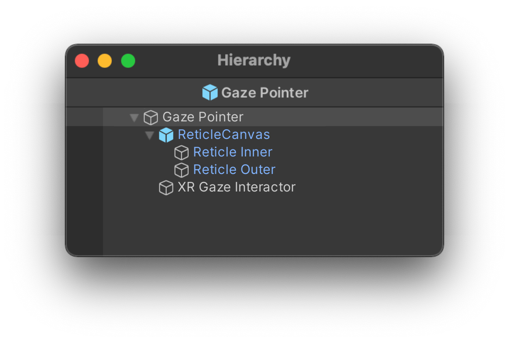
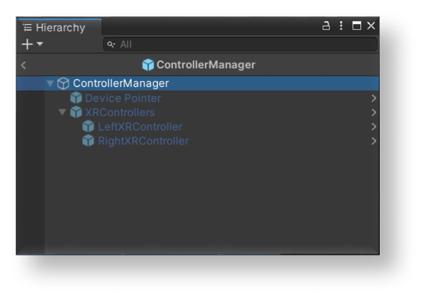
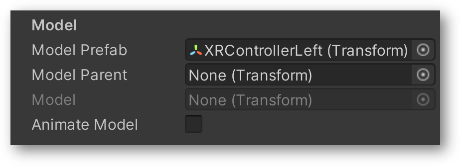
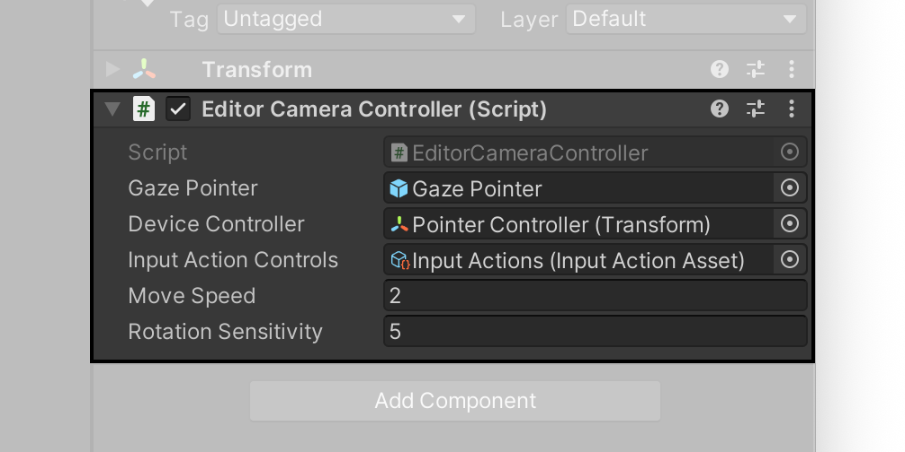

# 交互

**交互** 预制件（Interaction Prefab）包含了三个预制件，用于支持 Snapdragon Spaces 示例中不同交互方法。

**InteractionManager** 组件位于此预制件的根 GameObject 中。它包含了不同交互输入系统的方法，以及处理输入交互切换的代码。默认配置将默认使用 **手部跟踪（Hand Tracking）**，并在 Unity 项目中不包含 QCHT 软件包或手部跟踪与目标设备不兼容时回退到注视射线（Gaze Pointer）。否则，将从 [手部跟踪](./QCHTGuide/HandTrackingOverview.md) > [注视射线](#注视射线) > [设备输入（Device Input）](#控制器管理器).进行切换。

> 手部跟踪
>
> 请参考 [QCHT 手部跟踪](./QCHTGuide/BasicSceneSetup.md) 文档。

## XR 交互管理器

每个场景至少需要一个 XR 交互管理器，用来建立 **交互器（Interactors）** 和 **可交互对象（Interactables）** 之间的连接。

必须通过 **输入操作管理器（Input Action Manager）** 启用输入操作。要想手动添加，请找到 **输入操作管理器** 脚本，并将输入操作资源添加为元素（Element）。这些输入操作位于共享 **Assets/Input Actions** 路径下。

## 注视射线

**注视射线（Gaze Pointer）** 由以下游戏对象组成：

**GazeInteractorUI** 组件被添加到根对象中，负责进行射线检测，并与场景中 UI 对象进行交互，同时管理指示器的计时器时长和 “点击” 功能。

>**注视射线的局限性**
>
>目前，注视射线只能与场景中的 UI 对象进行交互，而不像射线控制器（Pointer Controller）一样与 UI 和 3D 对象进行交互。

## 控制器管理器

**控制器管理器（Controller Manager）** 由以下游戏对象组成：

在根游戏对象上，**XRControllerManager** 组件从 **SampleController** 脚本中接收 `XRControllerProfile` 。如果使用 `HostController`，则会激活 `DevicePointer`。`DevicePointer` 中包含 `HostController` 的网格和输入引用。如果使用带有两个控制器的 VR 设备，则会激活 `XRControllers` 游戏对象。 `XRControllers` 包含左右控制器的两个游戏对象，各有一个 [基于行为的控制器（Action Based Controller）](https://docs.unity3d.com/Packages/com.unity.xr.interaction.toolkit@1.0/manual/index.html#controllerinteractor)组件，组件包含一个控制器预制件和一个特定输入的引用参考。

**SampleController** 将根据所使用的 [输入设备](https://docs.unity3d.com/ScriptReference/XR.InputDevice.html) 向 **ControllerManager** 发送选定的 `XRControllerProfile`。请参考 Unity 文档中的 [微软混合现实运动控制器配置文件（Microsoft Mixed Reality Motion Controller Profile）](https://docs.unity3d.com/Packages/com.unity.xr.openxr@1.4/manual/features/microsoftmotioncontrollerprofile.html) 文档，和 [Oculus 触摸控制器配置文件（Oculus Touch Controller Profile)](https://docs.unity3d.com/Packages/com.unity.xr.openxr@1.4/manual/features/oculustouchcontrollerprofile.html) 文档。

## 输入方式

用作输入行为的按钮：

|  | 主机控制器（Host Controller） | XR 右控制器（XR Controller Right） | XR 左控制器（XR Controller Left） |
| --- | --- | --- | --- |
| **选择（Select）** | 轻点触控板 | 右扳机按钮 | 左扳机按钮 |
| **注视/射线切换（Gaze/Pointer switch）** | 菜单按钮 | 无 | 左菜单按钮 |
| **触控板（Touchpad）** | 触控板 | 右摇杆 | 左摇杆 |
| **锚点位置确认（Anchor Position Confirmation）** | 轻点触控板 | 任意扳机按钮 | 任意扳机按钮 |

## 控制器触觉反馈

控制器的触觉反馈通过 **SampleController** 的 [发送触觉反馈脉冲（SendHapticImpulse）](https://docs.unity3d.com/ScriptReference/XR.InputDevice.SendHapticImpulse.html) 功能发送到 XR 控制器管理器。当调用 `SendHapticImpulse` 时，无论是按下还是滚动 UI 按钮，都会在 `主机控制器（host controller）` and `XR 控制器（XR Controllers）` 上触发触觉脉冲。

>**警告**
>
>目前，不论触发动作的控制器是哪个，两个 XR 控制器上均会感受到触觉反馈。

## XR 控制器的控制器动画

 `XRControllers` 中的每个 XR 控制器都用到了相应 XR 控制器的预制件，包含带有按钮混合形状的控制器网格模型。

每个预制件都附带有 **XRControllerInputAnimation.cs** 脚本。控制器每个按钮接收到的值都会被该脚本用来更新 [混合形状权重（blend shape weight）](https://docs.unity3d.com/Manual/BlendShapes.html)值，从而创建按钮动画。

## 编辑器相机控制器

编辑器相机控制器虽然在构建时可能非常耗时，但却允许在 Unity 编辑器内进行快速测试，而且提供了一个关键的快捷方式，能在注视射线（gaze pointer）和控制器（controller）之间进行切换。切换的关键就是在编辑器控制台中进行输出。

> **提示**
>
> [XR Device Simulator](https://docs.unity3d.com/Packages/com.unity.xr.interaction.toolkit@2.3/manual/xr-device-simulator-overview.html) 也与 Snapdragon Spaces 示例兼容，可用于模拟编辑器中的交互。

## 交互软件包

Snapdragon Spaces 插件能与许多交互软件包完美配合。有关如何开始使用这些软件包的详细信息，请参阅相应的页面：

- [MRTK3](https://docs.spaces.qualcomm.com/Unity/samples/preview/MRTK3SampleWinOnly.html)
- [QCHT](https://docs.spaces.qualcomm.com/unity/handtracking/BasicSceneSetup.html)
- [XRIT（XR Interaction Toolkit，XR 交互工具包）](https://docs.spaces.qualcomm.com/Unity/samples/XRITSample.html)