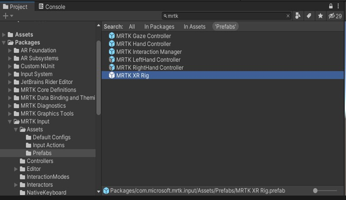
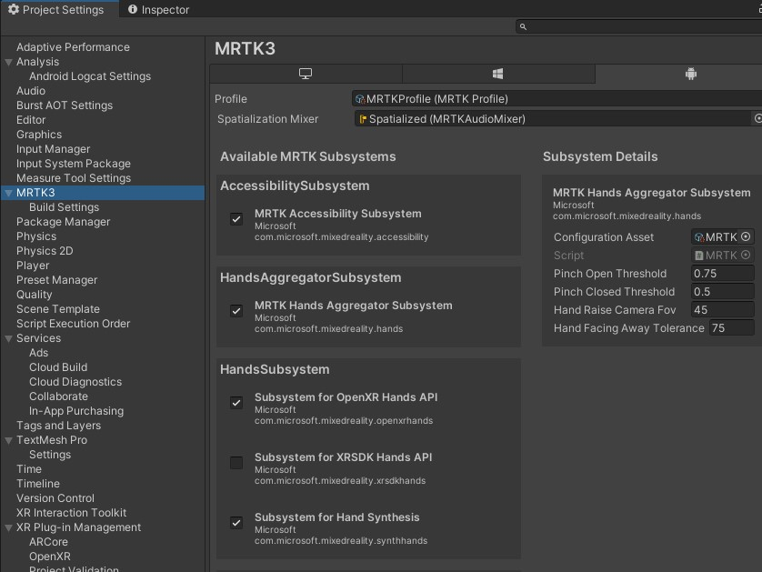

# MRTK3 的 Unity 设置

此示例场景演示了如何将 MRTK3 集成到您的 Unity 项目中。请访问 [MRTK3 文档](https://learn.microsoft.com/en-us/windows/mixed-reality/mrtk-unity/mrtk3-overview/) 了解更多信息。

## 在 Windows 上使用 MRTK3 和 Snapdragon Spaces 设置新的 Unity 项目

在本指南中，我们将为 Snapdragon Spaces 设置并构建全新的 MRTK3 项目。

> **注意**
>
> - 当前暂不支持需要虚拟键盘和网页浏览器的组件，请避免使用，否则可能会导致意外行为出现。

## Unity 项目设置

请遵照 [Unity 设置指南](./SetupGuideUnity.md) 中，从 **前提条件** 到 **启用 Spaces 功能** 来依次进行设置。

设置完成后，请保持 Unity 项目处于打开状态，并记下文件路径。

# MRTK 的项目配置

- MRTK3 的安装需求：
    - [Visual Studio](https://visualstudio.microsoft.com/) 2019 社区版或更高版本
    - 访问 MRTK3 软件包必须要求您先下载 [混合现实功能工具（Mixed Reality Feature Tool）](https://www.microsoft.com/en-us/download/details.aspx?id=102778)。该工具当前仅在 Windows 上提供下载。请您下载后先不要运行。
    - 您需要 .Net 5+ 运行时，该运行时已包含在 Visual Studio 16.11.14+ 中。

## 导入 MRTK3 软件包

- 打开 **混合现实功能工具** (MixedRealityFeatureTool.exe)
- 等待加载完成后，点击左下角的设置图标。
    - 点击 **功能（Feature）** 选项卡。
    - 勾选 **显示预览版本（Show preview releases）**。
    - 点击 **确定（Ok）** 以确认。


- 点击 **开始（Start）**。
- 将 `项目路径（Project Path）` 设置为 Unity 项目的文件路径。
- 点击 **发现功能”（Discover Features）**。
    - 对 MRTK3 项目，点击 **全选（Select All）**。
    - 点击 **获取功能（Get Features）**。可能会显示一些推荐的依赖项。如进行显示，请同时进行勾选。完成后点击 **导入（Import）** 以下载文件并更新 Unity 项目清单。
    - 完成后，您可以选择关闭 **功能工具（Feature Tool）**，也可以选择继续保持打开状态以便后续调整。


## 返回 Unity 完成导入软件包

- 切换回 Unity 项目，并等待新功能带来的导入提示，这里的新功能是由混合现实功能工具添加的。
    - 如果提示 XR Interaction Layer Mask，选择 `我已备份，继续！（I made a backup, go ahead!）` 。
    - 如果提示重新启动，请选择（ `Yes`）。


## 场景设置

- 创建一个新场景。我们将从头开始设置相机和输入。

## 为 Snapdragon Spaces 修改相机

- 从场景层级（Scene Hierarchy）中删除主相机。
- 找到 **MRTK XR Rig Prefab**，并将其拖入场景中，位置在：`Packages/com.microsoft.mrtk.input/Assets/Prefabs/MRTK XR Rig.prefab`



## 配置 Snapdragon Spaces 控制器输入

如上所述，本指南仅适用于将伴侣控制器（Companion Controller）作为设备输入的情况。要设置 伴侣控制器（Companion Controller），请按照以下步骤操作：

- 在 MRTK XR Rig（顶级 GameObject）上：
    - 在输入行为管理器（Input Action Manager）组件中，添加第二个元素到行为资源（Action Assets）下拉菜单中，并设置为：位于 `Samples/Snapdragon Spaces/[version ID]/Core Samples/Shared Assets/Input Actions` 的 `输入行为（Input Actions`) 。这会把输入行为映射到从 Snapdragon Spaces 核心示例中设置过的操作上，从而允许正确连接到 伴侣控制器（Companion Controller）。


- 现在添加 **设备射线预制件（Device Pointer Prefab）**，位置在：`Samples/Snapdragon Spaces/[version ID]/Core Samples/Shared Assets/Prefabs/Interaction/` ）
    - 在 XR Interactor Line Visual 组件中，将线宽（Line Width）更改为0.005。


## 设置 MRTK 配置文件

- 拷贝一份位于 `Packages -> MRTK Core Definitions -> Configuration -> Default Profiles` 的 **MRTKProfile**，然后将其放入项目资源目录中。


- 打开 `Edit -> Project Settings -> MRTK3`。
- 将该拷贝文件拖放到 Android 选项卡下的配置文件（Profile）部分。
- 取消勾选 **MRTK Hands Aggregator Subsystem**
- 取消勾选 **Subsystem for Hand Synthesis**


## 可选：添加交互组件以测试 MRTK 功能

### 可选择对象

- 在场景中添加一个 3D 立方体。
    - 将位置设置为 (0, 0, 1.5)
    - 将旋转设置为 (45, 45, 45)
    - 将缩放设置为 (0.5, 0.5, 0.5)
- 添加 `ObjectManipulator` 组件，以允许从激光射线抓取。

### MRTK 按钮组

- 通过将 `ButtonGroup_32x32mm_H3` 预制件添加到场景中来测试 MRTK 预制交互组件。
- 这可能会提示您安装 TextMeshPro。如果提示，请选择 `Import TMP Essentials`。
- 在层级结构（Hierarchy）中选择 `ButtonGroup`，在 `Inspector` 中将 `Transform Position` 设置为 `0,0,0.5`。按下 `播放（Play）` 处理脚本并可视化按钮面，然后 `停止（Stop）` 返回编辑状态。
- 展开 `ButtonGroup` 找到三个 `PressableButton_32x32mm_IconAndText` 对象，并将其逐个展开。


- 第一个按钮，选择顶层按钮对象，在 `检查器（Inspector）` 中找到 `可点击按钮（Pressable Button）` 组件，点击 `OnClicked()` 的 `+` 号，将其设置为场景中的 `立方体（Cube）`，并将行为设置为 `GameObject.SetActive`，复选框不勾选。
    - 在子对象 `CompressableButtonVisuals` 下：
        - 找到 `UX.Button.Icon.Char` 子对象，将 `精灵渲染（SpriteRenderer）`的 `精灵（Sprite）` 更改为空心圆。
- 第二个按钮，选择顶层按钮对象，在 `检查器（Inspector）`中找到 `可点击按钮（Pressable Button）` 组件，点击 `OnClicked()` 的 `+` 号，将其设置为场景中的 `立方体（Cube）`，并将行为设置为 `GameObject.SetActive`，复选框勾选。
    - 在子对象 `CompressableButtonVisuals` 下：
        - 找到 `UX.Button.Icon.Char` 子对象，将 `SpriteRenderer` 的 `Sprite` 更改为实心圆。
        - 找到 `TextMeshPro` 子对象，将 `文本输入（Text Input）`设置为 `显示（Show）`。
- 第三个按钮，您需要先创建一个新的脚本并将其添加到立方体上。该脚本应该有一个公开可访问的功能，例如
```
    ...
    public void Quit() {
        Application.Quit();
    }
    ...
```

- 仍然在第三个按钮上：
    - 选择顶级按钮对象，在 `检查器（Inspector）`中找到 `可点击按钮（Pressable Button）` 组件，点击 `OnClicked()` 的 `+` 号，将其设置为场景中的 `立方体（Cube）`，并将操作设置为来自新脚本的 `Quit()`。
        - 在子对象 `CompressableButtonVisuals` 下：
            - 找到 `UX.Button.Icon.Char` 子对象，将 `SpriteRenderer` 的`Sprite` 更改为 `Quite` 按钮。
            - 找到 `TextMeshPro` 子对象，将 `文本输入（Text Input）` 设置为 `显示（Show）`。


## 真机调试

- 配置 `构建设置（Build Settings）` 和 `播放器设置（Player Settings）` 以构建应用程序。
- 从构建设置窗口构建应用程序并将其保存到本地。
- 连接您的 Android 设备，并在提示时 `开启 USB 调试`。
- 将 apk 安装到您的设备上。
- 长按应用程序图标，点击 `应用信息（App Info）`，并打开所有权限。
- 接通眼镜，等待完全加载后，运行应用程序。

---

## MRTK 示例

为了进一步了解可用的 MRTK3 用户界面组件，建议下载 MRTK3 示例并进行 Snapdragon Spaces 的配置。请按照以下步骤进行操作：

### 获取 MRTK3 示例

- 通过链接克隆存储库或下载 mrtk3 分支：[https://github.com/microsoft/MixedRealityToolkit-Unity/tree/mrtk3](https://github.com/microsoft/MixedRealityToolkit-Unity/tree/mrtk3)
- 在文件名较短的位置提取或克隆此存储库。该存储库有许多具有长名称的文件夹，可能会导致文件名过长，并在 Unity 中引起问题。
- 存储库中的文件之间存在许多依赖关系，更改文件的位置将引发问题，因此不要移动此存储库中的任何文件。如果需要移动存储库，请将整个存储库一起移动。

### 开启项目并集成 Snapdragon Spaces：

- 在 MRTK3 示例的 `UnityProjects` 文件夹中添加 `MRTKDevTemplate` 到 Unity Hub。
- 打开 Unity 项目。
- 按照 [Unity 设置指南](./SetupGuideUnity.md) 导入Snapdragon Spaces 软件包。
- 选择要打开的场景。推荐使用 `手部交互示例（HandInteractionExamples）` 场景。
- 如上所述，配置场景以修改相机和输入。
- 构建并部署到设备。

## 手部跟踪

>**注意**
>
>- 您需要在目标设备上安装 Snapdragon Spaces Services 0.11.1 或更高版本以支持手部跟踪。在具有早期版本 Snapdragon Spaces Services 的设备上，为 MRTK 手部跟踪构建的应用程序可能无法按预期工作。

### 手部跟踪插件设置

手部跟踪使用混合现实 OpenXR 插件。要获取插件，请使用 [混合现实功能工具（Mixed Reality Feature Tool）](https://www.microsoft.com/en-us/download/details.aspx?id=102778)，并从平台支持（Platform Support）部分选择混合现实 OpenXR 插件。


单击完成项目更新，然后返回到您的 Unity 项目。

### Unity 配置

在 Unity 中有两个区域需要更新。

#### MRTK 设置

第一个是 MRTK 设置。确保勾选启用手部聚合器子系统（MRTK Hands Aggregator Subsystem）和 OpenXR 手部 API 子系统（Subsystem for OpenXR Hands API）。



此外，建议尝试校准捏合关闭阈值（Pinch Closed Threshold）设置，默认值设置为 0.25。开发人员已经尝试将该阈值调整为 0.45 或 0.5（如图），并取得了一定的成功。

#### OpenXR 设置

第二个需要更新的区域是 OpenXR 设置。在这里，启用两个手部跟踪复选框。其中一个是为了让 Spaces 手部跟踪（Spaces Hand Tracking）被跟踪，另一个是为了让 MRTK 在交互系统中对手部跟踪进行运用。 


### 手部可视化设置

除了 MRTK 提供的手部网格外，Snapdragon Spaces SDK 还提供了用于可视化虚拟手覆盖物的 QCHT 手部网格。

要使用该功能，以右手为例，请在场景层次结构中的 `MRTK XR Rig > Camera Offset > MRTK RightHand Controller` 选择 `MRTK RightHand Controller`。


将位于 `packages/QCHT Unity Interactions/Prefabs/MRTK3/` 中的 `hand_right_qcht` 预制件拖到 `MRTK RightHand Controller 的 `Model Prefab` 字段中。


对左手也需要执行相同的过程。

### 手部跟踪选项

> **注意**
> 
> 目前无法从 Snapdragon Spaces 控制器和两只手同时进行射线投射，因为这与 OpenXR 控制器配置文件存在冲突。因此，有两个可选解决方式。

#### 选项1：禁用左手跟踪

要禁用左手跟踪，请关闭 MRTK XR Rig 中的左手控制器，但保留右手控制器。如果您仍然打开左手控制器，它可能仍可作为碰撞器（collider）使用，但可能无法正常作为射线交互器（interactor）工作。此选项允许继续使用设备射线，但限制效果可能并不理想。


#### 选项2：禁用Snapdragon Spaces 控制器（双手选项）

要禁用 Snapdragon Spaces 控制器，场景中如果存在设备射线预制件（Device Pointer Prefab），请选择删除或停用。

然后从 OpenXR 设置中删除配置文件。


这将在基本运行时特性旁边标记一个警告，但可以忽略。这使得两只手都可以跟踪，但手机控制器将不会向应用程序发送任何指针跟踪或按钮按下消息，因为它是 `仅手部跟踪` 模式。这主要是建议直接从其他 `仅手部跟踪` 平台移植应用程序时使用的资源。

### MRTK 资源

有关更详细的 MRTK 信息，请参阅 [MRTK3文档](https://learn.microsoft.com/en-us/windows/mixed-reality/mrtk-unity/mrtk3-overview/)，或查看 [Github MRTK项目](https://github.com/microsoft/MixedRealityToolkit-Unity/tree/mrtk3) 的源代码。
