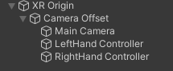
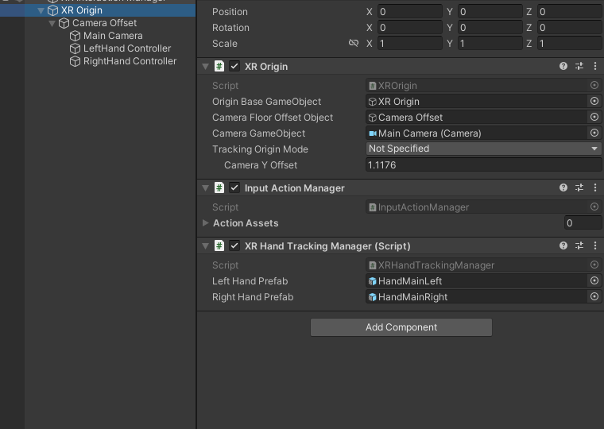
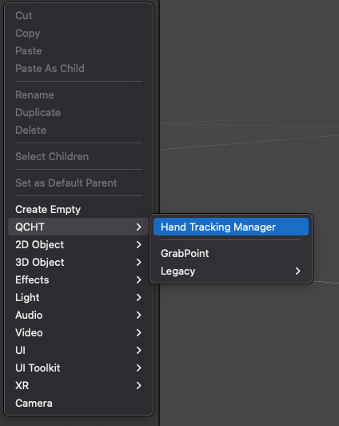
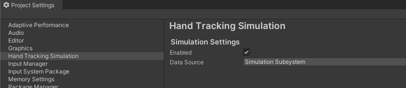
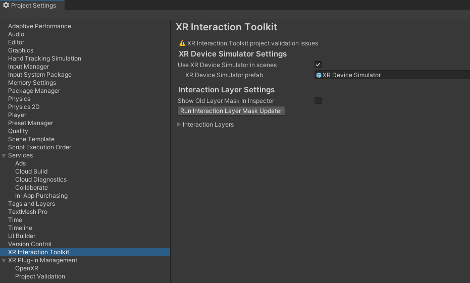
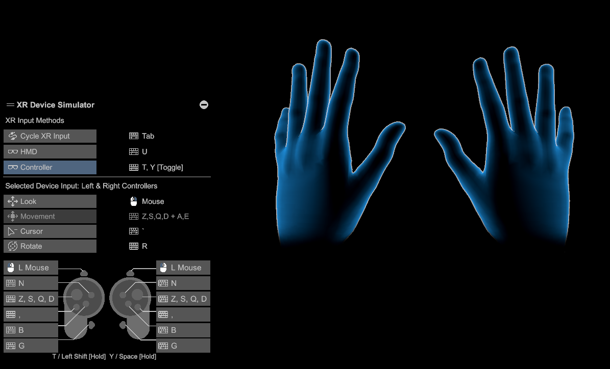

# 基本场景设置

> **AR Session 和 AR Session Origin**
>
> 如果需要，手部跟踪还支持 AR Foundation 4.X 的 AR Session 和 AR Session Origin，具体说明可以参考提供的 [链接](./../SceneSetup.md#ar-foundation)。

## XR Origin

首先，按照这里的 [说明](https://docs.unity3d.com/Packages/com.unity.xr.core-utils@2.0/manual/xr-origin.html)，在场景中创建一个 **XR Origin**。

创建 **XR Origin** 游戏对象后，展开它的层次结构以查看 **Left Hand Controller** 左手控制器和 **Right Hand Controller** 右手控制器。

这两个游戏对象都包括一个 **XR Controller** 组件，但默认情况下未映射到任何输入动作。此时可以删除这两个组件，因为它们没有用处。

然后，在 **XR Origin**（或 **AR Session Origin**）游戏对象上添加一个 **XR Hand Tracking Manager** 组件。

## XR 手部追踪管理器

> **提示**
>
> 可以通过在 **XR Hand Tracking Manager** 类上使用 `GetOrCreate` 静态公共 API 来通过代码创建 `XR Hand Tracking Manager` 的实例。请参见 [XR Hand Tracking Manager API](./HandTrackingAPI.md)。
>

XR 手部追踪管理器（XR Hand Tracking Manager）组件是管理手部跟踪子系统所必需的。它在运行时更新手部跟踪数据，并跟踪用户的手，这些手是相对于 **XR Origin** 或 **AR Session Origin** 的，在此组件上附加（它支持 **XR Origin** 和 **AR Session Origin**）。在运行时，手部跟踪管理器将实例化左右手预制件，并在 Open XR 手部跟踪层跟踪或不跟踪手时启用或禁用实例。

通过在场景的层次结构中右键单击并选择 `QCHT > Hand Tracking Manager`，将 **Hand Tracking Manager** 添加到场景中。

## 编辑器中的模拟器

要启用 [XR 交互工具包（XRIT）的设备模拟器](https://docs.unity3d.com/Packages/com.unity.xr.interaction.toolkit@2.0/manual/xr-device-simulator.html) 进行模拟，请在 Unity 项目设置的 Hand Tracking Simulation 部分中启用模拟子系统。

然后，在项目设置的 XR Interaction Toolkit 部分中启用场景中的 Use XR Device Simulator。

> **警告**
>
> 在将应用程序构建到目标平台之前，需要禁用此设置。
>

要了解如何使用模拟器，请参考 [XR Interaction Toolkit 设备模拟器文档](https://docs.unity3d.com/Packages/com.unity.xr.interaction.toolkit@2.0/manual/xr-device-simulator.html)。

> **提示**
>
> 在构建项目到目标平台之前，不要忘记禁用 “Use XR Device Simulator in scenes（在场景中使用 XR 设备模拟器）”。
>
> 在编辑器中播放场景时，可以通过按下键盘上的 tab 键来快速切换头部、左手或右手。
>

### 模拟模式（已弃用）

> **弃用**
>
> 从 Snapdragon Spaces 版本 0.12.1 开始，QCHT 使用 [XR Interaction Toolkit Device Simulator](https://docs.unity3d.com/Packages/com.unity.xr.interaction.toolkit@2.0/manual/xr-device-simulator.html) 用于模拟。

在编辑器中运行时，**QCHT Manager** 预制件提供了 2 种 `模拟模式` ：

- `MODE_REPLAY` 表示您可以通过拖放手部数据来重播先前记录的序列。
- `MODE_EDITOR` （默认模式）允许您在播放模式下控制双手。

## 编辑器模式下的交互（已弃用）

> **弃用**
>
> 从 Snapdragon Spaces 版本 0.12.1 开始，QCHT 使用 [XR Interaction Toolkit Device Simulator](https://docs.unity3d.com/Packages/com.unity.xr.interaction.toolkit@2.0/manual/xr-device-simulator.html) 用于模拟。

要在编辑器模式下模拟双手的交互，您可以参考以下命令：

| 交互 | 行为 |
| --- | --- |
| 加入左手 | 点击+按下 B |
| 加入右手 | 点击+按下 N |
| 移开双手 | 按下 C |
| 捏合 | 按下 P |
| 抓起 | 按下 G |
| 翻转 | 按下 F |
| 释放双手 | 按下空格 |
| 鼠标位置 | 位置（鼠标） |
| 鼠标滚动 | 滚动（鼠标） |
