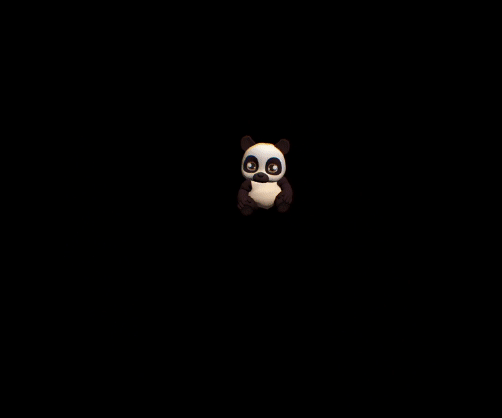
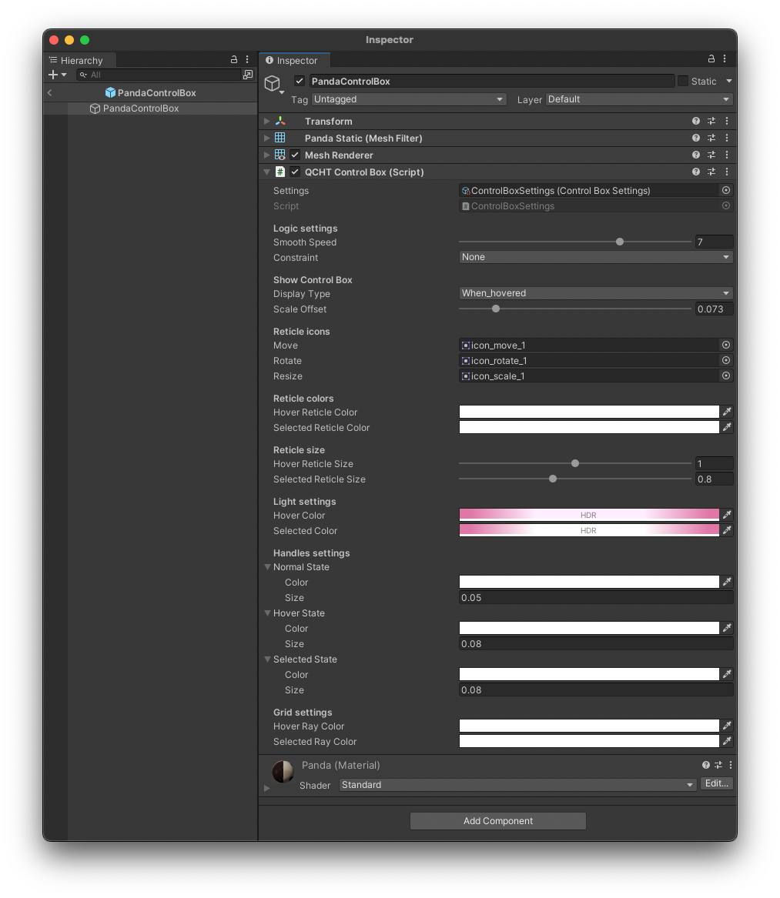
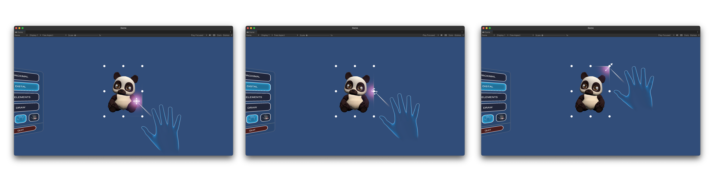
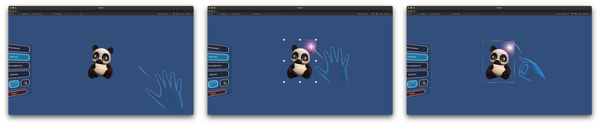

# 控制框

**控制框（Control Box）** 允许您通过 **移动**、**旋转** 和 **调整大小** 等交互方式来对对象进行远端检查。控制框会提供视觉反馈来指示与框内对象的交互。一个框将被绘制在目标对象周围，并应适应目标对象的大小。

## QCHT 控制框描述

您能够通过该组件对所有的交互方式进行自定义。例如，您可以设置准星的颜色和精灵（sprite），或更改激光颜色和框灯。该组件允许您自定义移动、旋转和调整大小等交互方式。

### 如何与控制框进行交互？

- 射线投射到控制框的各个面，然后进行 **移动**
- 瞄准角落后，可以 **调整** 大小
- 瞄准边缘的中间，可以进行 **旋转**

### 视觉提示

当用户与控制框交互时，控制框会提供视觉反馈。

首先，当对象处于闲置状态时，用户是感知不到控制框的。当用户开始对其进行射线投射时，准星将照亮控制框，以此来表示控制框可以进行交互。此外，控制框的图标将会指示所选的交互方式（移动、旋转、调整大小）。进行选择后，控制框的轮廓线会发光，以指示选择完成。

## 逐步集成

1. 创建一个对象（例如一个 3D 立方体）
2. 添加 `QCHT 控制框`脚本
3. 碰撞器需要处于触发模式
4. 自定义控制框
