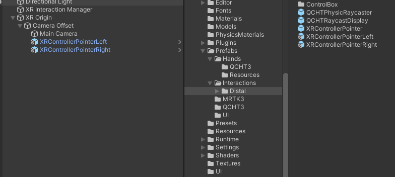
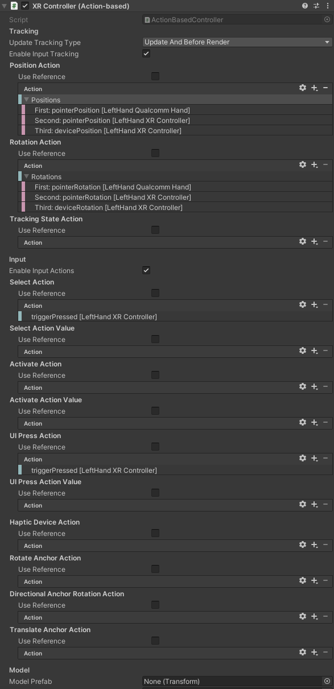

# 远端交互

为了与远处的物体进行交互，用户可以使用 XRIT（XR Interaction Toolkit，XR 交互工具包） 的 **XR 射线交互（XR Ray Interactor）** 组件。

要使用远端交互功能，用户必须将手放在头戴式显示器的视野范围内，然后会看到一个光线，使他们能够瞄准他们想要交互的物体。光线末端的准星允许用户针对性地调整交互的精度。捏合手势将激活选择模式，以便操作目标物体。

用户可以使用射线检测（Raycast）功能与远端元素进行交互。
 
## 说明

首先，请确保场景中的 [手部跟踪初始设置](./BasicSceneSetup.md) 已完成。

### XRControllerPointer

**XRControllerPointerLeft** 和 **XRControllerPointerRight** 预设位于 `Packages > QCHT Unity Interactions > Prefabs > Interactions > Distal` 文件夹中，应该将它们作为子对象添加到 **XR Origin** GameObject 中的 **Camera Offset** GameObject 中。

通过更改每只手的 XR 射线交互组件来调整射线投射参数。请参阅 Unity 文档以了解更多关于 [XR 交互](https://docs.unity3d.com/Packages/com.unity.xr.interaction.toolkit@2.3/manual/xr-ray-interactor.html) 的信息。

默认情况下，控制每只手的 [XRController](https://docs.unity3d.com/Packages/com.unity.xr.interaction.toolkit@2.3/api/UnityEngine.XR.Interaction.Toolkit.XRController.html) 脚本会将位置设置为 `pointerPosition`，并将旋转设置为 `pointerRotation`。这些由 [XRHandTrackingManager](./BasicSceneSetup.md#xr-手部追踪管理器) 计算得出。默认情况下，**Select** 和 **UI Press** 操作使用 `triggerPressed`（即捏合手势）。

如本示例所示，第二个和第三个动作可以映射到另一个设备，作为手部跟踪的备选方案。由于新的输入系统兼容性，可以轻松支持不同的输入方式，而完全相同的代码。

### Snap Volume

使用 XRIT 的 [XR Interactable Snap Volume](https://docs.unity3d.com/Packages/com.unity.xr.interaction.toolkit@2.3/manual/xr-interactable-snap-volume.html) 组件，可以提高射线投射的准确性和效率。