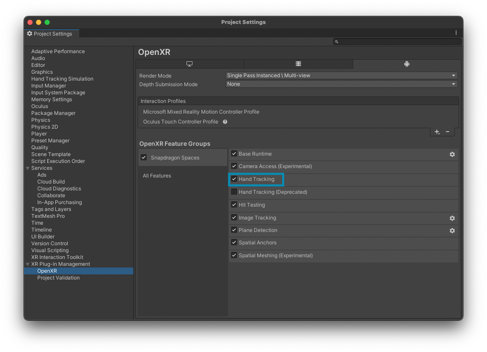
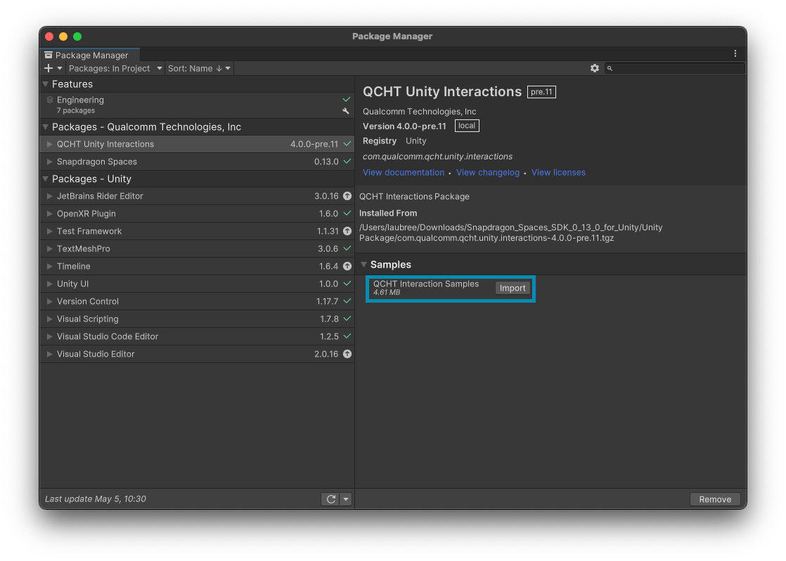
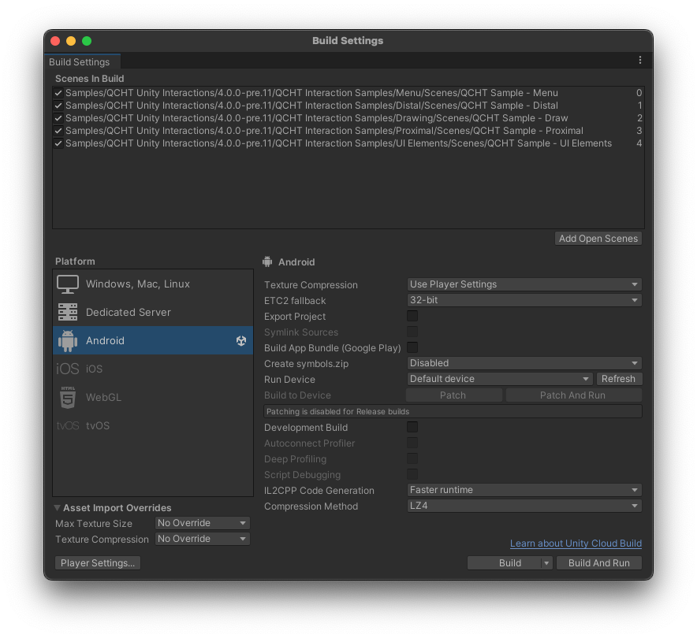
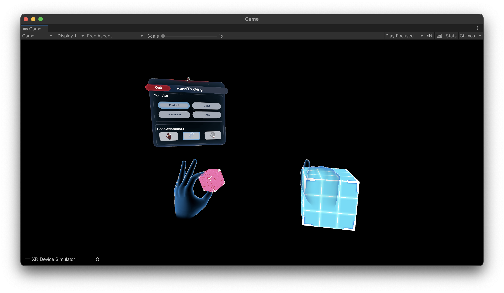
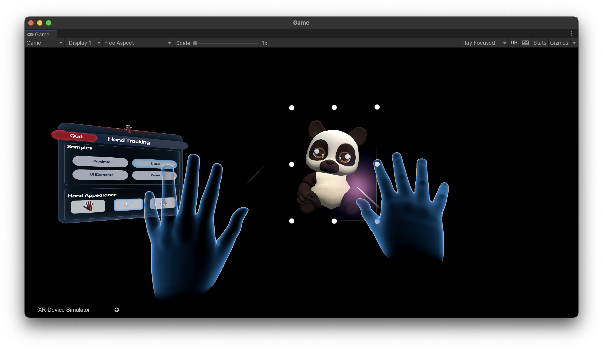
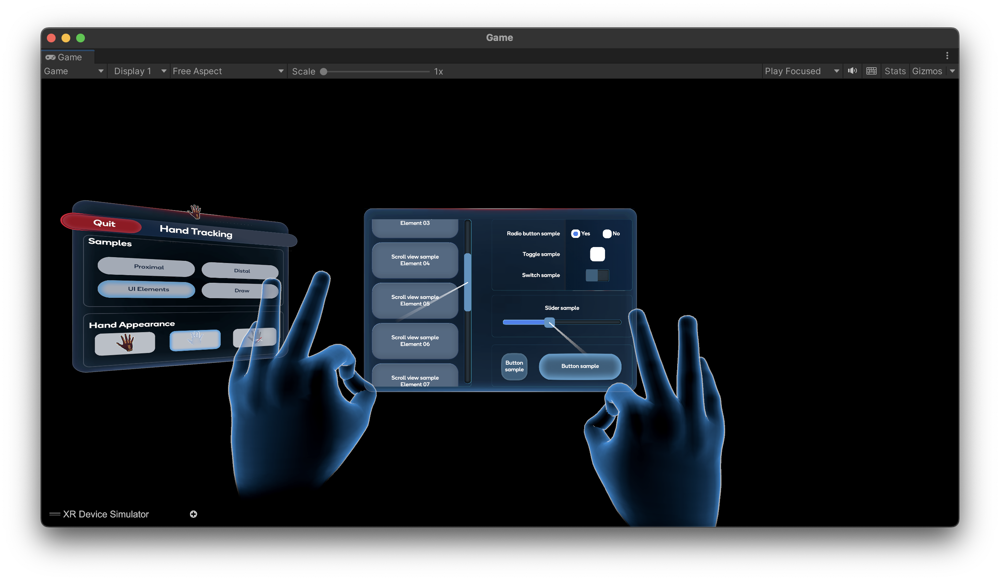
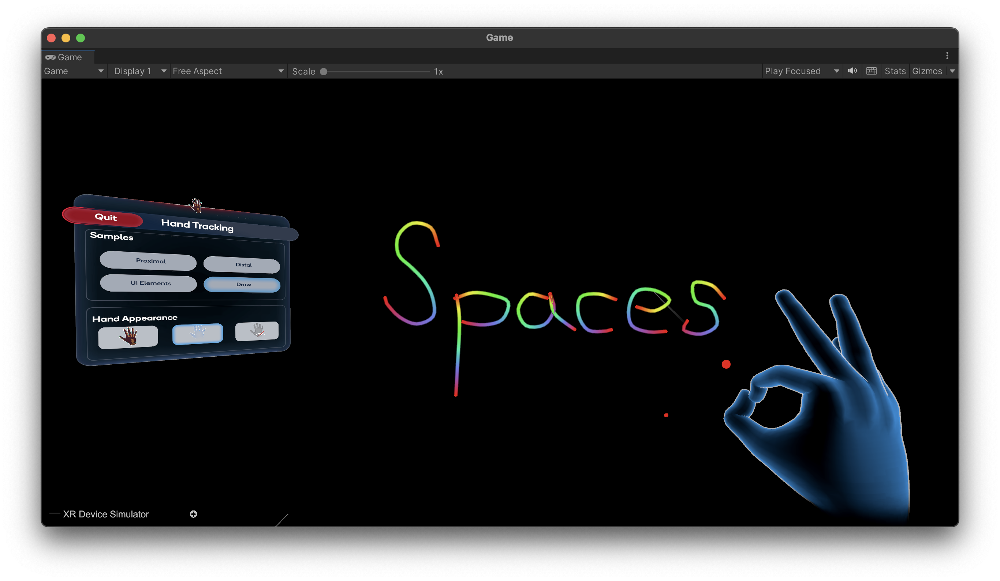

# 手部跟踪扩展示例

这个场景对多种交互方式（接近、远离、单手、双手）进行了上下文演示，使用了手部跟踪功能。如需了解手部跟踪的工作原理，请参阅 [手部跟踪集成](./BasicSceneSetup.md) 文档部分。

## 构建示例场景

首先，请确保在 OpenXR 项目设置中启用了 `手部跟踪（Hand Tracking）` 。

然后，从 [QCHT Unity 交互](./ImportAdditionalPackages.md#导入附加软件包) 软件包中导入示例。

完成后，您可以在 `Assets > Samples > QCHT Unity Interactions > 4.0.0-pre.11 > QCHT Interactions Samples` 中找到所有场景。

要在编辑器模式下尝试这些示例，请打开 `Assets > Samples > QCHT Unity Interactions >  4.0.0-pre.11 > QCHT Interactions Samples > Menu > Scenes` 中提供的 **QCHT 示例 - 目录** 场景。如需在编辑器模拟模式下进行交互，请参考 [基本场景设置](./BasicSceneSetup.md) 文档。

>**重要提示**
>
>在测试手部跟踪示例之前，您需要将所有场景添加到构建设置中。

## 示例描述

这个示例分为 4 个场景，并在 **QCHT Sample - Menu** 主场景中组合在一起。

主目录允许您在场景、交互和手部 avatar 之间切换。我们建议您不要在 AR 环境中显示 avatar。

### 近场

#### 简单交互

通过捕捉（粉色立方体）或不捕捉（蓝色立方体）与 3D 对象进行近端交互。

#### 捕捉

当用户与粉色立方体交互（通过捏合）时，他的手部的 avatar 将按照 [手势编辑器（Hand Pose Editor）](./ProximalSnapping.md) 中预设的位置，从立方体的上方捕捉（Snapping）。

可捕捉对象主要与 [抓取点（Grab Point）](./ProximalSnapping.md#抓取点)系统和 [手部姿势 (Hand Pose)](./ProximalSnapping.md) 生成器配合使用。

### 远端

当用户使用从手中发出的射线瞄准熊猫后，熊猫会变成可交互状态。通过捏合手指，可以通过 [控制框（Control box）组件](./DistalGizmo.md)) 移动、旋转和调整熊猫的大小。

### UI 元素

对于 UI 元素，可以使用射线投射系统进行操作。可以与许多元素进行交互，例如单选按钮、复选框、滑块、滚动视图和按钮。要操作对象，请将其选中并捏合以选择。

UI 元素接收并将所有事件转换为 Unity 的标准。它是用户操作和系统反应之间的链接。投射射线元素响应所有 Unity 回调。请参考 [远端交互](./DistalInteraction.md) 部分，了解更多关于射线投射系统的信息。

### 绘图

捏合（Pinch）手势开始绘图操作，[开手（Open-Hand ）](./../../designux/InteractionGestures.md#开手) 手势停止绘图。