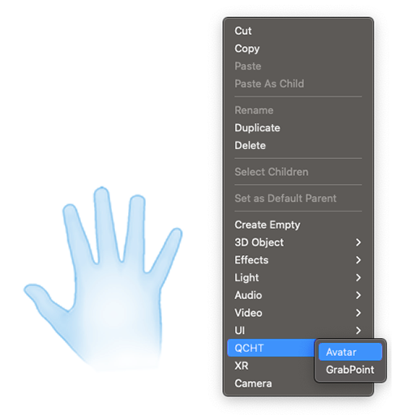
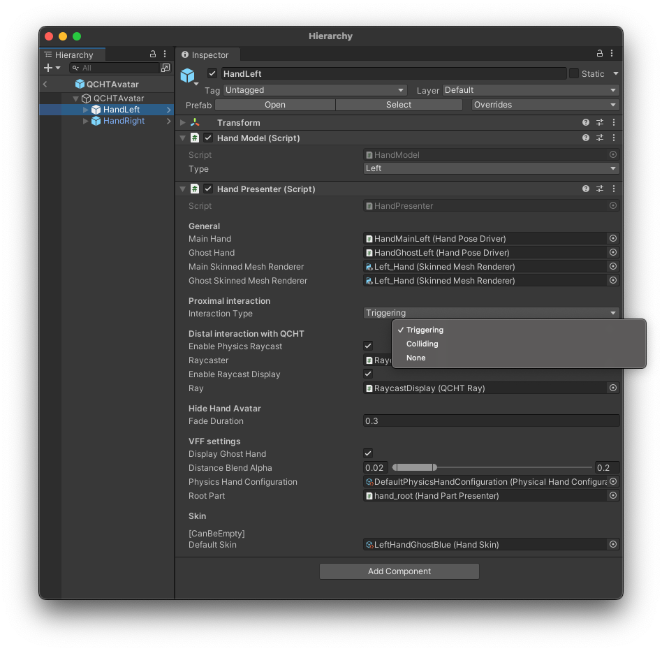

# 手部 Avatar

## 使用 QCHT Avatar 激活双手

要激活手部跟踪功能，需要在 Unity 层次结构中单击左键并选择 **QCHT**，然后添加 **Avatar** 预制件。

该预制件由左右手（`HandLeft` 和 `HandRight`）组成。每只手包含以下内容：

- `HandMain` 的主要功能是使用 QCHT SDK 数据驱动手部的皮肤网格，并允许配置手部在环境中的交互方式。
- `Hand Ghost` 主要用于虚拟力反馈（Virtual Force Feedback）（VFF）交互模式。可以在 [虚拟力反馈（VFF）](./ProximalVFF.md) 文档查看关于此功能的更多细节信息。
- `Raycaster` 包含射线检测系统的可调参数设置，而 `Raycast Display` 则包含激光和准星的显示参数。有关射线检测的所有详细信息都在 [远端交互](./DistalInteraction.md) 的文档章节中进行详述。

## 手部呈现脚本

QCHTAvatar 主要使用脚本是 `手部呈现（Hand Presenter）`。该脚本管理手部 avatar 的各个方面。您可以通过该组件选择交互类型、启用射线系统，和进行外观设置。

### 近场交互

- **触发**：可用于 [远端](./DistalInteraction.md) 和 [近场交互](./ProximalInteraction.md) ，但也可用于 [控制框（Control Box）](./DistalGizmo.md) 和 [捕捉（Snapping）](./ProximalSnapping.md) 功能。我们不建议您在 VFF 中使用此交互类型。
- **碰撞（用于虚拟力反馈（virtual force feedback））**：如果想要使用物理方式实现自然交互，请选择这一交互类型。可以在 [虚拟力反馈（VFF）](./ProximalVFF.md) 文档查看关于此功能的更多细节信息。。
- **无**：仅显示一个没有任何交互的幽灵手 avatar。

### 远端交互

- **启用物理射线检测（Enable Physics Raycast）**：禁用后，图形射线投射仍将正常工作。
- **启用射线投射显示（Enable Raycast Display）**：激光射线将不再显示，但画布上仍会显示指针。

### 隐藏手部

当无法检测到手部时，变量 `Fade Duration` 用于配置淡出效果。

### VFF 设置

- 默认手部 avatar 由于物理对象的约束而无法移动时，**距离混合 Alpha（Distance Blend Alpha）** 将会决定幽灵手（ghost hand）显示的距离远近。
