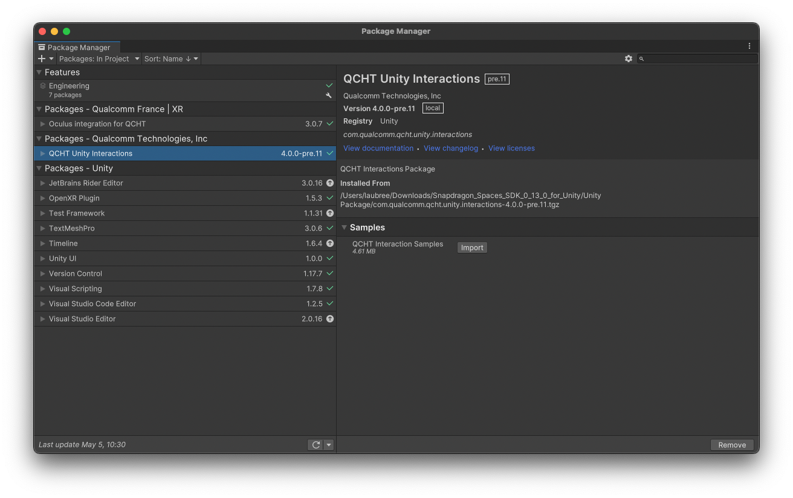
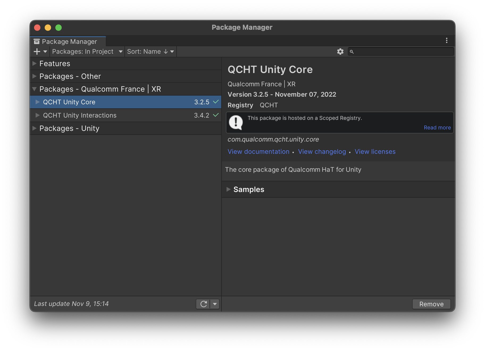

# 导入附加软件包

[Snapdragon Spaces 主软件包](./../SetupGuideUnity.md#导入软件包) 中并不包含一些手部跟踪功能，如带骨骼的手部网格和交互组件。，而是压缩包文件的形式提供在单独的包中。它们可以像主包一样导入，可参考 [Unity 文档](https://docs.unity3d.com/Manual/upm-ui-tarball.html)。

总结一下，首先，[安装 Snapdragon Spaces Package](./../SetupGuideUnity.md)。手部追踪所需的最低版本为 0.6.0。要利用完整的手部追踪功能选项板（feature palette），还应安装接下来列出的包。

>**警告**
>
>**必须启用** [Spaces Services 应用程序的相机权限](./../../setup/LaunchingSpacesAppsA3.md#设置-snapdragon-spaces-services)，手部跟踪功能才能正常运行。

## QCHT Unity 交互软件包 4

###（版本 4.0.0-pre.11）

此包管理手部跟踪子系统、OpenXR 连接和生命周期事件。它还包含手动装置和特定的 XRIT 的交互（例如远端和近端交互）。

您可以通过在 Package Manager 中单击导入按钮并浏览将直接添加到 Assets 文件夹中的文件，来探索手部跟踪示例场景。

## QCHT Unity 核心软件包（版本 3.2.5）（已弃用）

> **弃用**
>
> 从 Snapdragon Spaces 版本 0.12.1 开始，QCHT Unity 核心包已弃用，不再包含在 Snapdragon Spaces SDK 中。请删除 QCHT 核心包的所有引用和使用，以确保在 Spaces Services 版本 0.12.1+ 上运行的应用程序能够正常运行。

该软件包管理 QCHT 生命周期和手部输入。它公开手部数据并允许在手部位置显示原始点。要查看这些原始点，请导入 `QCHT 原始数据示例（QCHT Raw Data sample）`。

