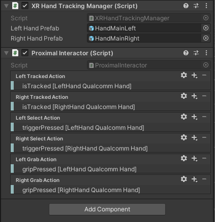
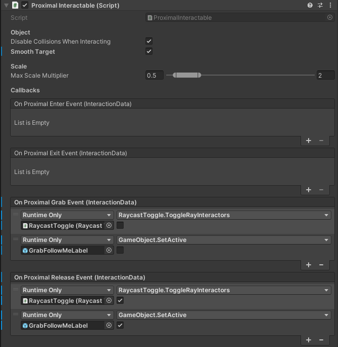

# 近场交互

近场交互是指与靠近手的虚拟元素进行交互。

### XR 直接交互器

由于 QCHT Interactions 包基于 XRIT，因此可以使用 **XR 直接交互器（XR Direct Interactor）** 组件进行对象操作。

[XR 直接交互器](https://docs.unity3d.com/Packages/com.unity.xr.interaction.toolkit@2.3/manual/xr-direct-interactor.html) 负责在任何可交互对象上触发交互。它是 XRIT（XR Interaction Toolkit，XR 交互工具包）的 标准组件，高度可配置。

在 `Packages > QCHT Unity Interactions > Prefabs > Hands folder` 文件夹中可以找到预配置的带有 **XR 直接交互器** 组件的 **HandMainLeftXRIT** 和 **HandMainRightXRIT** 手部预设。

### XR 抓握可交互

**XR 直接交互器** 触发与 [**XR 抓握可交互（XR Grab Interactable）**](https://docs.unity3d.com/Packages/com.unity.xr.interaction.toolkit@2.3/manual/xr-grab-interactable.html) 的交互。这是 XRIT 的标准组件，高度可配置。

### 近场交互器和近场可交互（已弃用）

**近场交互器**（已弃用）

近场交互器（Proximal Interactor）是用于执行近距离交互的组件，通常与 XR 手部跟踪管理器（Hand Tracking Manager）一起使用。

默认情况下，手部预制件带有近场交互控制器（Proximal Interaction Controller）组件。 近场交互器（Proximal Interactor）使用这些组件来执行近场交互。

近场交互器与 XR 直接交互器（Direct Interactor）的主要区别在于，近场交互器允许过滤抓取和捏取手势的选择。例如，如果只希望使用捏取手势来处理可交互对象，则近场交互器允许过滤此手势。

> 提示：
>
> 在 QCHT Interactions 的下一个版本中，近场交互器已被弃用。如果您的项目不需要过滤选择动作，则强烈建议使用 XR 直接交互器。我们将很快推出使用自定义 XR 过滤器来处理 XR 直接交互器过滤的版本。

在 XR 手部跟踪管理器旁边添加一个近场交互器组件并填充动作设置。 可以在 `Presets > ProximalInteractor.preset` 中找到预设

**近场可交互**（已弃用）

当使用近场交互器时，交互对象应该具有 `ProximalInteractable` 近场可交互组件，以便被抓取。

ProximalInteractable 在交互操作时会暴露一些事件：

| 事件 | 描述 |
| -- | -- |
| On Proximal Enter Event | 手已进入交互对象的碰撞器触发区域 |
| On Proximal Exit Event | 手已离开碰撞器触发区域 |
| On Proximal Grab Event | 手已抓取交互对象 |
| On Proximal Release Event | 手已释放交互对象 |

