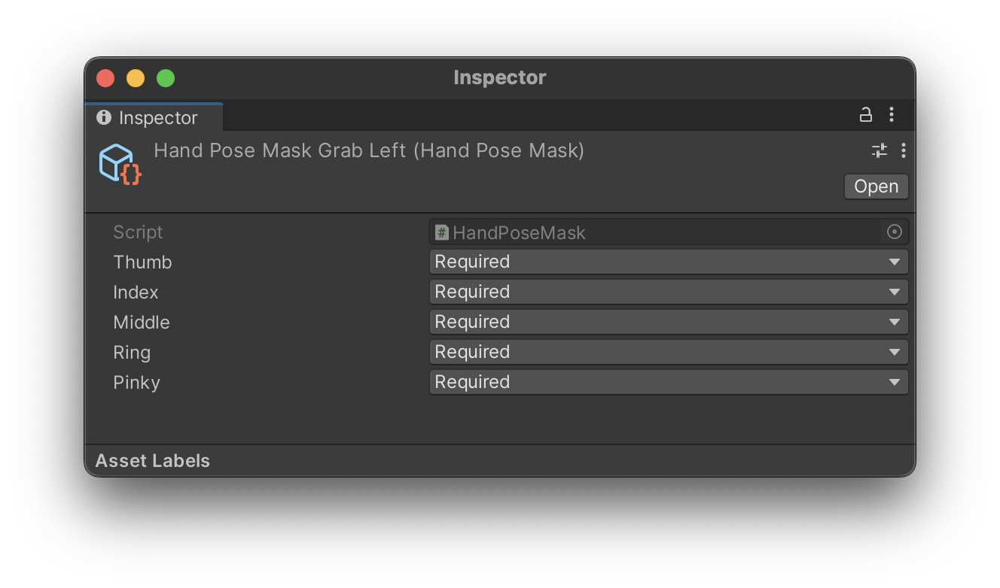

# 捕捉

**捕捉（Snapping）** 的功能的目的是创建受物理约束的姿势，让抓住虚拟元素的动作更加连贯。该功能通过调整手和手指的旋转，以最好地适应抓取对象。这些姿势与选择的手势（如 [抓取（Grab）](./../../designux/InteractionGestures.md#抓取) 或 [捏合（Pinch）](./../../designux/InteractionGestures.md#捏合)）相关联。

当用户在碰撞物体时选择手势，虚拟手将根据配置进行捕捉。

## 描述

- [碰撞器（Collider）](https://docs.unity3d.com/Manual/class-Rigidbody.html)
- [可交互对象（Interactable）](./ProximalInteraction.md)组件

通过在层次结构中的 **XR Grab Interactable** 对象下添加 **GrabPoint** 抓取点，可以在 interactable 上定义手部姿势。当可交互对象被抓取时，姿势将自动应用到对象上。抓取点定义了手捕捉到的对象上的确切位置。

>**警告**
>
>该组件存在已知的用户体验问题，将在未来版本中解决。
>

### 逐步集成

1. 首先，在目标对象内 **右键单击 > QCHT > 抓取点（GrabPoint）**，将 `抓取点` 元素导入为子元素。

2. 在添加 `抓取点（GrabPoint）` 的对象中添加一个 `碰撞器（Collider）` 的触发器。调整大小并放置在所需位置。此碰撞器可以检测手和对象之间的距离。
3. 然后，在 `抓取点（GrabPoint）` 组件上选择 `捕捉（Snap）` 作为交互类型。

4. 创建新的手部姿势（Hand Pose）（包括 `姿势（Pose）` 和 `姿势遮罩（Pose Mask）`），请单击 `+`。它将复制先前的 `姿势` 和 `姿势遮罩`。
    

    
5. 如下所述，通过使用 `手部姿势编辑（hand pose editor）` 工具，`姿势` 允许在对象物体上创建姿势。在 `手部姿势（HandPose）` 组件上选择左手或右手。

6. `姿势遮罩（Pose Mask）` 决定了捕获物体时，需要哪根手指，不需要哪根手指。例如，用小幅度的手势（如 [捏合（Pinch）手势](./../../designux/InteractionGestures.md#捏合)）可以轻松地抓住小物体。这种情况下，只需要拇指和食指进行交互。要夹取大物体，则必须使用 [抓取（Grab）手势](./../../designux/InteractionGestures.md#抓取)，这就需要使用所有手指。

7. 创建完 `姿势（Pose）` 和 `遮罩（Mask）` 后，可以点击 `编辑（Edit）` 对目标物体上的姿势进行调整。

8. 姿势编辑完毕后，点击 **停止** 来进行保存。

