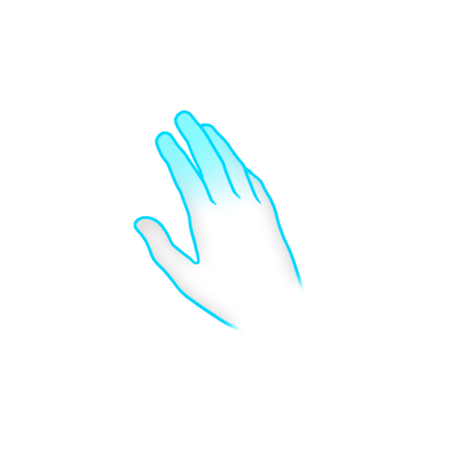
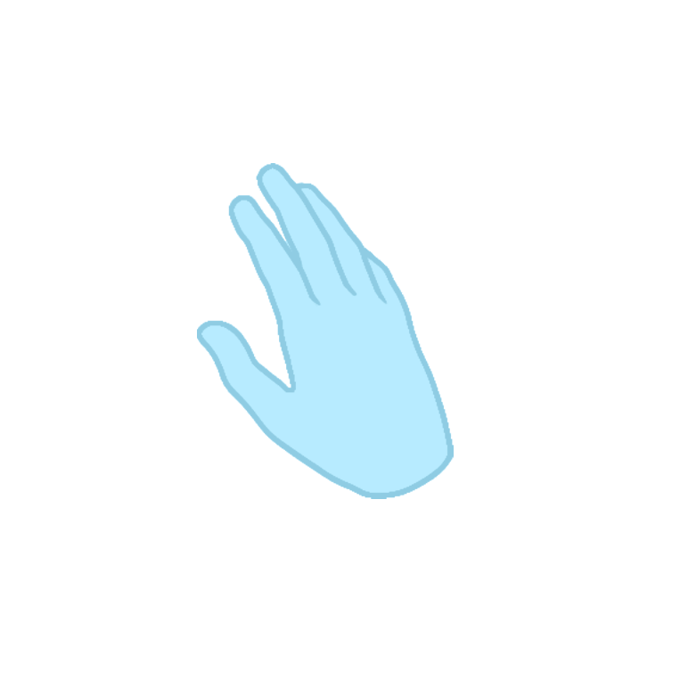
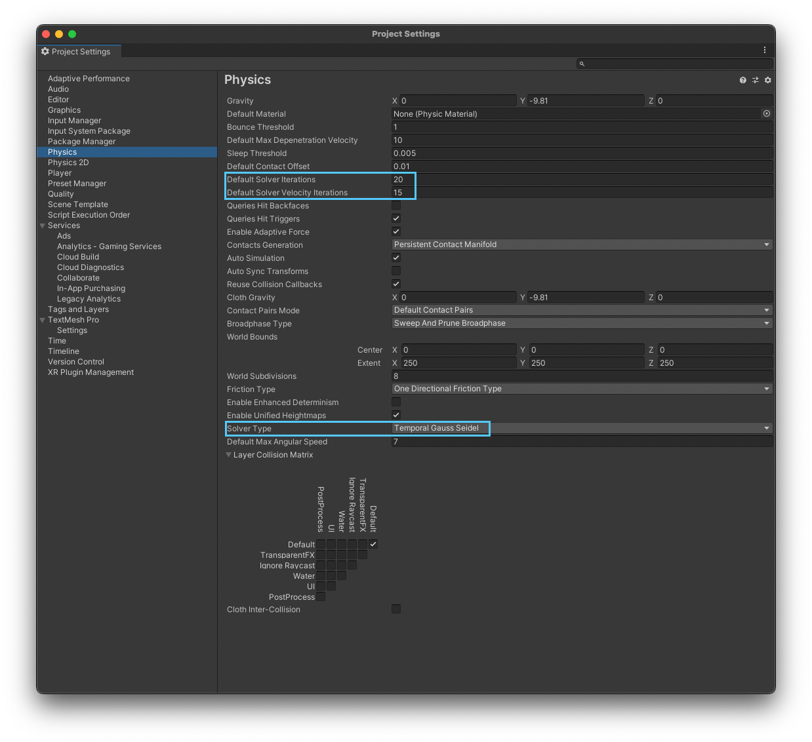
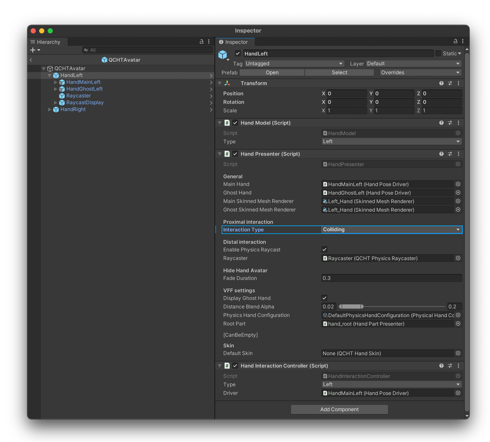

# 虚拟力反馈（VFF）

这一功能让用户感到在与一个实体的虚拟物体进行交互：它有助于克服缺乏触觉反馈的问题。当与虚拟物体交互时，手部虚拟形象（avatar）将分为两只手进行展示。**幽灵（ghost）** 手（来自用户的手部行为）将继续移动，而 **主要（main）** 手则会（受物理约束）停留在虚拟元素上。

## 主要手

在 VFF 环境中，手部虚拟形象也代表用户真实的手部行为，但手部会靠在具有碰撞器的物体上，创造出虚拟触觉反馈的感觉。

## 幽灵手

幽灵手的用于表示用户手部的实时行为。会在手部虚拟形象与物体碰撞时出现。为了不打扰用户，幽灵手会以渐进的、不显眼的方式出现。

## VFF 的物理设置（已弃用）

> **警告**
>
> QCHT Avatar for Virtual Force Feedback Interaction 中的信息仅对 QCHT3 有效。

由于 VFF 功能对物理有要求，因此在 **项目设置** 中对 **物理** 进行配置非常重要，具体步骤如下：

## QCHT Avatar 的虚拟力反馈交互

激活 VFF 交互模式，您需打开 `QCHTAvatar > HandLeft and HandRight > HandPresenter`，将 **交互类型（Interaction Type）** 更改为 **碰撞（Colliding）**。

VFF 交互模式将 **触发器（Triggers）** 更改为 **碰撞器（Colliders）**。
