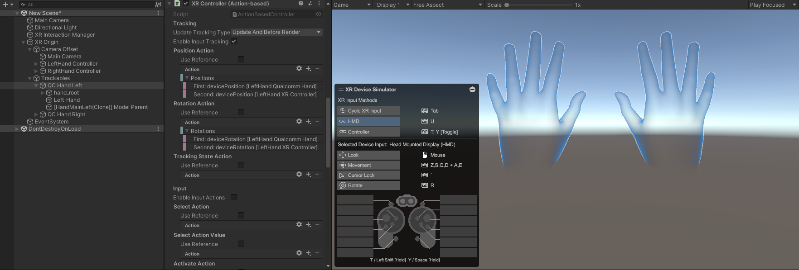

# 手部控制器

## 场景架构

创建 **XR Hand Tracking Manager** 后，会自动在左右手区域设置两个预制件。

这两个游戏对象中的每一个都包含一个来自 XR Interaction Toolkit 包的 **XR Controller** 组件，负责处理来自直接映射到底层手部跟踪子系统的新 Unity 输入系统的输入动作。

这两个游戏对象中的每一个都有 **Hand Rigged Visualizer** 和 **Hand Driver** 组件，它们负责可视化手部网格并更新 **Skinned Mesh** 的手部关节变换。

这些游戏对象还带有 **近端交互器** 使用的 **近端交互控制器**（参考 [近端交互](./ProximalInteraction.md)）。