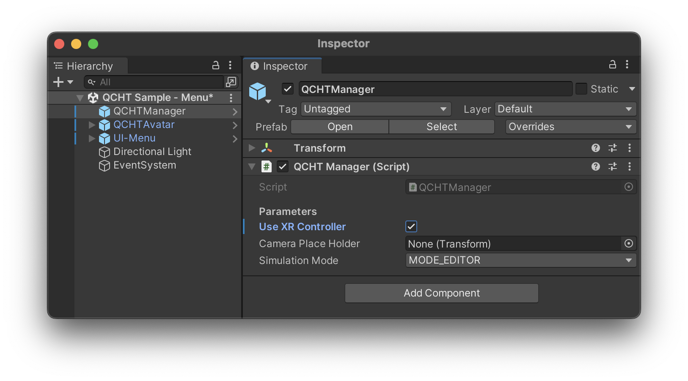
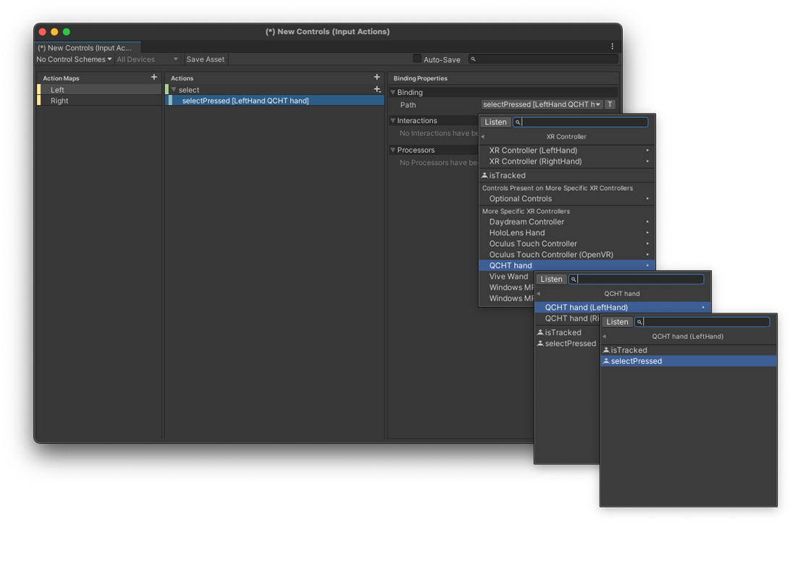
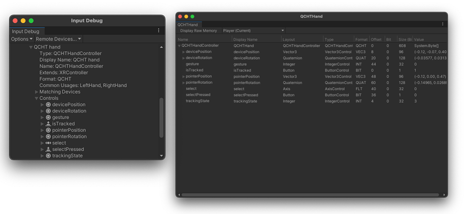

# XR 交互工具包

对于 QCHT 版本 4.0.0 及其之前的预发布版本，一切都基于 XRIT（XR Interaction Toolkit，XR 交互工具包），因此此页面中的信息仅对 QCHT 版本 3.x 及以下有效。

> **弃用**
>
> 自 Snapdragon Spaces 版本 0.12.1 起，QCHT Avatar 已弃用。您现在可以引用 [XRHandController](./xr) 组件。
>

> **警告**
>
> **这是一个实验功能。**
>
> 本指南默认您已经掌握 XR 交互工具包（XR Interaction Toolkit） 的基础知识。如需更详细的概述，请访问 [Unity 官方文档](https://docs.unity3d.com/Packages/com.unity.xr.interaction.toolkit@2.2/manual/index.html)。
> 

要使用 QCHT XR 控制器，请确保您已从 Unity 包管理器（Unity Package Manager）中导入 [QCHT Unity Interaction 4](./ImportAdditionalPackages.md#qcht-unity-交互软件包-4)和 [XR 交互工具包（XR Interaction Toolkit）](https://docs.unity3d.com/Packages/com.unity.xr.interaction.toolkit@2.2/manual/index.html) 包。
然后，在 [QCHT 管理器](./BasicSceneSetup.md) 组件上启用 `Use XR Controller`。

在您的项目中，创建一个 `输入操作（Input Actions）` 或使用现有操作来分配与 `QCHT Hands` 相关的动作。

以上设置完成后，请确认手部设备已正确连接点击编辑器中的播放按钮，并通过单击  **Windows > Analysis > Input Debugger** 打开 `输入调试器（Input Debugger`） ，然后，双击 `QCHTHand` 以查看实时输入数据。

以下是运行时跟踪的手部数据示例：

要创建交互并了解更多 **XR 交互工具包** 的相关信息，请查看 [Unity 官方文档](https://docs.unity3d.com/Packages/com.unity.xr.interaction.toolkit@2.2/manual/index.html)。
