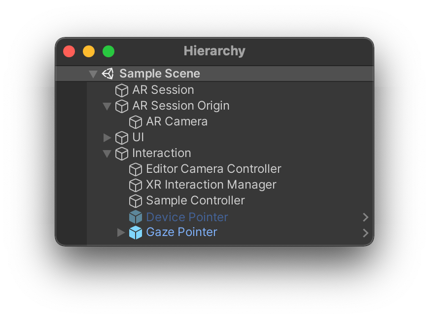

# 场景设置

> **警告**
>
>本指南默认读者对 AR Foundation 和 OpenXR 的已有一定了解。如需更详细的信息，请访问 Unity 官方文档中 **[AR Foundation](https://docs.unity3d.com/Packages/com.unity.xr.arfoundation@4.2/manual/index.html) 和 [OpenXR](https://docs.unity3d.com/Packages/com.unity.xr.openxr@0.1/manual/index.html)** 部分 。

为了 AR Foundation 和 XR 交互工具包（Interaction Toolkit）能够支持运行您的项目，我们建议您按照下图的示例场景层次结构进行场景搭建：

## AR Foundation

启用位置头部跟踪时，需要在场景中添加以下对象：

- AR Session
- AR Session Origin
    - AR Camera（**将其标记为“主相机”**（**MainCamera**））

要手动创建这些游戏对象，请在层级面板中右键单击并选择 **XR > AR Session** 或 **XR > AR Session Origin**。

## 透视（仅适用于 MR 设备）

[透视（Passthrough）](https://registry.khronos.org/OpenXR/specs/1.0/html/xrspec.html#environment_blend_mode)是指将物理环境作为图像带入 VR 设备的可能性。要激活这一功能，在 **UI > Floating Panel** 中，有一个 **扩展内容（Extend Content）** 面板，其中有一个能够启用或禁用 **透视** 的复选框。该面板仅在支持透视的设备上显示可用。在 `MainMenuSampleController.cs` 脚本的 `Start()` 函数中，使用 `IsPassthroughSupported()` 进行检查。

UI 面板上的复选框调用 `MainMenuSampleController` 中的 `OnPassthroughToggle()` 函数，该函数能够设置 `BaseRuntimeFeature` 中的 `PassthroughToggle` ，用户能够以此来查看或隐藏物理环境图像。您还可以使用任一控制器上的任一主要按钮按键（“X” 和 “A” 按钮），对于这两种状态进行切换。

> **警告**
>
> 在 Unity 场景中正确使用并将 **透视** 可视化，**主相机** 的 **背景（Background）** alpha 必须设置为 0 。如果启用了穿透功能，并且会话相机背景设置不正确，则日志中将显示自动警告。

