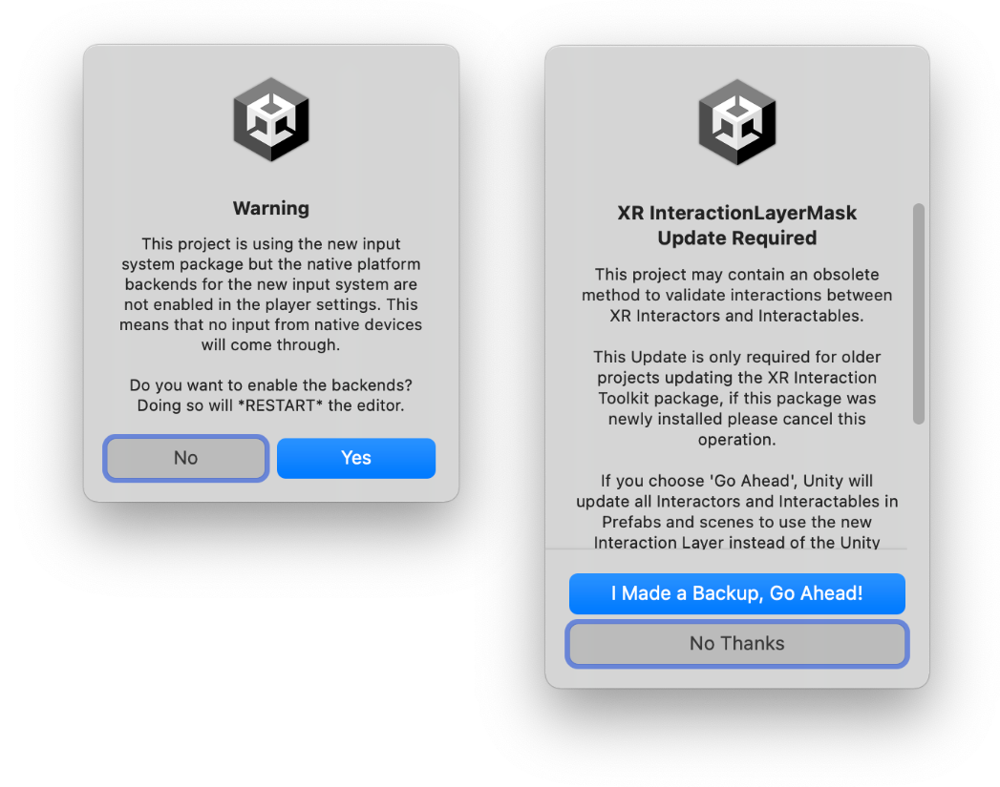
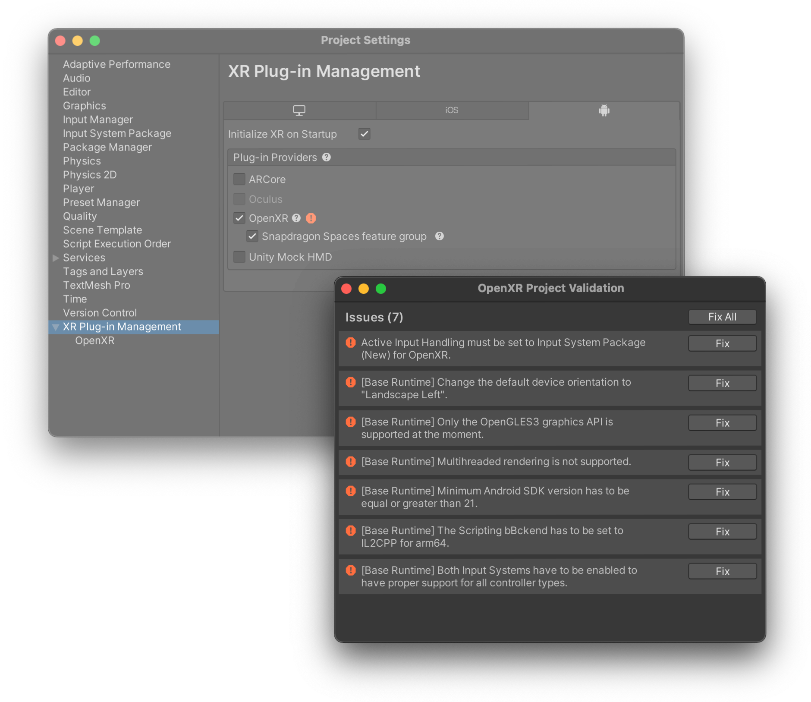
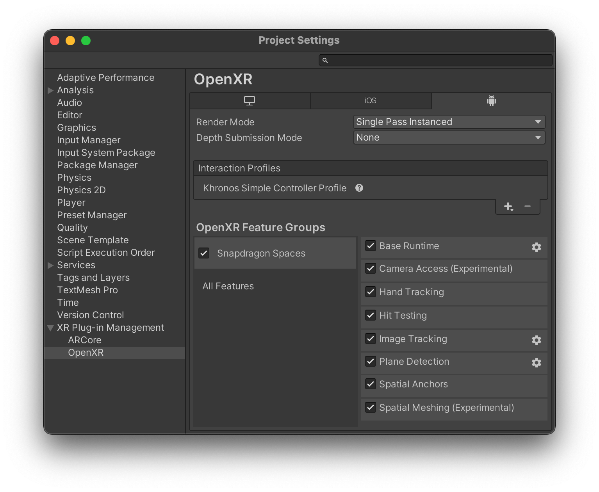
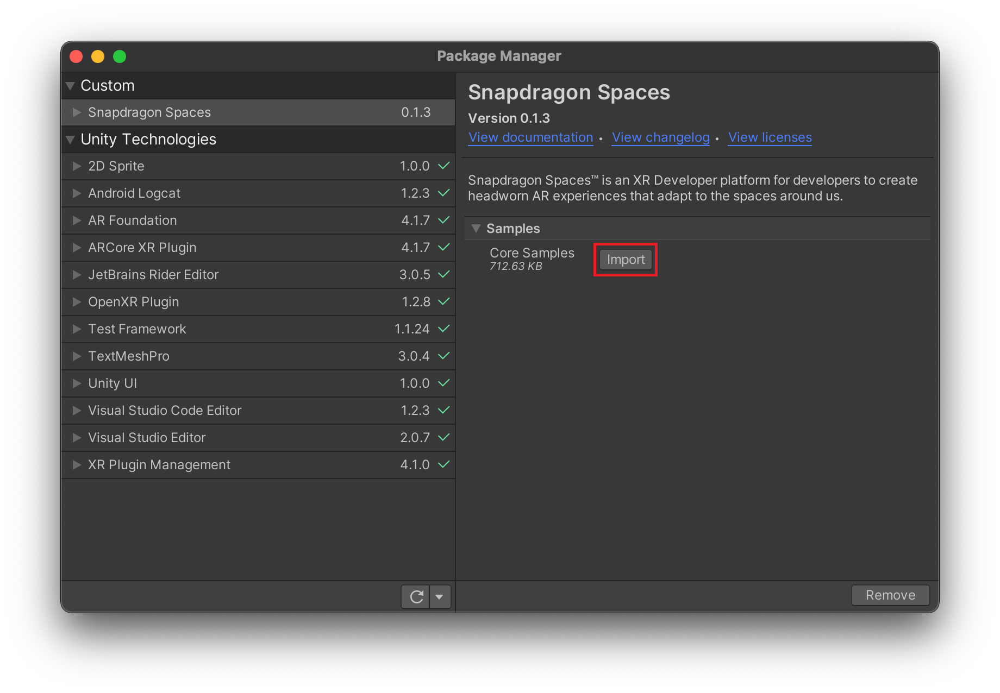
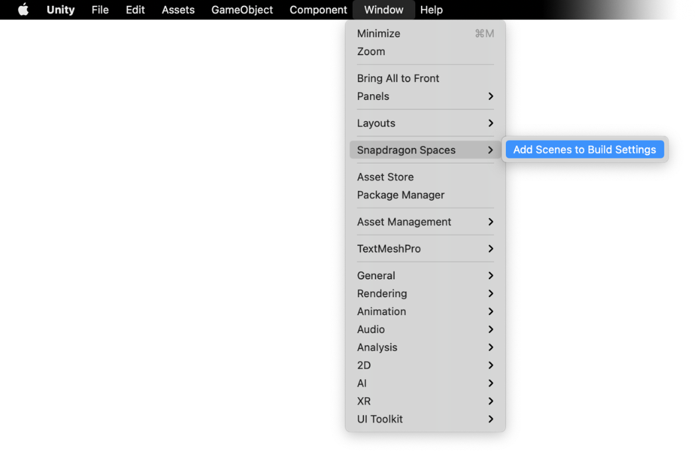
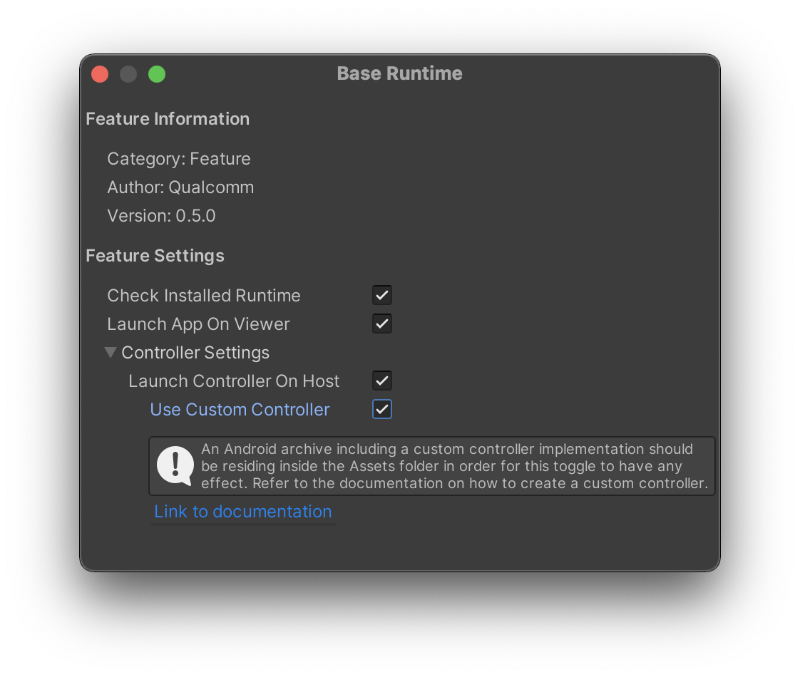
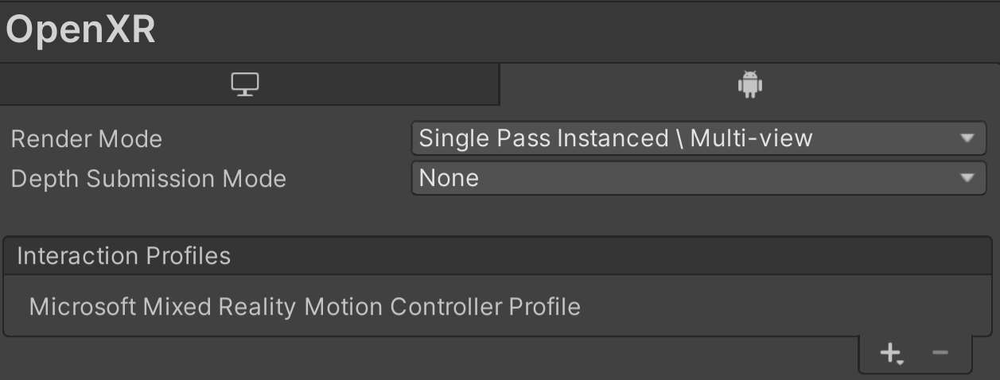

# Unity 设置指南

这份指南将详细说明如何在 Unity 中开始使用 Snapdragon Spaces SDK。

## 前提条件

> **版本**
> 
> 请注意，与 Snapdragon Spaces 配合使用的 Unity Editor 版本中，我们推荐使用 **2021.3.16f1**。后续版本的 Unity Editor *可能* 也能够正常使用，但并未经过广泛测试。

在安装 Unity Editor 时必须添加 Android Build Support 模块才能导出 .apk 文件。该模块也可以后续通过 Unity Hub 进行添加。

## 导入软件包

骁龙 Spaces SDK 软件开以压缩文件的形式提供。请按照 [Unity 说明](https://docs.unity3d.com/Manual/upm-ui-tarball.html)，用 *Unity Package* 文件夹下的 tgz 文件，将软件包导入到项目中。

>**提示**
>
>为了使软件包在列表中显示相对路径（更适合版本控制）而非绝对路径，请将 tgz 文件复制到您项目的 Packages 目录中，然后从那里进行添加。

### 导入 XR Interaction Toolkit

Snapdragon Spaces Unity 软件包依赖于 XR Interaction Toolkit 软件包。在导入 Snapdragon Spaces 软件包时，可能会出现两个提示窗口，如下所示：

- **启用新输入系统**：建议点击 **Yes** 以启用新的输入系统软件包，以确保与 OpenXR 和 XR Interaction Toolkit 软件包的完全兼容性。如果还需要旧版输入系统，则可以在 `Player > Other Settings > Configuration`  将 Active Input Handling 值设置为 **both**。

- **Interaction Layer Mask Update**: ：Interaction Layer Mask Updater（opens new window）可能会显示一个提示，要求升级交互层掩码。如果之前没有添加 XR Interaction Toolkit，则可以选择 **No Thanks**。如果已经导入了版本低于 2.0.0 的 XR Interaction Toolkit 软件包，则建议单击 **I Made A Backup, Go Ahead!**，然后升级交互层掩码。

> **警告**
>
> 更新到新的输入系统将重新启动 Unity 编辑器，这是正常现象。这可能会导致混淆或留下崩溃的印象，但实际上并非如此。如果您担心您的项目，建议在更新之前保存或备份。

## 更改项目设置

要启用 Snapdragon Spaces OpenXR 插件，您可以通过 **编辑 > 项目设置 > XR插件管理（Edit > Project Settings > XR Plug-in Management）**，找到项目设置，并打开Android 选项卡。勾选 **OpenXR** 插件以及 **Snapdragon Spaces 功能组**。起初，您需要更新/修复一些项目设置。请单击 **OpenXR** 旁边的红色感叹号，进入 OpenXR 项目验证（Project Validation）窗口。点击问题对应的修复按钮，应用所需的项目设置。最后，应用这些设置以启用两个输入系统，这可能会需要重启编辑器。

## 启用 Spaces 功能

启用 OpenXR 设置中在运行时应该被激活的功能。下表列出了当前支持的功能以及相应可同时使用的 AR Foundation 管理器或 XR 子系统。

| 功能 | AR Foundation/Spaces 管理器 | XR 子系统 |
| --- | --- | --- |
| 基础运行时 | [AR Foundation 文档](https://docs.unity3d.com/Packages/com.unity.xr.arfoundation@4.2/manual/index.html) | [XR session subsystem 文档](https://docs.unity3d.com/Packages/com.unity.xr.arsubsystems@4.2/manual/session-subsystem.html) |
| 相机帧访问 | AR 相机管理器 | [Class XRCameraSubsystem 文档](https://docs.unity3d.com/Packages/com.unity.xr.arsubsystems@4.2/api/UnityEngine.XR.ARSubsystems.XRCameraSubsystem.html) |
| 手部跟踪 | Spaces 手部跟踪管理器 | Spaces.XR 手部跟踪子系统 |
| 命中测试（实验） | AR 射线投射管理器 | [XR raycast subsystem 文档](https://docs.unity3d.com/Packages/com.unity.xr.arsubsystems@4.2/manual/raycasting-subsystem.html) |
| 图像跟踪 | AR 图像跟踪管理器 | [XR image tracking subsystem 文档](https://docs.unity3d.com/Packages/com.unity.xr.arsubsystems@4.2/manual/image-tracking.html) |
| 平面检测 | AR 平面管理器 | [XR plane subsystem 文档](https://docs.unity3d.com/Packages/com.unity.xr.arsubsystems@4.2/manual/plane-subsystem.html) |
| 空间锚点 | AR 锚点管理器 | [XR anchor subsystem 文档](https://docs.unity3d.com/Packages/com.unity.xr.arsubsystems@4.2/manual/anchor-subsystem.html) |
| 空间网格化（实验性） | AR 网格管理器 | [XR Mesh Subsystem 文档](https://docs.unity3d.com/2021.3/Documentation/ScriptReference/XR.XRMeshSubsystem.html) |

## 导入示例

Snapdragon Spaces SDK 软件包中包含示例，这些示例展示了如何使用该软件包中的感知功能。要导入这些示例，您只需在软件包管理器（打开菜单栏中的 **Window> Package Manager**）中选择该软件包，然后点击 `Core Samples` 旁的导入按钮即可。

> **重要**
>
> 相机帧访问（Camera Frame Access）示例的实现需要在 `Player Settings (> Android Tab) > Other Settings group > Script Compilation > Allow 'unsafe' Code` 设置启用不安全代码。如果您不希望允许不安全代码，不需要使用相机帧访问示例，并且想要消除 OpenXR 项目验证中的错误，则可以在 `Samples > Snapdragon Spaces > {SDK Version} > Core Samples > Scenes` 删除相机帧访问示例文件夹。

导入示例后，您可以单击菜单栏中的 **Window > Snapdragon Spaces > Add Scenes to Build Settings**，使用辅助工具将示例场景添加到构建设置中。

## 自定义控制器设置

Snapdragon Spaces Unity 软件包中包含一个功能，能够在主机设备上启动应用程序时生成控制器。这一功能在 **基础运行时功能（BaseRuntimeFeature）** 中默认启用，您可以在 `Edit > Project Settings > XR Plug-in Management > OpenXR > OpenXR Feature Groups > BaseRuntimeFeature`（通过点击齿轮）中找到。

如果您需要自定义外观，或者希望实现轻微差别的功能，您可以按照 [自定义控制器部分](./../designux/CustomControllerProject.md) 中描述的步骤中替换为其他控制器存档。

通过这些步骤生成的存档可以保存在 Unity 项目的任何 Assets 文件夹中，并且必须启用 **使用自定义控制器** 切换（这需要启用 **在主机上启动控制器** 选项）。

>**警告**
>
>某些情况下，添加自定义控制器档案可能会导致 Gradle 缓存错误。如果出现这种情况，删除项目文件夹中 `Temp > gradleOut` 下生成的临时 Gradle 项目文件夹，可能会解决该问题。

## 添加新的交互配置文件

如果不使用 Snapdragon Spaces 插件中包含的交互配置文件，您需要在项目中添加一个新的交互配置文件。在 Unity 中添加新的交互配置文件，需要在 `Project Settings > XR Plug-in Management > OpenXR > Interaction Profiles` 中进行添加。然后您就可以使用新配置文件的输入来对相应的输入动作进行配置了。

