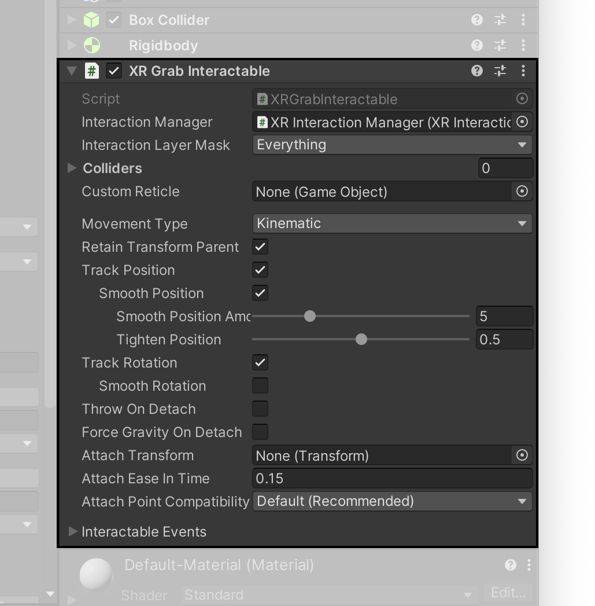
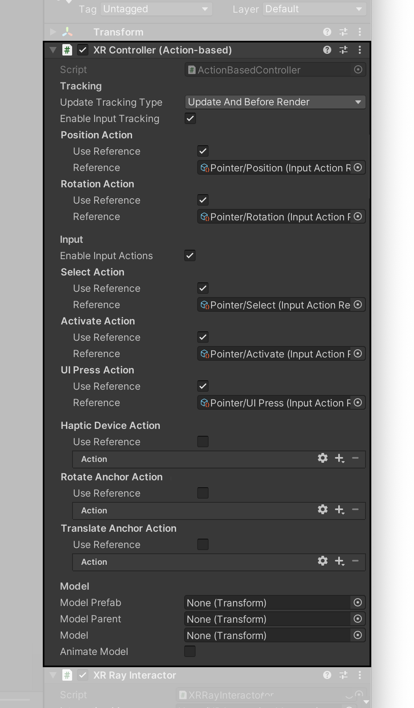

# XR 交互工具包示例

本示例演示了如何使用基于行为（Action）的输入系统和 XR 交互工具包（XR Interaction Toolkit）组件。有关新输入系统和 XR 交互工具包的基本信息，请参阅 [Unity 文档](https://docs.unity3d.com/Packages/com.unity.xr.interaction.toolkit@1.0/manual/index.html)。

## 示例的工作原理

这个示例展示了如何与场景中的 UI 和其他游戏对象（GameObjects）进行交互。

浮动的 UI 面板提供可供交互的常见 UI 元素，如按钮和滚动条。虽然按钮可以使用凝视激光（gaze pointer）和设备激光（device pointer），但示例中的滚动条只能使用设备激光。此外，场景中的另一个 UI 元素展示了来自主机控制器触控板的输入。

最后，可以使用设备激光抓取交互式立方体对象，以演示 3D 对象交互。交互式对象需要具有以下组件：

- 碰撞器（Collider）
- 刚体（Rigidbody）
- XR 可交互对象抓取（XR Grab Interactable）（参考 XR **交互管理器**）

## 设备激光控制器

示例中包含的设备激光预制件由三个主要组件组成：

- **XR 控制器（基于行为）** 组件负责接收来自 XR 输入设备的输入。在示例中，如下图所示，将从动作映射来的输入操作引用分配给 **位置**、**旋转**、**选择**、**激活** 和 **UI 点击**（**UI Press**）。
- **XR 射线交互器（XR Ray Interactor）** 是多种类型的交互器之一。它可以通过射线检测与场景中的 Unity UI 元素以及有效的交互对象进行交互。XR 射线交互器应该引用场景中当前的 **XR 交互管理器**。
- **XR 交互线视觉效果（XR Interactor Line Visual）** 和相应的 **交互线渲染器（Line Renderer）** 组件的功能是，沿控制器正方向从控制器原点绘制一条线。线在默认情况下是红色，一旦碰到有效的交互对象，就会变为绿色。

