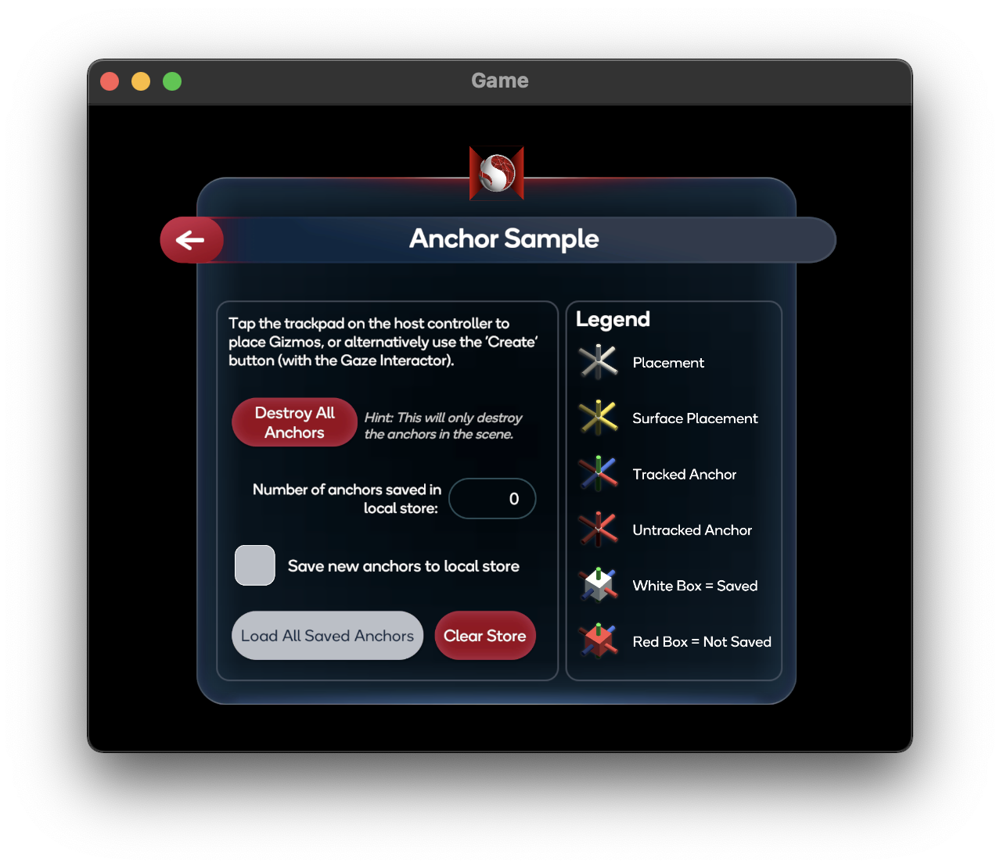

# 锚点示例

这个示例演示了如何创建和销毁本地锚点，以对现实世界中的点进行准确跟踪。有关锚点和 AR Foundation 的 `AR 锚点管理器` （`AR Anchor Manager`） 组件的基本信息，请参阅 [Unity 文档](https://docs.unity3d.com/Packages/com.unity.xr.arfoundation@4.2/manual/anchor-manager.html)。使用此功能，必须先打开 `Project Settings > XR Plug-in Management > OpenXR (> Android Tab)`），找到 OpenXR 插件设置并对其进行启用。

# 示例的工作原理

首先，请确保在 OpenXR 项目设置中启用了 `空间锚点` 功能。

进行放置时，透明放置 Gizmo 视觉效果（placement gizmo visual）会漂浮在相机中心 1 米远的地方。每帧都会从头部中心向前投射一条射线，对放置 Gizmo 相对于真实世界平面的位置来进行定位。如果检测到命中，则放置 Gizmo 也会变成黄色。在主机控制器上轻敲触控板或与 UI 面板上的注视交互器（gaze interactor）进行交互后，将会实例化出一个空的游戏对象 （GameObject） 和一个 AR锚点游戏对象 （ARAnchor GameObject）。空的游戏对象有透明的 Gizmo 网格，并将由 AR 会话 （AR Session）跟踪。AR 锚点 gizmo 将通过 `ARAnchorManager` 的 `anchorsChanged` 事件进行更新，以表示其跟踪状态。

    `public GameObject GizmoTrackedAnchor;
    public GameObject GizmoUntrackedAnchor;

    private override void Start() {
        FindObjectOfType<ARAnchorManager>().anchorsChanged += OnAnchorsChanged;
    }

    private void OnAnchorsChanged(ARAnchorsChangedEventArgs args) {
        foreach (var anchor in args.added) {
            ...
        }

        foreach (var anchor in args.updated) {
            Destroy(anchor.transform.GetChild(0).gameObject);
            var newGizmo = Instantiate(anchor.trackingState == TrackingState.None ? GizmoUntrackedAnchor : GizmoTrackedAnchor);
            newGizmo.transform.SetParent(anchor.transform, false);
        }

        foreach (var anchor in args.removed) {
            ...
        }
    }`

# 销毁所有锚点



在用户界面中，可以通过点击 `Destroy All Anchors` 来销毁所有锚点和 gizmo 。删除命令会延迟执行，以防止用户在本应删除所有内容后，使用“选择”按钮创建一个新的锚点。

# Spaces 锚点储存

>**警告**
>
>请确保查看您的环境，以生成更好的跟踪映射（map）并减少保存和加载时间。一次保存多个锚点会阻塞主线程，因此应使用回调来保存任何后续锚点。

通过在 `AR 锚点管理器`旁边添加 `Spaces 锚点储存` 组件，可以将锚点保存在本地以便在以后的会话进行识别和跟踪。该组件提供以下 API 用于加载和保存锚点、删除已保存的锚点以及清除锚点的本地存储。

```namespace Qualcomm.Snapdragon.Spaces
{
    public class SpacesAnchorStore
    {
        public void ClearStore();

        public void SaveAnchor(ARAnchor anchor, string anchorName, Action<bool> onSavedCallback = null);
        public void SaveAnchor(ARAnchor anchor, Action<bool> onSavedCallback = null);
        
        public void DeleteSavedAnchor(string anchorName);

        public void LoadSavedAnchor(string anchorName, Action<bool> onLoadedCallback = null);
        public void LoadAllSavedAnchors(Action<bool> onLoadedCallback = null);

        public string[] GetSavedAnchorNames();
        public string GetSavedAnchorNameFromARAnchor(ARAnchor anchor);
    }
}`
```


在此信息移至脚本 API 之前，以下是这些方法的简短描述：

- `ClearStore`
    - 清除锚点的本地存储。
- `SaveAnchor`
    - 保存 `AR 锚点` 对象，可以使用给定的名称或生成的哈希值（hash）。可以在完成时调用回调函数。
- `DeleteSavedAnchor`
    - 从本地存储中按名称删除保存的锚点。
- `LoadSavedAnchor`
    - 从本地存储加载锚点，并尝试在场景中定位。找到锚点时，会实例化出一个 `AR 锚点` 对象。可以使用 `获取保存的锚点名称` （`GetSavedAnchorNames`）检索保存的锚点的名称。可以在完成时调用回调函数。
- `LoadAllSavedAnchors`
    - 从存储中加载所有锚点，并尝试在场景中进行定位。与 `加载保存的锚点` （`LoadSavedAnchor`）类似，一旦识别出一个 `AR 锚点` 对象，就会进行实例化展示。
- `GetSavedAnchorNames`
    - 返回所有已保存锚点的名称。
- `GetSavedAnchorNameFromARAnchor`
    - 如果跟踪的 `AR 锚点` 对象是以前保存的对象，则返回其名称，否则返回空字符串。可以使用此方法来检查锚点是否为已保存的锚点。

# 保存、删除和加载示例中的锚点

通过启用 `Save new anchors to local store` 保存新锚点到本地存储开关，每当创建一个新的锚点时，该新锚点将保存到本地应用程序存储中。这意味着只要场景中有 `AR 锚点管理器`，保存的锚点就可以像任何其他常规锚点一样重新创建和跟踪。为了区分常规锚点和保存的锚点，将在保存的锚点中心生成一个额外的立方体网格。如果立方体是红色的，则表示未跟踪保存的锚点；如果是白色的，则表示正在跟踪。通过单击 `加载所有保存的锚点` ，将加载本地存储中的所有锚点，并尝试定位。另一方面，单击 `清除存储` 将删除保存在本地存储中的所有锚点。这一操作不会销毁从存储中加载的任何现有锚点。
