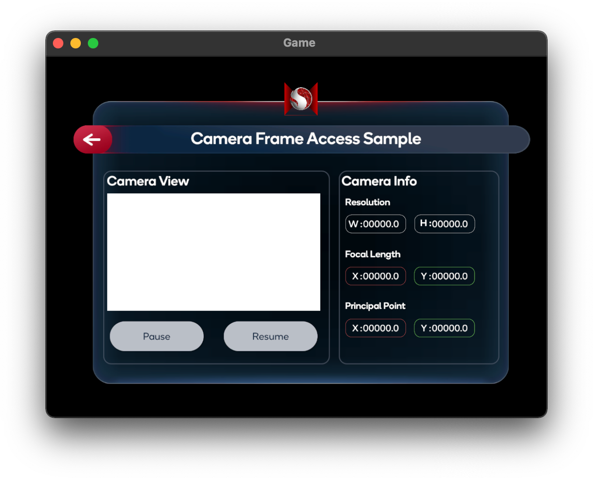

# 相机帧获取示例

> **警告**
>
> 相机帧访问功能被标记为实验性功能，因为它目前尚未完全支持所有公共 AR Foundation API，而且在软件包和 Snapdragon Spaces Service 方面的优化会导致版本之间的向后兼容性被破坏。

该示例演示了如何通过获取 RGB 相机帧和内在属性对图像进行处理。有关相机帧访问的基本信息以及 AR Foundation 的 `AR 相机管理器` （`AR Camera Manager`）组件的作用，请参阅 [Unity 文档](https://docs.unity3d.com/Packages/com.unity.xr.arfoundation@4.2/api/UnityEngine.XR.ARFoundation.ARCameraManager.html)。使用此功能，必须先打开 `Project Settings > XR Plug-in Management > OpenXR (> Android Tab)`，找到 OpenXR 插件设置并启用该功能。此外，该示例要求在 `Project Settings > Player > Android > Script Compilation` 中允许“不安全”代码。

## 示例的工作原理

将 `AR Camera Manager` 相机管理器组件添加到 `AR Session Origin > AR Camera` 游戏对象中，相机获取子系统将被启用。在启动时，该子系统将从查看器（viewer）设备检索有效的传感器配置。如果找到有效的 YUV420 传感器配置，该子系统将选择此配置为 CPU 相机图像提供程序。概念上，`AR Camera Manager` 表示一个单独的相机，不会同时管理多个传感器。

示例场景包括两个面板：

- **camera feed（相机反馈）** 面板显示来自设备相机的最新 CPU 图像，并带有 *暂停（Pause）* 和 *恢复（Resume）* 按钮。
- **camera info（相机信息）** 面板枚举设备相机的各种属性。



### 检索 CPU 图像

相机管理器的 `TryAcquireLatestCpuImage` 尝试获取最新 CPU 图像函数将返回一个 `XRCpuImage` 对象，该对象表示所选设备相机中的单个原始图像。可以使用 `XRCpuImage` 的 `Convert` 转换函数提取此图像的原始像素数据，该函数返回一个 `NativeArray<byte>`。

>**重要**
>
>`XRCpuImage` 对象在转换后必须进行显式处理。要做到这一点，请使用 `XRCpuImage`  的`Dispose` 曝光函数。如果未处理 `XRCpuImage`  对象，则会泄漏内存，直到相机获取子系统被销毁。

如果在转换之前分配了 `NativeArray<byte>` ，则此缓冲区在复制或操作后也必须被处理。要做到这一点，请使用 `NativeArray<T>` 的 `Dispose` 函数。如果未处理 `NativeArray<byte>` ，则会泄漏内存，直到相机获取子系统被销毁。

有关如何使用 `TryAcquireLatestCpuImage` 尝试获取最新 CPU 图像和 `XRCpuImage` 的详细信息，请参阅 [Unity 文档](https://docs.unity3d.com/Packages/com.unity.xr.arfoundation@4.2/manual/cpu-camera-image.html)。

下面的示例代码首先从 `AR Camera Manager` 请求一个 CPU 图像。如果成功，它将 `XRCpuImage`  的原始像素数据直接提取到一个受控 `Texture2D` 的 `GetRawTextureData<byte>` 缓冲区中，并在之后使用 `Apply` 函数应用纹理缓冲区。最后，它更新目标 `RawImage` 中的纹理，使新帧显示在应用程序 UI 中。

```
public RawImage CameraRawImage;

private ARCameraManager _cameraManager;
private Texture2D _cameraTexture;
private XRCpuImage _lastCpuImage;

public void UpdateCpuImage() {
    _lastCpuImage = new XRCpuImage();
    if (!_cameraManager.TryAcquireLatestCpuImage(out _lastCpuImage)) {
        return;
    }
        
    UpdateCameraTexture(_lastCpuImage);
}

private unsafe void UpdateCameraTexture(XRCpuImage image) {
    var format = TextureFormat.RGBA32;

    if (_cameraTexture == null || _cameraTexture.width != image.width || _cameraTexture.height != image.height) {
        _cameraTexture = new Texture2D(image.width, image.height, format, false);
    }

    var conversionParams = new XRCpuImage.ConversionParams(image, format);
    var rawTextureData = _cameraTexture.GetRawTextureData<byte>();
    
    try {
        image.Convert(conversionParams, new IntPtr(rawTextureData.GetUnsafePtr()), rawTextureData.Length);
    }
    finally {
        image.Dispose();
    }

    _cameraTexture.Apply();
    CameraRawImage.texture = _cameraTexture;
}
```

 `AR Camera Manager` 支持以下纹理格式:

- `RGB24`
- `RGBA32`
- `BGRA32`

### 检索传感器本质

相机管理器的 `TryGetIntrinsics` 函数将返回一个 `XRCameraIntrinsics` 对象，该对象描述了所选传感器的物理特性。有关 `XRCameraIntrinsics` 的详细信息，请参阅 [Unity 文档](https://docs.unity3d.com/Packages/com.unity.xr.arsubsystems@4.2/api/UnityEngine.XR.ARSubsystems.XRCameraIntrinsics.html)。

下面的示例代码检索所选传感器的内部参数，并显示在应用程序 UI 中。

```
public Text[] ResolutionTexts;
public Text[] FocalLengthTexts;
public Text[] PrincipalPointTexts;

private ARCameraManager _cameraManager;
private XRCameraIntrinsics _intrinsics;

private void UpdateCameraIntrinsics() {
    if (!_cameraManager.TryGetIntrinsics(out _intrinsics)) {
        Debug.Log("Failed to acquire camera intrinsics.");
        return;
    }
    
    ResolutionTexts[0].text = _intrinsics.resolution.x.ToString();
    ResolutionTexts[1].text = _intrinsics.resolution.y.ToString();
    FocalLengthTexts[0].text = _intrinsics.focalLength.x.ToString("#0.00");
    FocalLengthTexts[1].text = _intrinsics.focalLength.y.ToString("#0.00");
    PrincipalPointTexts[0].text = _intrinsics.principalPoint.x.ToString("#0.00");
    PrincipalPointTexts[1].text = _intrinsics.principalPoint.y.ToString("#0.00");
}
```
