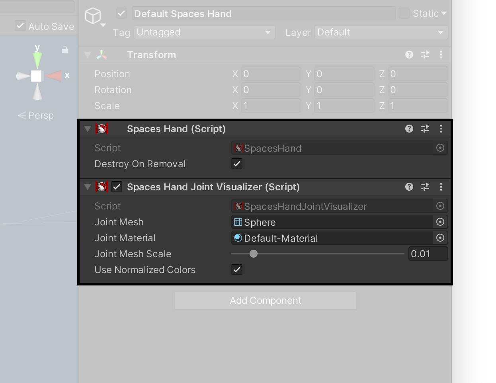

# 手部跟踪示例

> **警告**
>
> Spaces Hand 组件已被弃用，取而代之的是 [QCHT 包](./../QCHTGuide/ImportAdditionalPackages.md) 中的组件，并将在未来的版本中删除。示例应用程序中的当前手部跟踪场景包含在 [QCHT 包](./../QCHTGuide/ImportAdditionalPackages.md) 中，必须导入该示例才能正常工作。

## Spaces 手部管理器

> **警告**
>
> Spaces 手部管理（Hand Manager）组件已被弃用，取而代之的是 [QCHT 包](./../QCHTGuide/ImportAdditionalPackages.md) 中的组件，并将在未来的版本中删除。

### 手部管理器

 `Spaces Hand Manager` 手部管理器组件属于 `ARTrackableManager` （AR 可跟踪管理器）类型，其编程方式与 **AR Foundation** 的所有其他管理器类似 —— 通过提供回调函数来检索以对项目形式进行添加、更新和删除等更改。

```
public void Start() {
    spacesHandManager.handsChanged += OnHandsChanged;
}

...

private void OnHandsChanged(SpacesHandsChangedEventArgs args) {
    foreach (var hand in args.added) {
        ...
    }

    foreach (var hand in args.updated) {
        ...
    }

    foreach (var hand in args.removed) {
        ...
    }
}
```

它还提供了一个检查器字段，用于定义在检测到手部时应生成的默认预制件。如下图所示，示例中的`默认 Spaces 手部` （`Default Spaces Hand`）预制件包含两个附加组件。下述部分将对其进行详细描述。



### Spaces 手部组件

> **警告**
>
> Spaces Hand 组件已被弃用，取而代之的是 [QCHT 包](./../QCHTGuide/ImportAdditionalPackages.md) 中的组件，并将在未来的版本中删除。

该组件是获取所有与手相关数据的通用接口。它属于 `ARTrackable` 类型，因此具有一些常见属性，例如**TrackableID（可跟踪 ID）**、**TrackingState（跟踪状态）** 和 **Pose（姿势）**，这些属性将由被跟踪的手腕关节进行定义定义。

它还另外提供了三个属性：

- **IsLeft** 是一个布尔值，如果被跟踪的手是左手，则返回 `true` 。否则，返回 `false` 。
- **Joints** 是一个 `Qualcomm.Snapdragon.Spaces.SpacesHand.Joint` 类型的数组。这种类型有以下属性：
    - **Pose** 是一个 Unity 姿态类型，返回手部关节的姿态。
    - **Type** 是 `Qualcomm.Snapdragon.Spaces.SpacesHand.JointType` 类型，返回一个枚举值，以指定被处理的手部关节。
- **Gesture** 的手势类型为 `Qualcomm.Snapdragon.Spaces.SpacesHand.Gesture` ，具有以下属性：
    - **Type** 是一个类型为 `Qualcomm.Snapdragon.Spaces.SpacesHand.Gesture` 的枚举值，表示检测到的手势类型。
    - **GestureRatio** 是 0 到 1 之间的浮点值，表示手势应用的程度。
    - **FlipRatio** 是 -1 到 1 之间的浮点值，表示手势是从背面（-1）、正面（1）还是中间检测到的。
    有关手势的更多信息，请参阅 [交互手势文档](./../../designux/InteractionGestures.md)。

```
namespace Qualcomm.Snapdragon.Spaces.SpacesHand
{
    public enum JointType
    {
        PALM = 0,
        WRIST = 1,
        THUMB_METACARPAL = 2,
        THUMB_PROXIMAL = 3,
        THUMB_DISTAL = 4,
        THUMB_TIP = 5,
        INDEX_METACARPAL = 6,
        INDEX_PROXIMAL = 7,
        INDEX_INTERMEDIATE = 8,
        INDEX_DISTAL = 9,
        INDEX_TIP = 10,
        MIDDLE_METACARPAL = 11,
        MIDDLE_PROXIMAL = 12,
        MIDDLE_INTERMEDIATE = 13,
        MIDDLE_DISTAL = 14,
        MIDDLE_TIP = 15,
        RING_METACARPAL = 16,
        RING_PROXIMAL = 17,
        RING_INTERMEDIATE = 18,
        RING_DISTAL = 19,
        RING_TIP = 20,
        LITTLE_METACARPAL = 21,
        LITTLE_PROXIMAL = 22,
        LITTLE_INTERMEDIATE = 23,
        LITTLE_DISTAL = 24,
        LITTLE_TIP = 25
    }
}
```

```
namespace Qualcomm.Snapdragon.Spaces.SpacesHand
{
    public enum GestureType
    {
        UNKNOWN = -1,
        OPEN_HAND = 0,
        //FLIP = 1,
        GRAB = 2,
        //UP = 3,
        //DOWN = 4,
        //SWIPE = 5,
        //SWIPE_OUT = 6,
        PINCH = 7,
        POINT = 8,
        VICTORY = 9,
        //CALL = 10,
        METAL = 11
    }
}
```

### Spaces 手部关节可视化组件

> 警告
>
> Spaces Hand Joint Visualizer（手部关节可视化组件） 组件已被弃用，取而代之的是 [QCHT 包](./../QCHTGuide/ImportAdditionalPackages.md) 中的组件，并将在未来的版本中删除。

这个组件提供了一些属性，用来改变关节可视化的外观，例如：

- **JointMesh（关节网格）** 是应该为每个关节实例化的网格。
- **JointMaterial（关节材质）** 是应该应用于网格的材质。
- **JointMeshScale（关节网格比例）** 是一个浮点值，在0.005和0.05之间，定义应该应用于网格的缩放比例。
- **UseNormalizedColors（使用统一颜色）** 是一个布尔值。如果设置为 `true`，则应用的材质着色器的 **_Color** 属性将由组件进行着色。

在示例中，使用 Unity 引擎中包含的简单球形网格作为 **JointMesh**，同时使用 **Default-Material（默认材质）** 作为 **JointMaterial**。
