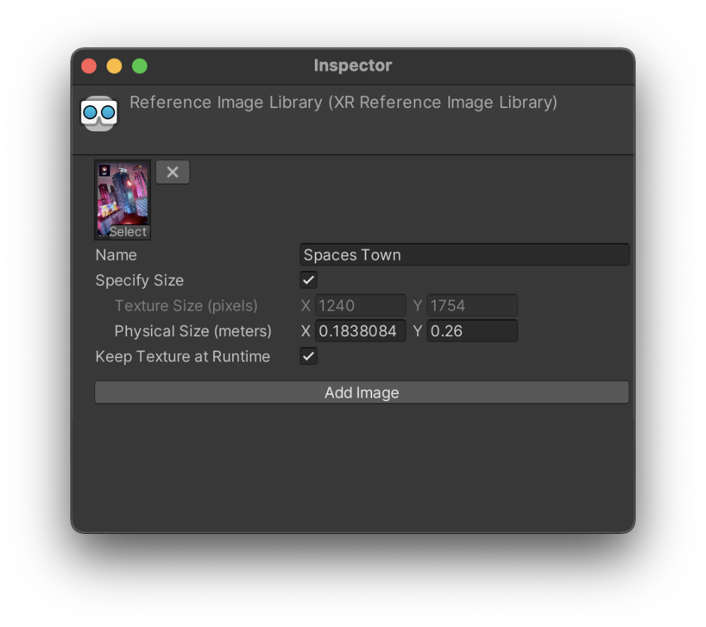
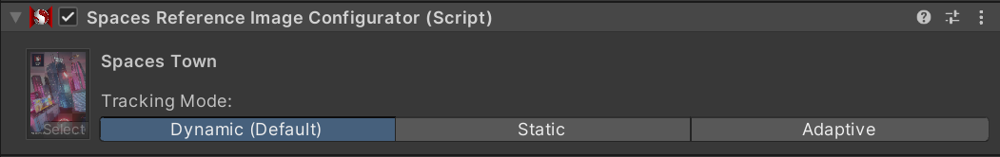
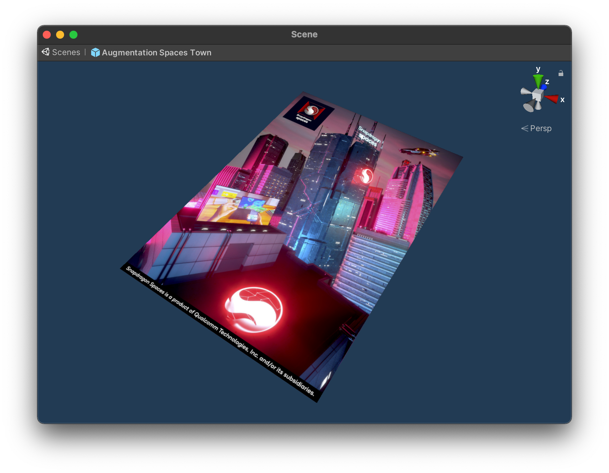

# 图像跟踪示例

本示例演示了如何检测和增强在现实世界中找到的图像目标。有关图像跟踪以及 AR Foundation 的 `AR Tracked Image Manager` AR 跟踪管理器组件的基本信息，请参阅 [Unity 文档](https://docs.unity3d.com/Packages/com.unity.xr.arfoundation@4.2/manual/tracked-image-manager.html)。

使用此功能，必须先打开 `Project Settings > XR Plug-in Management > OpenXR (> Android Tab)`，找到 OpenXR 插件设置并启用该功能。

## 示例的工作原理

首先，请确保在 OpenXR 项目设置中启用 `图像跟踪`（`Image Tracking`）功能。

>**提示**
>
>您可以在 [测试目标图像](./../../designux/ImageTargetsToTry.md) 部分找到使用的参考图像。 

图像目标通过 `XR Reference Image Library` XR 参考图像库提供给底层 XR 插件。添加的图像会生成一个名称，稍后用于识别已跟踪的目标，并且有一个重要的标志 **保留运行时纹理（Keep Texture at Runtime）**，该值应设置为 `true`。子系统能够以此将纹理数据传递给 Snapdragon Spaces Services 以进行跟踪。

此外，在示例中，图像目标的高度为 26 厘米（在 DIN A4 或 US letter 打印时）。正确的尺寸对于正确的姿势估计和后续增强放置至关重要。因此，在启用 **指定大小**（**Specify Size**）之后，必须指定正确尺寸。



在导入设置中，纹理应启用 **读/写** 标志并将 **Format** 设置为 **RGB 24 bit**（也可能显示为 **RGB8**）。如果 **Format** 设置为 **Automatic**，项目的图形设置可能会错误地设置格式。

添加 `ARTrackedImageManager` 到`ARSessionOrigin`，GameObject` 将启用 Snapdragon Spaces 包中包含的图像跟踪子系统。该组件提供三个字段：一个用于`RuntimeReferenceimageLibrary` 上面创建的字段，一个用于指定 `Max Number Of Moving Images` 的字段，以及一个用于定义预制件以在检测到跟踪图像时生成的字段。使用的预制件是渲染为纹理网格的 Snapdragon Spaces Town 的目标图像。

通过订阅 `AR 跟踪图像管理器` 的方法以侦听跟踪图像的更改，适当的 UI 信息将被设置为跟踪图像的状态和位置，如下面简化的代码示例所示。

>**警告**
>
>为了此示例能够正常工作，`XR 参考图像库` 中设置的参考图像名称必须是唯一的。任何相同的名称都会导致 `_trackedImages` 字典中的哈希码冲突（a hash code collision）。

```
    ...

    private Dictionary<TrackableId, ...> _trackedImages = new Dictionary<TrackableId, ...>();

    public override void OnEnable() {
        ...
        FindObjectOfType<ARTrackedImageManager>().trackedImagesChanged += OnTrackedImagesChanged;
    }

    public override void OnDisable() {
        ...
        FindObjectOfType<ARTrackedImageManager>().trackedImagesChanged -= OnTrackedImagesChanged;
    }

    private void OnTrackedImagesChanged(ARTrackedImagesChangedEventArgs args) {
        foreach (var trackedImage in args.added) {
            if (trackedImage.referenceImage.name == "Spaces Town") {
                _trackedImages.Add(trackedImage.trackableId, ...);
                ...
            }
        }

        foreach (var trackedImage in args.updated) {
            var info = _trackedImages[trackedImage.trackableId];
            ...
        }

        foreach (var trackedImage in args.removed) {
            _trackedImages.Remove(trackedImage.trackableId);
            ...
        }
    }
```



可选的 `Spaces Reference Image Configurator` 组件也可以添加到与 `ARTrackedImageManager` 相同的GameObject 中。该组件为每个已跟踪图像提供了额外的配置选项。

**Tracking Mode** 字段允许为每个图像定义三种不同的跟踪模式：

- *动态（默认）*- 动态模式每帧更新跟踪图像的位置，适用于移动和静态目标。如果无法找到跟踪图像，则不会报告位置或姿态。相对于其他跟踪模式，此模式具有更高的功耗。如果未找到Spaces Reference Image Configurator组件，则所有跟踪图像默认使用此跟踪模式。

- *静态* - 静态模式适用于已知为静态的图像跟踪，这会导致更低的功耗和更好的性能。例如，这些可能是粘贴在地板或墙上的图像。此模式对于在图像不再可见时仍应继续显示的增强非常有用。在静态模式下跟踪的图像位置永远不会更新，无论图像是否移动或不再可见。

- *自适应* - 自适应模式适用于静态图像，但如果它们略微移动（大约每 5 帧一次），则会定期更新跟踪图像的姿态。对于不再可见的图像的跟踪最终会丢失。此模式平衡了功耗和对将保持固定位置的图像的跟踪精度。

启动应用程序时，每个跟踪图像最初将使用 `Spaces Reference Image Configurator` 组件中定义的 **Tracking Mode**，但如果需要，可以在运行时更新此值，如下面的简化示例代码所示。

```
    public SpacesReferenceImageConfigurator referenceImageConfigurator;
    private Dictionary<TrackableId, ...> _trackedImages = new Dictionary<TrackableId, ...>();
    ...

    string referenceImageName = ...; // referenceImageName to change Tracking Mode for
    TrackableId trackableId = ...; // a TrackableId for an existing tracked instance of this image
    ...

    // first, stop tracking any instances of the tracked image for which the Tracking Mode should be updated.
    // if tracking is not stopped, the instance can (but is not guaranteed to) continue to be tracked using the old Tracking Mode for some time 
    referenceImageConfigurator.StopTrackingImageInstance(referenceImageName, trackableId);
    ...
    
    // then, set the desired tracking mode for all future instances of the tracked image with that referenceImageName
    referenceImageConfigurator.SetTrackingModeForReferenceImage(referenceImageName, SpacesImageTrackingMode.DYNAMIC);
    referenceImageConfigurator.SetTrackingModeForReferenceImage(referenceImageName, SpacesImageTrackingMode.STATIC);
    referenceImageConfigurator.SetTrackingModeForReferenceImage(referenceImageName, SpacesImageTrackingMode.ADAPTIVE);
```


