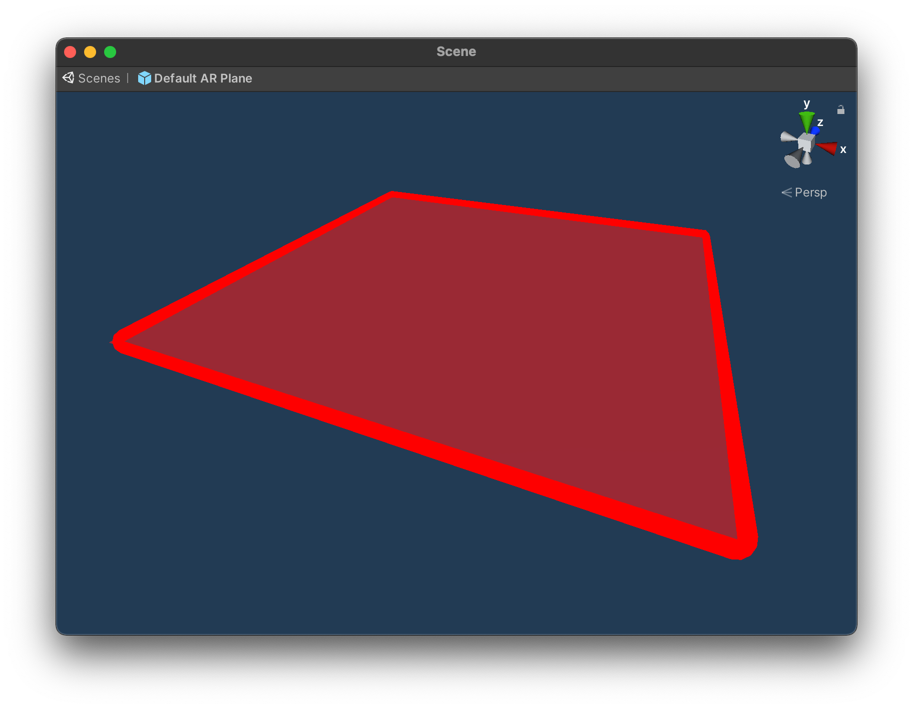

# 平面检测示例

该示例展示了如何对现实世界中发现的平面进行可视化。关于平面检测/跟踪以及 AR Foundation 的 `AR Plane Manager`  平面管理器组件的基本信息，请参考 [Unity 文档](https://docs.unity3d.com/Packages/com.unity.xr.arfoundation@4.2/manual/plane-manager.html)。使用此功能，必须先打开 `Project Settings > XR Plug-in Management > OpenXR (> Android Tab)`，找到 OpenXR 插件设置并对其进行启用。

## 示例的工作原理

首先，请确保在 OpenXR 项目设置中启用了 `Plane Detection` 平面检测功能。

场景中只需要两个组件即可在运行体验时看到平面。将 `ARPlaneManager` 添加到 `ARSession` 游戏对象（ gameObject）中，将启用 Snapdragon Spaces 软件包中包含的平面子系统（Plane Subsystem）。该组件提供了一个字段，用于定义在创建平面时要生成的预制件。该预制件附有 `AR Plane` 和 `AR Plane Mesh Visualizer` AR 平面网格可视化器，以及 `Mesh Renderer` 网格渲染器和 `Line Renderer` 线渲染器。 `AR Plane Mesh Visualizer` 会定期调整网格和线条，并绘制具有填充和边框的平面，可以通过修改渲染器的材质和属性进行调整。此外，还可以向预制件添加 `Mesh Collider` 网格碰撞器组件以接收射线检测命中的信息。

### 功能设置

在 OpenXR 项目设置中，可以通过点击 `平面检测` 功能旁边的齿轮图标来找到功能设置。

**使用场景理解平面检测：**

- 启用或禁用 **Use Scene Understanding Plane Detection（使用场景理解平面检测）** 设置将在检测到的平面形状和数量方面产生不同的结果。
  
- 启用此设置将启用使用 `Scene Understanding` 来检测平面。这利用了 `Spatial Meshing (Experimental)` 空间网格化功能使用的相同技术。
  
- 当 **Use Scene Understanding Plane Detection** 启用后，运行该示例时，用户可以切换选项以 **Use Convex Hull**（**使用凸包**）。
  
- 当禁用 **Use Scene Understanding Plane Detection** 后，**Use Convex Hull** 选项默认启用，并且在示例运行时用户无法取消选择。
  
- 当启用 **Use Scene Understanding Plane Detection** 选项时，检测到的平面的凸包将用于生成更复杂的形状。禁用后，它将根据检测到的平面范围生成平面。
  
- 如果由于任何原因无法加载场景理解，则此功能将表现为禁用 **使用场景理解平面检测**。
