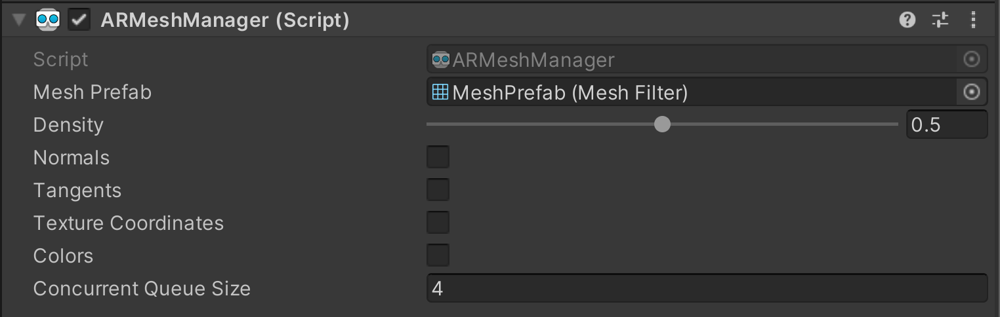

# 空间网格示例

> **警告**
>
> 空间网格化功能被标记为实验性功能，因为目前软件包和 Snapdragon Spaces Service 方面的优化会破坏版本之间的向后兼容性。此外，网格法线（Mesh normals）尚未实现。

本示例演示了如何生成并将近似真实世界环境的空间网格进行可视化。有关空间网格和 AR Foundation 的 `AR Mesh Manager` 网格管理器组件的基本信息，请参阅 [Unity 文档](https://docs.unity3d.com/Packages/com.unity.xr.arfoundation@4.2/manual/mesh-manager.html)。使用此功能，必须先打开 `Project Settings > XR Plug-in Management > OpenXR (> Android Tab)`，找到 OpenXR 插件设置并启用该功能。

## 示例的工作原理

`ARMeshManager`  需要作为 `ARSessionOrigin` 的子对象。该组件引用了在网格可用时将生成的 `MeshFilter` 。由于网格本身不包含法线、切线、纹理坐标（Normals, Tangents, Texture Coordinates）和颜色数据，因此这些选项被关闭。

>**警告**
>
>将 `ARMeshManager` 附加到摄像机对象上会导致对象的 **比例 （Scale）** 发生变化，从原始的 (1, 1, 1) 变为 (10, 10, 10) 。这将导致在恢复原始摄像机比例之前，应用程序在头戴设备上出现渲染问题。

默认情况下，打开样本时会生成一个适应检测环境的多边形网格。该网格使用自定义的 `MeshVisualization.shader` 进行可视化，仅用于生成供可视化目的使用的法线。
通过订阅 `ARMeshManager` 的 `meshesChanged` 网格变更回调，可以获取有关何时添加、更新或删除网格的数据。

> **警告**
> 
> 目前的解决方式不是更新网格，而是移除并替换为新的网格。

### 示例代码

    `private ARMeshManager _meshManager;

        public void Awake() {
            _meshManager = FindObjectOfType<ARMeshManager>();
        }

        public override void OnEnable() {
            ...
            _meshManager.meshesChanged += OnMeshesChanged;
        }

        public override void OnDisable() {
            ...
            _meshManager.meshesChanged -= OnMeshesChanged;
        }

        void OnMeshesChanged(ARMeshesChangedEventArgs args) {
            foreach (MeshFilter meshFilter in args.added) {
                ...
            }

            foreach (MeshFilter meshFilter in args.updated) {
                ...
            }

            foreach (MeshFilter meshFilter in args.removed) {
                ...
            }
        }`
