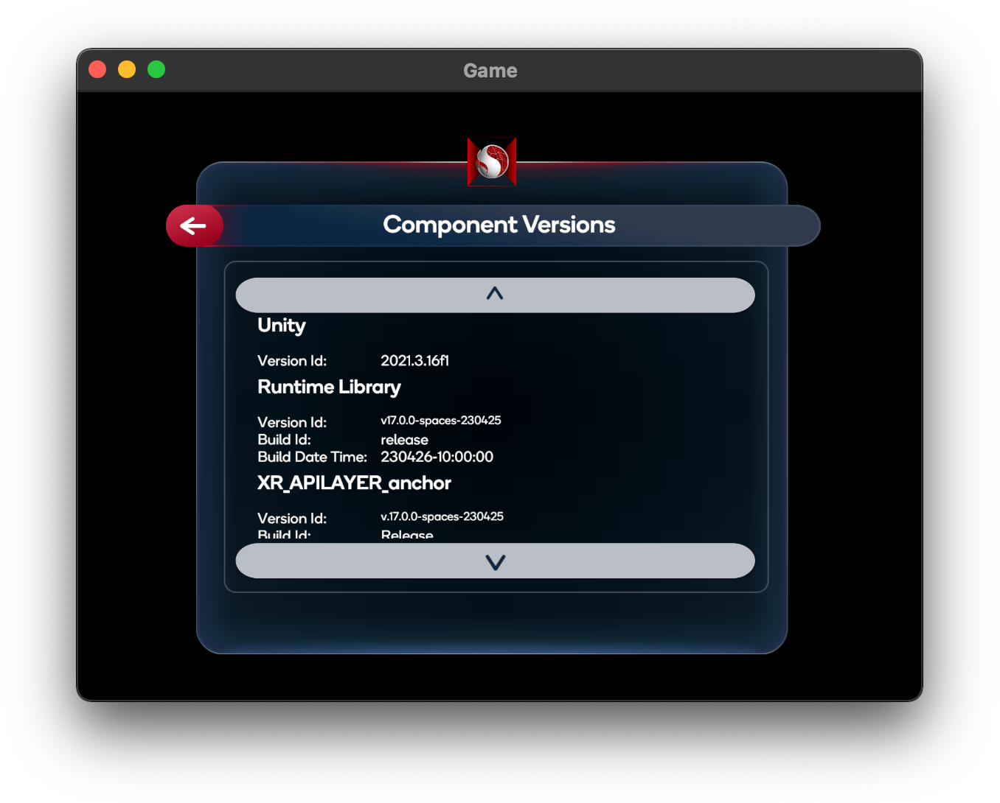

# 故障排除

本节将介绍一些您在运行硬件或应用程序时可能遇到的常见问题。

您应该“正确”关闭正在使用 Snapdragon Spaces Services 的应用程序——退出应用程序或强制关闭应用程序。在继续改进 Snapdragon Spaces 并提供新功能的同时，我们会解决部分问题，目前这里有一些变通办法帮你解决问题。

> **提示**
>
> 请确保您按照最新版本的安装和入门指南:
> 
> [设置手机和眼镜的程序](./../setup/ThinkRealityA3Setup.md)
> 
> [开始使用 Snapdragon Spaces SDK](./../setup/QuickStartGuide.md)

| 问题 | 重新启动后，应用程序无法多次运行 |
| --- | --- |
| 现象 | 有时 Snapdragon Spaces Services（连接耳机和设备）无法正确关闭，会阻止下一个应用程序初始化该服务。解决方案是强制退出任何使用骁龙空间服务的应用程序。 |
| 解决办法 | 长按应用程序图标，直到弹出“应用程序信息”，选择“应用程序信息”，然后按“强制停止”终止服务进程。按“返回”键退出“应用信息”界面。你可能还需要强制停止骁龙空间服务应用程序。如果失败了，可以尝试重启手机 |

| 问题 | 应用程序无法运行 |
| --- | --- |
| 现象 | 当你连接眼镜并打开后，选择运行应用程序时，出现以下情况之一：1) 应用程序无法运行； 2) 在手机上显示；3) 警告信息；4) 黑屏 |
| 解决办法 | 这表明 Snapdragon Spaces Services 未运行或与您的设备不兼容。检查您手机和眼镜的版本，并确保您的版本是最新的。尝试运行一个 SDK 示例应用程序来验证设备上的设置。 |

| 问题 | 控制器无法自动出现，或你需要退出 |
| --- | --- |
| 现象 | 有时控制器会消失或者无法显示 |
| 解决办法 | 按住 Snapdragon Spaces Services 图标并点击 “主机控制器” 将其恢复。 |

| 问题 | 运行 Spaces 应用程序后，头部锁定的 ThinkReality 菜单 “卡住” 了 |
| --- | --- |
| 现象 | 头部锁定的 ThinkReality 菜单 “卡住” |
| 解决办法 | Spaces 应用程序应该仍然能够运行。 要恢复 ThinkReality 功能，请重新启动手机。 |

| 问题 | 我插入眼镜后什么都看不到 |
| --- | --- |
| 现象 | 眼镜无法正常运行 |
| 解决办法 | 尝试拔下并重新插入眼镜。 如果不起作用，请摘下眼镜并运行 Companion 应用程序。 它会提示您插入眼镜。 插上眼镜大约 15-30 秒后，它会显示眼镜已连接。 如果失败，您应该使用不同的 USB 数据线重试 - 我们发现某些 USB 数据线质量较差。 如果失败，您应该就此问题联系 Spaces 团队。 |

如果您遇到了上述方法无法解决的问题，请尝试以下操作

1. 把眼镜从手机上拔下来
2. 确保手机有充足的电量。
3. 重启手机，等待开机完成。
4. 插上眼镜，等待大约15秒后启动完毕，你就会看到 ThinkReality 的标志。
5. 尝试一个已知的工作空间应用程序，例如提供的 Unity 应用程序。
6. 如果这样做有效，强制停止你刚刚尝试的应用程序(确保已停止)，并启动你自己的应用程序。如果您仍然遇到问题，请联系 Spaces 团队以获得更多帮助。

## 组件版本

出于支持目的，在进行故障排除时可能需要有关组件的详细信息。可以通过位于 Unity 或虚幻引擎示例中主菜单底部的按钮访问 `Info`  面板，以获取有关运行时中不同组件的信息。例如：组件名称、版本标识符、构建标识符和构建日期时间。例如，下图显示 **Musketir** 组件的版本，该组件是提供图像跟踪和平面检测功能的核心组件。

