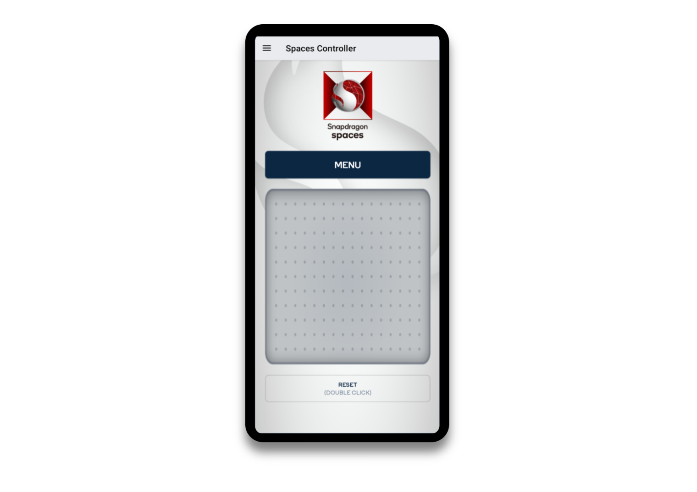

# Snapdragon Spaces 自定义启动器

Snapdragon Spaces 的当前架构针对创建头戴式体验进行了优化，主要应用体验在头戴设备/眼镜中，支持手部跟踪、硬件控制器或模拟控制器的触摸屏界面（称为 Companion Controller），所有这些都使用 OpenXR Profiles 进行通信。

这种架构允许一些应用程序在不需要重新编译的情况下在不同的形态因素之间构建和运行。因此，了解底层发生的架构非常重要。

## 自定义启动器

在为 Snapdragon Spaces 构建应用程序时，首次启动的是一个包含的自定义启动器，它查询设备是否存在 Snapdragon Spaces 运行时，并执行权限检查。一旦这些检查通过，此自定义启动器将检查设备是否通过手机加眼镜的形态连接，或者是否通过纯头戴式形态连接。

在头戴式形态中，专为头戴设备设计的活动会直接在设备上启动。

在手机加眼镜的形态中，伴侣控制器（Companion Controller）的 Activity 会立即在手机上启动，同时专为头戴设备设计的活动会在连接的眼镜上启动。这两个活动彼此独立，通过 OpenXR 桥进行通信。即使伴侣控制器活动被滑动关闭并关闭，它也不会关闭应用程序，头戴式活动仍将运行，需要应用程序发送适当的退出信号或强制停止。

> **眼镜未连接**
>
> 如果在没有连接眼镜的情况下，在手机上启动了头戴式 Spaces 应用程序，则头戴式活动将在移动设备上启动。这可以通过从 Android UI 中轻松地滑动活动来退出。
>

## 伴侣控制器（Companion Controller）

在眼镜连接移动手机的形态中，默认提供了伴侣控制器作为一个包含的预编译 Android ctivity，用于使用触摸屏处理输入。该预编译二进制文件将触摸传输为按钮，并将旋转信息发送到 OpenXR Runtime，然后由运行的 Activity 读取。

如何使用伴侣控制器：

- 点击触摸板会触发选择或单击事件。
- 应用程序可以选择如何响应 `菜单` 按钮。
- 控制器的旋转，可以使用三个自由度（3DoF）旋转地控制“激光指针”来控制设备指针。
- `重置按钮` 可用于根据需要重新调整设备的方向以进行对齐校准。

虽然此形态因素不支持其他按钮，因为其功能受限于符合 OpenXR 控制器配置文件，但可以自定义伴侣控制器屏幕和按钮位置的设计。有关更多详细信息，请参见 [自定义控制器](./../designux/CustomControllerProject.md)。
