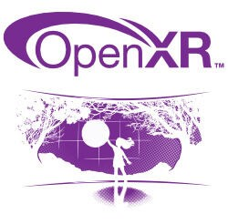

# Snapdragon Spaces 中使用 OpenXR

### 什么是 OpenXR，内容开发者为什么要关心 OpenXR ？

OpenXR 是 VR 和 AR 的行业标准。正如有可以创建统一的图形标准的图形 API（例如 OpenGL、OpenGL-ES 或 Vulkan）一样，OpenXR 是一种标准，允许内容开发者以 AR 或 VR 为目标的进行开发。Khronos Group 与 OpenXR 的许多成员一起维护 OpenXR。OpenXR API 在许多可用的和即将推出的 XR 设备上得到支持，通过使用统一的、开放的 API，努力使应用程序的开发更容易、更一致。

OpenXR API 提供构建可同时针对全息和沉浸式设备的引擎所需的核心姿态预测、帧时序和空间输入功能。 如果您想了解有关 OpenXR API 的更多信息，请查看 [Khronos Groups 的 OpenXR](https://www.khronos.org/openxr/)，[OpenXR 规范](https://www.khronos.org/registry/OpenXR/#apispecs)，或 [快速参考指南](https://www.khronos.org/files/openxr-10-reference-guide.pdf) 。

### OpenXR 是一个新的开发平台吗？

OpenXR 并不是混合现实的平台或引擎。相反，OpenXR 由标准化 API 组成，Unity、Unreal 和 Cocos 等游戏引擎能够通过 OpenXR 生成可访问本地硬件平台 XR 功能的可移植代码。若想查看更多通过游戏引擎进行 OpenXR 开发的信息，请浏览 [Unity OpenXR 插件](https://docs.unity3d.com/Manual/com.unity.xr.openxr.html) 和 [Epic OpenXR 插件](https://docs.unrealengine.com/4.27/en-US/SharingAndReleasing/XRDevelopment/OpenXR/) 。

### 为什么选择 OpenXR？

像 OpenGL 和 OpenXR 这样的抽象 API 使您能够针对 API 进行开发，而硬件供应商们则会提供围绕独特硬件接口的封装。有了统一标准，开发者就能够专注于开发内容而不用担心硬件是否能够兼容。 像 OpenXR 这样的标准在设计时就考虑到了稳定性和持续支持的问题，这是开放标准的一个好处。 这意味着更新的硬件应该会随着时间的推移，继续支持这些 API。

### OpenXR 可以添加新功能吗？

OpenXR 支持核心 API 之上的扩展，您可以对硬件平台支持的哪些可选功能进行查询。例如，手部跟踪是一项扩展功能，并非所有 XR 设备最初都支持。要启用这些扩展功能，应用程序可以在运行时检查硬件支持。当前的一些 OpenXR 扩展类型包括：

- 手部跟踪
- 眼动跟踪
- 手势
- 控制器支持
- 调试覆盖
- 记录/回放

### Snapdragon Spaces 如何利用 OpenXR？

Snapdragon Spaces 提供了 OpenXR 兼容的运行时间，以及各种 OpenXR 扩展及示例应用程序来展示使用方法。开始使用，请访问 [Snapdragon Spaces 开发者门户](https://spaces.qualcomm.com/)。
