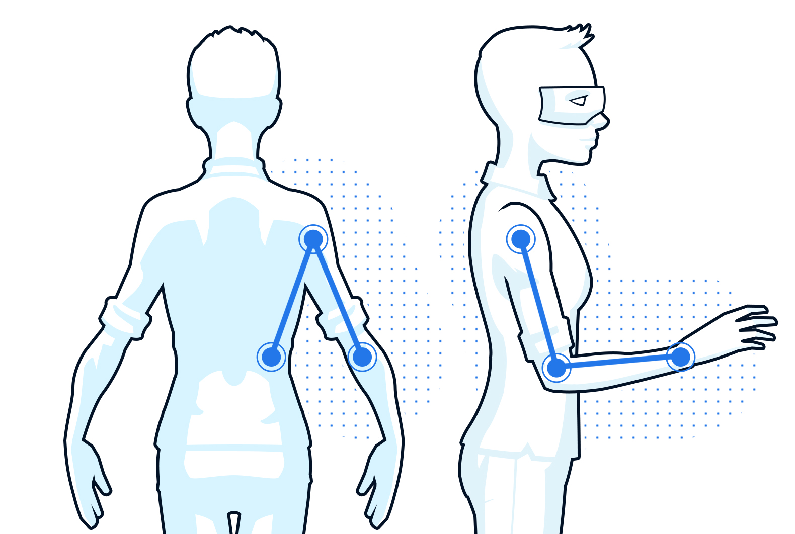
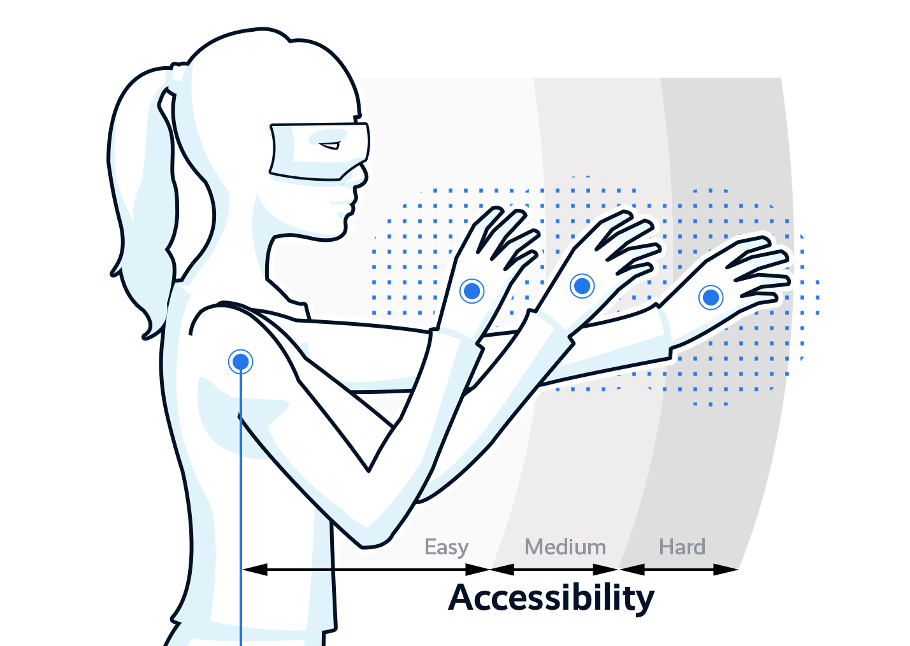
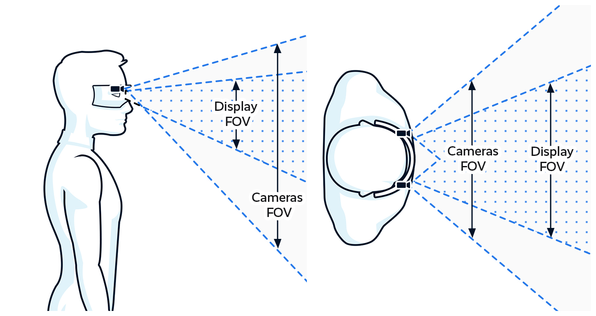
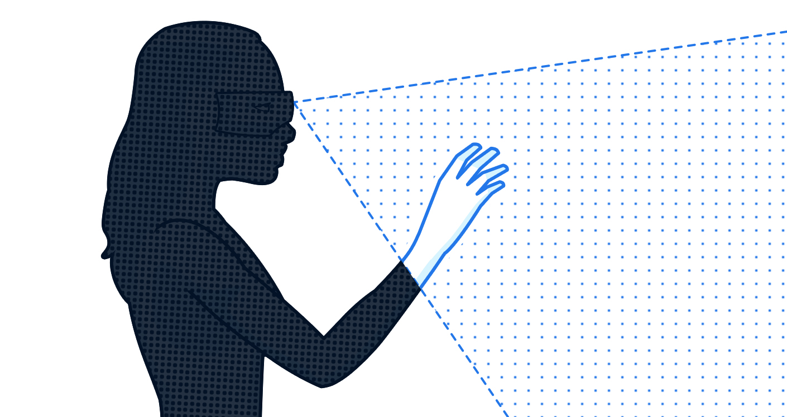
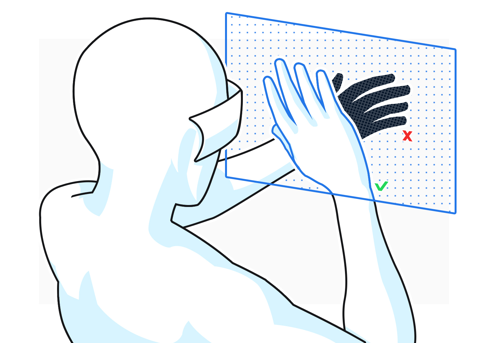

# 最佳实践

在 XR 应用程序的设计中，用户舒适度、实用性和可用性是创建高质量体验的关键。

本节的目的是为您介绍最佳实践，以设计出能够获得最舒适、最身临其境和最引人入胜的体验产品。

最佳实践部分包括手势及与虚拟对象和界面的交互、人体工程学、可用性和限制故障排除。

### 虚拟交互

手部跟踪科技提供了两种方式，能让用户与虚拟内容进行交互：

- 是一种特殊的手势姿势，能够用于触发行为或与物品进行交互。
- 对象交互允许手与虚拟对象通过远端或近端进行物理交互。

### 手势

以手势作为一种交互方式的话，通常需要一定程度的教程或指导。即使手势是最通用、最自然的语言之一，不同的人对建议手势的理解可能也会存在差异。

最好在以下情况下使用手势：

- 在用户引导教程中逐步介绍，而非一次性介绍完全部手势
- 手势数量有限，且在整个应用程序中保持一致性
- 各个手势明确且与特定的功能相对应
- 用户能够在任意位置和时间查看教程

在正确的时间和地点成功地使用虚拟对象和手势，有助于创造出积极的用户体验。

## 易用性

易用性（Usability）是创造出真正沉浸式的用户体验产品的关键。设计因素中需要将人体工程学认真考虑在内：空间环境、用户交互体放置和用户旅程。

### 用户姿势

- 保持身体中立位
- 手臂放在身体旁边、保持下垂、放置在身体两侧
- 避免大的、剧烈的和重复的动作

### 易访问性

在XR技术中设计易于访问的体验意味着用户界面（包括教程、字体、颜色和交互方法）对每个人都是易访问的

请记住，在 XR 中的用户界面并不局限于手机屏幕或笔记本电脑。在 360 和 3D 环境中，通过提示来引导用户使用至关重要。

我们建议用户在手臂自然弯曲的近距离处进行操作，而不是伸出手臂进行操作，因为后者更容易让用户感到疲劳。

### 用户旅程（User Journey）

- 用户使用过程中使用提示进行用户引导
- 通过视觉显示或音频反馈告知用户是否可以进行操作以及是否检测到交互
- 为用户提供退出选项以离开不想要的状态，所有操作都应该可逆

### 上下文（Context）

为了进一步改善用户体验，可通过上下文来简化内容传递和相关交互。可以通过跟踪用户正在查看的内容并调整可用元素，减少混乱情况，创造更为直接顺畅的体验。

例如，绘图演示中有许多元素可用于自定义（铅笔粗细、颜色等）。默认菜单提供了选择任何这些元素的能力。一旦用户选择了其中一个元素，菜单就会改变，只提供与该元素相关的选项。如果用户选择颜色，那么随后的菜单将仅缩小为绘图演示可用的不同颜色选项。

### 物品放置

- 对相似物品进行分组，以使其更容易被找到（参考 Gestalt Principles）
- 将物体放置在明显的位置，不遮挡用户的视线
- 如果需要接近交互和碰撞，请确保物体距离用户足够近在用户可触及范围内
- 交互物体需要根据相应的使用模式适当调整大小。

## 限制

### 视场角（FOV）

FOV，通常用度数来衡量，是人通过他们的眼睛或通过 AR/VR 设备看到的开放可观察区域。

在 AR/VR 中，FOV 取决于设备本身，尤其是：

- **相机 FOV** 由相机（通常是单色或 RGB）构成。
- **展示 FOV** 是“屏幕内的 FOV”，即为用户看到的内容范围。

### 遮挡

遮挡是指当 3D 空间中的一个物体阻挡了视图中的另一个物体时，使其无法被观察到，就会发生遮挡。有时会出现一只手挡住另一只手时，可能会发生遮挡问题，从而妨碍进行准确的手部跟踪。

要想尽量减少遮挡，需要：

- 尽量避免可能会让用户双手重叠的手势和交互
- 尽可能使用单手交互模式
- 遮挡发生时，提醒用户移开双手，以获得最佳手部跟踪效果。

### 户外环境

为了获得最佳体验，请在室内使用手部跟踪。由于当前支持的硬件限制，打算在室外使用的应用程序，可能无法如预期的良好运行。
