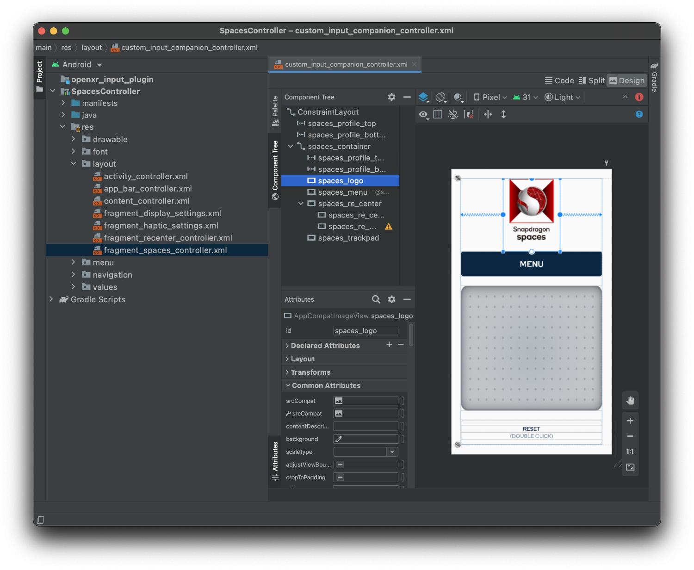
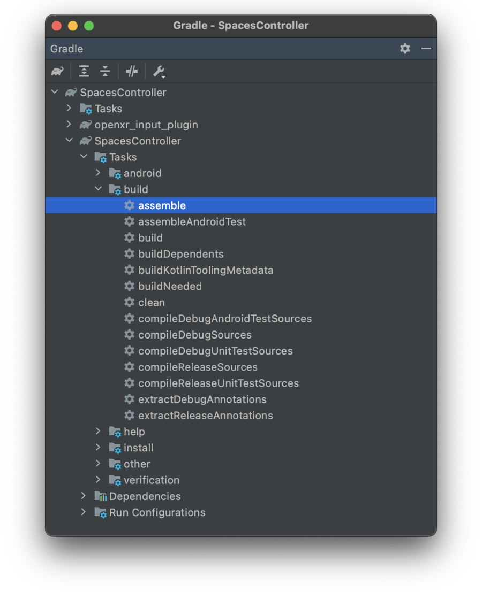

# 自定义控制器项目

开发者工具包中包含一个 Android Studio 项目，构建时使用自定义控制器 AAR 来代替 Snapdragon Spaces 在 Unity 或 Unreal Engine 插件内置的默认控制器 AAR。

更改控制器的外观，请使用 Android Studio（推荐 2020.3 或更新版本）打开项目，然后打开 **SpacesController > res > layout > custom_input_companion_controller.xml**。 位于 **SpacesController > java > com.qualcomm.snapdragon.spaces.spacescontroller.SpacesCustomInputContentViewFactory** 下的类将覆写 Snapdragon Spaces Services 应用程序内的控制器。
如果布局文件或 **SpacesController > res > values** 路径下声明的其他值的 ID 即将更改，则应相应地管理先前提到的类中的相应对应项，以避免任何链接错误。

要创建一个定制控制器 AAR 文件，该文件可用于 Snapdragon Spaces Unity 包或 Unreal Engine 插件中，需要在 Gradle 窗口（打开 `View > Tool Windows > Gradle`）中的 `SpacesController` 模块下运行 `assemble` 任务，该任务位于 `SpacesController > Tasks > build` 中，或在 Windows命令行中从项目根目录运行 `gradle assemble`，或在 macOS/Linux 上运行 `./gradle assemble`。

如果构建成功，生成的归档文件 AAR 之一（发行版或调试版）将位于 **SpacesController > build > outputs > aar** 下，可以在接下来的步骤中使用：

- [在 Unity 中使用自定义控制器](./../Unity/SetupGuideUnity.md.md)
- [在虚幻引擎中使用自定义控制器](./../unreal/SetupGuideUE.md)
