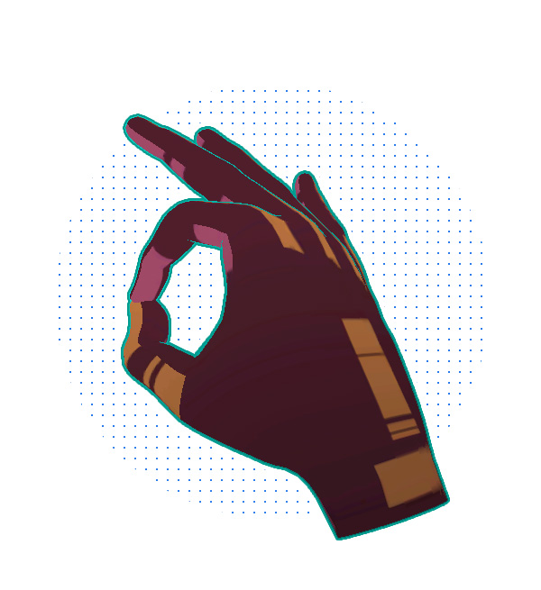
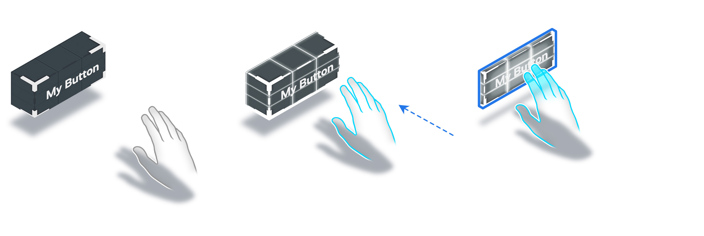

# 交互手势

## 主要交互手势

### 捏合

捏合（Pinch）手势通过将拇指指尖接触食指指尖，同时伸出其余手指来执行。从侧面看捏合手势，可以达到最佳地识效果。

捏合会在手指接触时进行选择操作，或通过保持并移动这一手势来进行操作。

捏合手势会触发 **自动触觉反馈**，因此是一种有效的沉浸式验证手势。

### 抓取

抓取（Grab）手势通过将手放在相机前面并握紧拳头来执行。

该手势用于抓取和操纵近距离的大体积物体。

抓取手势还允许自动触觉反馈。

### 开手

开手（Open-Hand）手势是一种中立的姿势，通过伸出手并张开手指并将手掌远离摄像头的方向来完成。

通常使用捏合手势来连接射线检测，以便与远处元素进行交互。

这个手势用于显示射线检测或用作释放手势。

### 指向（已弃用）

*从 Snapdragon Spaces 版本 0.12.1 开始，指向手势已被弃用。仅在使用Snapdragon Spaces 版本 0.11.1 及以下版本进行开发时使用此手势。*

指向手势是指伸出食指，同时其他手保持握紧的动作。

这种手势手势通常会在近距离交互中与 GUI（例如按下按钮）交互时进行使用。

## 手部展现

### 增强现实

在增强现实环境中，不建议在真实的手上显示虚拟手。建议将重点放在虚拟元素的反馈上，而不要放在展示手部模型 上面。

### 虚拟现实

逆向运动学是 3D 模型在虚拟现实应用中最佳的应用方式。在数字空间中，3D 式手部模型表示会覆盖真实手势，为用户创造更身临其境的体验。根据示例的上下文调整手部模型非常重要。  

此外，必须通过视觉效果使 3D 手提示用户正在进行交互。这里有两个 3D 手部头像的例子：

以下是两个 3D 手部模型 的示例：

**Alpha Hand**

**Harlequin hand**

## 反馈、提示和可支配性

由于手部无法像其他输入设备一样提供触觉反馈，因此在用户与 3D 对象进行交互时，非常有必要通过视觉和音频反馈来进行补偿。重要的是设计出明显的声音和视觉变化，在用户与组件进行交互时能够以此进行确认。

为了改善用户体验，我们建议您在设计交互时，将真实世界的反馈等效地考虑在内。这将有助于在成功执行了对象或手势的交互时，通过视觉或音频提示进行确认。

一般来说，虚拟元素的主要状态如下：

| 状态 | 视觉反馈 | 音频反馈 |
| --- | --- | --- |
| 空闲 | 无 | 无 |
| 悬停 | 是 | 是 |
| 选中 | 是 | 是 |

## 虚拟反馈

**对象**

对象的行为可以改变，或者在成功交互时突出显示。对象还可以根据交互或手势而改变形状或大小。

*从左到右的对象状态：空闲、悬停、选中。*

**手**

根据上下文，我们建议除去交互对象外，同时给 3D 手部模型 加上视觉反馈。

一般来说，手有三种状态：无交互、与交互元素碰撞、正在交互。以下是 3D 手可能具有的效果类型的展现：

*手的反馈：空闲、悬停、选中。*

**准星**

要想指定出用户想进行交互的元素（特别是远端交互的情况下），在指针上返回不同类型的效果非常重要。经典的 HMI 界面中，指针的外观会根据其交互状态而进行变化。因此，这些行为对用户来说相当直观。在设计阶段就对射线检测和其准星可能存在的不同类型的行为也纳入考虑范围是至关重要的。

*准星反馈：空闲、悬停、选中*

### 音频反馈

因为交互声音与上下文相关，所以音频反馈最好只在虚拟对象上实现。用户与 2D 菜单进行交互时，此处的音频反馈将与该用户在视频游戏中交互有所不同。

音频还可以用于环境声，但仍然依赖于上下文。

## 交互提示

交互提示是一种手部动画，动画会在无法检测到用户的手时进行触发。该组件会在用户不知道如何与虚拟元素进行交互时，为用户提供指导。

如果用户在 x 秒钟没有进行交互（具体描述将在设计示例（demo）时定义），则该组件会循环播放动画，直到系统检测到交互为止。

## 操作列表

最适合交互状态的手势和反馈：

|  | 近端 | 远端 | 反馈 |
| --- | --- | --- | --- |
| 目标 | 碰撞 | 张开手掌（射线检测） | 视觉、音频 |
| 选择 | 捏合、抓取 | 捏合 | 视觉、音频 |
| 操作 | 捏合、抓取 | 捏合 | 视觉，具体情况而定 |
|  |  |  |  |
| UI目标 | 碰撞 | 张开手掌（射线检测） | 视觉、音频 |
| UI选择 | 捏合、指向、开手 | 捏合 | 视觉、音频 |
| UI操作 | 捏合、指向、开手 | 捏合 | 视觉、音频 |
