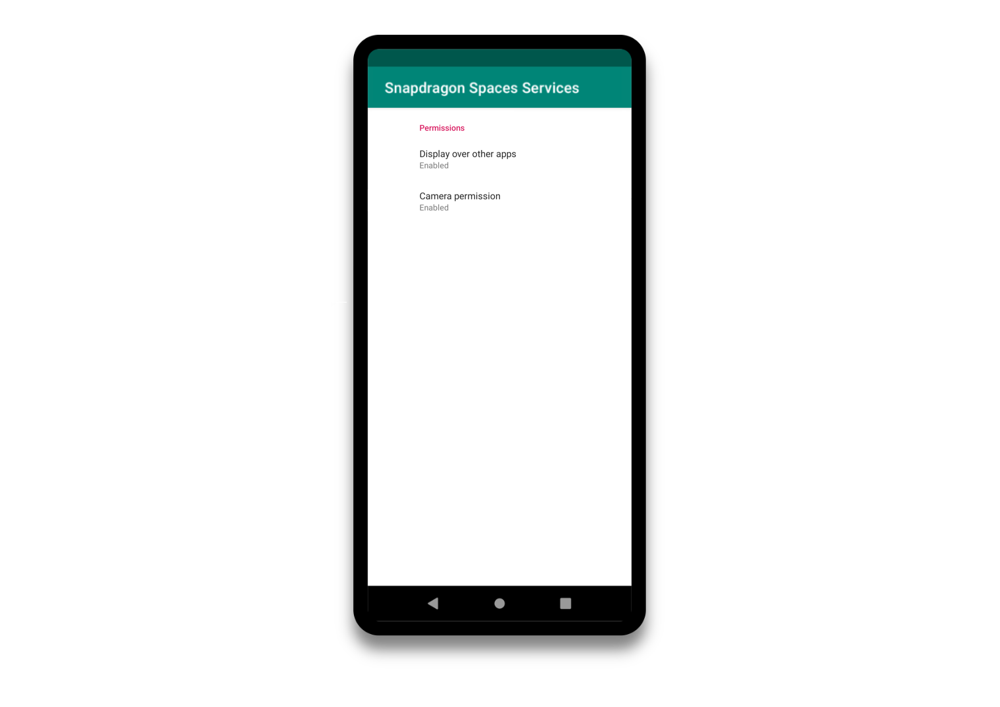
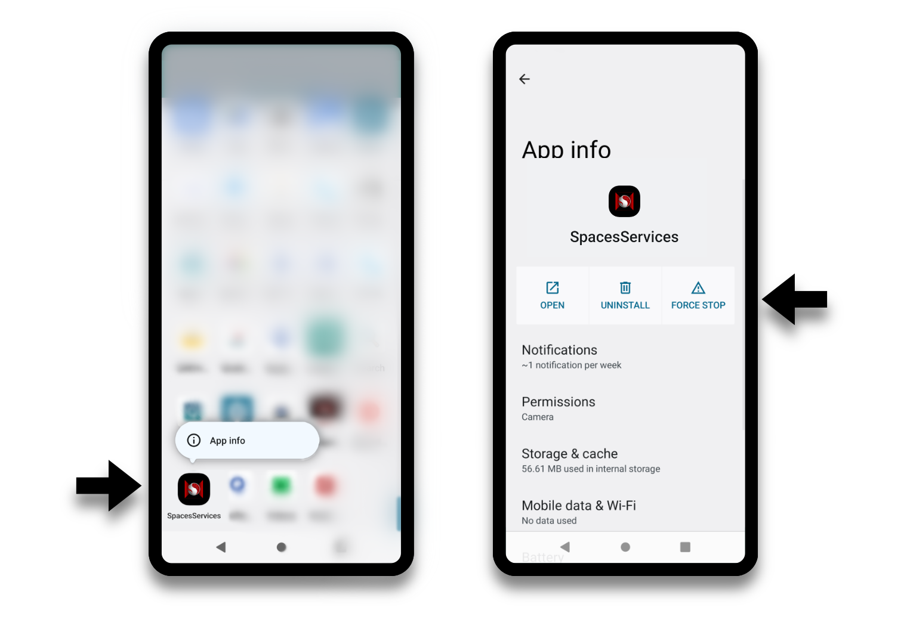

#  运行 Snapdragon Spaces 应用程序 - ThinkReality A3

Snapdragon Spaces SDK 开发者工具包中包含一个安卓服务应用程序，该程序能够在 A3 上运行、支持运行感知算法、支持与眼镜间的信息传输以及运行 OpenXR Runtime。

## 安装 Snapdragon Spaces Services

目前，Snapdragon Spaces Services APK 已包含在 SDK 下载中，后续将上架到各应用商店。这将是一个补充下载，可以在运行为 Snapdragon Spaces 设计的应用程序时进行拉取。

Snapdragon Spaces Services APK 目前与 SDK 中，供开发者使用，后续我们会将它上线至各大应用商店。应用上线后，当为 Snapdragon Spaces 设计的 APP 运行时，将会进行 Snapdragon Spaces Service 的补充下载。

目前开发者需要手动安装和设置 Snapdragon Spaces Services，请遵循以下步骤：

> **前提条件**
>
> 在继续进行此步骤之前，需要在计算机上安装 [Android debug bridge（ADB）](https://developer.android.com/studio/command-line/adb)。

- 设置移动设备以启用 [开发人员选项](https://developer.android.com/studio/debug/dev-options) 并启用 USB 调试。
  
- 将移动设备连接到计算机并授权 USB 调试。

- 从 [开发者门户](https://spaces.qualcomm.com/download-sdk) 下载可用的 SDK，并将其提取到本地文件夹中。
  
- 在提取的文件夹的顶层找到 Snapdragon Spaces Service 的 apk 文件，并通过 `adb install` 进行安装。

- 在子文件夹中找到 Sample apk，并使用 `adb install` 安装它们。

应用程序将在眼镜上启动，同时，“**Spaces 控制器**”（如下图所示）将在主机设备上启动。

## 设置 Snapdragon Spaces Services

您需对骁龙服务进行配置，以获得最佳开发者体验：

> 在安装、重新安装或更新 Snapdragon Spaces Service 后
> 
> 建议再次开启“在其他应用程序上显示”选项，即使该选项已经处于激活状态，以确保设备能够正常启用该功能。

> **提示**
在 Spaces 控制器的导航栏中，点击三条横线的图标会打开一个设置窗格，该窗格可调整触觉反馈和外观（例如明暗模式）。
> 

在我们提供的 Snapdragon Spaces 示例中，主机控制器（如上图所示）可用作激光控制器。触控板上的点击会映射为触发选择或点击事件，而点击 `菜单` 按钮，您可以在注视与设备指针之间进行切换。也可以通过旋转手柄来让设备指针引导“镭射激光”。底部的重置按钮，可用于重新调整设备的位置和方向，使其与头部姿势的前方向对齐。

## 验证应用程序启动

此步骤验证在完成上述配置 Snapdragon Spaces Services 的步骤后，设备是否已完全设置好提供的 Snapdragon Spaces 应用程序。

- 对于 A3 眼镜：确保眼镜已完全连接到手机并启动。应用程序可能会在眼镜上分屏显示，或者 ThinkReality 标志可能会出现在眼镜上。这两种情况都可以作为验证通过的情况。

- 在移动设备上，点击 **Snapdragon Spaces Sample** 应用程序的图标。

- 如果 **Snapdragon Spaces Services** 未正确安装或完全设置，请确保检查上面的 **安装Snapdragon Spaces Service** 的步骤。

- 在第一次运行应用程序时，可能会出现任何必要的权限弹出窗口。摄像头权限是某些感知跟踪功能（如平面检测、图像跟踪和手部跟踪）所必需的，因此需要允许使用这些权限。

- 在 Spaces Services 和权限检查完成后，控制器伴侣（Controller Companion）应用程序应立即出现在手机上，而主应用程序应在短暂延迟后出现在AR眼镜上。（这是由于运行时需要启动，可能需要几秒钟。）

- 验证 Sample 应用程序是否正常运行。

## 安装和运行 Spaces 应用

完成设备验证后，Spaces 应用程序现已准备好在设备上安装和测试。

- 使用 adb install 方式，从计算机安装应用程序
- 从 Google Play 等应用商店安装应用程序
- 使用 Unity 或虚幻引擎开发应用程序
- 从联想 UDC 客户端接收应用程序（需要按照硬件设置中注明的方式，由高通推送）

## 备注

以下是关于这些平台的额外说明：

> 升级 Snapdragon Spaces Services
>
> 当在设备上安装新版本的 Snapdragon Spaces Services 时，请重新启动手机，以确保清除任何残留物。如果出现任何不正常的行为，请尝试在 Snapdragon Spaces Services 应用程序中禁用和重新启用权限（相机、在其他应用程序上显示等）。
>

> 关于 ThinkReality A3 应用程序
>
> **ThinkReality A3 应用程序不是 Spaces 应用程序**
>
> 在 A3 眼镜上，请注意以下应用程序不是 Snapdragon Spaces 的一部分，而是另一个平台的一部分，称为 ThinkReality A3 平台。
> 
> - 联想 UDC
> - Companion
> - A3 Home
> - A3 Cast
> - Model Viewer（模型查看器）
>
> 有关 ThinkReality 的更多信息，请查看 [联想支持网站](https://support.lenovo.com/thinkreality)。请注意，您 *不需要** 联想 ID 或组织 ID 来设置设备，而是请参考 Spaces 门户上的 ThinkReality A3 设置。
>
> 此外，默认情况下，Companion 应用程序将自动启动。可以通过打开开发者模式来更改此行为。
>

> 关于从手机设备上拔下 A3 眼镜
>
> **在拔下 A3 眼镜之前关闭正在运行的 Spaces 应用程序**
> 
> 建议在拔下 A3 眼镜之前，关闭或强制停止所有 Spaces 应用程序。如果在 Spaces 应用程序运行时断开眼镜连接，将需要重新启动手机才能正确运行 OpenXR 应用程序。为了获得最佳的开发者体验，请按照应用程序关闭中的步骤操作。

## 应用程序关闭

因为应用程序主要在查看器上启动运行，所以它不会显示在安卓系统的多任务视图/最近的应用程序列表中，在应用程序此时应当关闭的情况下，这种结果并不理想。对于如期关闭应用程序的情形，`Snapdragon Spaces` Unity 开发工具包的示例展示了两种不同的方式：

要关闭 Snapdragon Spaces Unity 或虚幻引擎 Sample 应用程序，可以通过以下操作：

- 长按主机控制器的菜单按钮 2 秒钟（在 `SampleController.cs` 脚本中实现）。
- 在眼镜中，瞄准主菜单场景中的 **退出** 按钮并点击它

对于不提供退出功能的应用程序，可以使用 Android 中的 [强制停止](#应用程序强制停止) 功能将应用程序关闭，该功能在下一节中介绍。

## 应用程序强制停止

由于大多数 Spaces 应用程序是通过在 Viewer 上启动活动来运行的（请参阅 [架构](./../architecture/CustomLauncher.md)），因此通过传统方式，在系统中优雅地关闭正在运行的应用程序的方式并不可用。因此，Spaces 应用程序应处理应用程序内 UI 以关闭应用程序。如果没有实现或不可用该 UI，则需要手动关闭应用程序。

可以通过在应用程序启动器中长按应用程序图标，直到出现显示 `应用程序信息` 的上下文菜单为止。打开应用程序信息视图后，可以通过点击 `强制停止` 按钮来停止应用程序。

> **强制停止应用程序后，可能需要重新启动手机**
>
> 请注意，强制停止应用程序不会发送关闭信号给应用程序，而是立即终止应用程序，因此 Sockets 可能会保持打开状态并超时，某些感知功能可能会由于应用程序突然退出而无法正常工作。因此，任何在后续启动中出现的意外行为都可以通过重新启动手机来纠正。

## 故障排除

如果您在运行硬件或应用程序时遇到问题，请查看本节中可能遇到的一些常见问题。

> **检查您的设置**
>
> 如果您在运行硬件或应用程序时遇到问题，请查看本节中可能遇到的一些常见问题。
> 
> 请确保您按照最新版本的硬件设置和相应的引擎设置指南操作：
>
> - [设置手机和眼镜的过程](./ThinkRealityA3Setup.md)
> - [开始使用 Unity 的Snapdragon Spaces SDK](./../Unity/SetupGuideUnity.md) 
> - [开始使用虚幻引擎的Snapdragon Spaces SDK](./../unreal/SetupGuideUE.md)

| 症状 | 在重启后多次无法运行应用程序 |
| --- | --- |
| 表现 | Snapdragon Spaces Services 应用程序偶尔无法正确关闭，从而无法使下一个应用程序初始化 |
| 解决方案 | [强制停止](#应用程序强制停止) 任何使用 Snapdragon Spaces Services 的应用程序，然后重试。您可能还需要强制停止 Snapdragon Spaces Services 应用程序。如果失败，请尝试重新启动手机。|

| 症状 | 应用程序不能正常运行 |
| --- | --- |
| 表现 | 您已经插上并启动眼镜，但当您选择应用程序并运行它时，您会看到以下情况之一：1）应用程序无法运行 2）应用显示在手机上 3）弹出警告消息 4）黑屏 |
| 解决方案 | 这表明 Spaces Services 未运行或与您的设备不兼容。检查您正在运行的版本（手机和眼镜），并确保它们是最新的版本。尝试运行 SDK Sample 应用程序以验证设备上的设置。|

| 症状 | 插上眼镜后，看不到任何东西 |
| --- | --- |
| 表现 | 您似乎无法让眼镜工作 |
| 解决方案 | 尝试拔下并重新插入眼镜。如果这样不起作用，请断开连接眼镜并运行伴侣应用程序。它会提示您插入眼镜。插入眼镜。大约 15-30 秒后，它应该显示眼镜已连接。如果失败，请尝试将 USB 电缆反向翻转。如果仍然失败，请尝试重新启动手机。如果仍然失败，请在 [支持论坛](http://support.spaces.qualcomm.com/support/home/) 上寻求帮助（目前需要前往英文论坛）。|

如果您遇到以上技术均无法解决的问题，请尝试以下操作：

1. 从手机上拔下眼镜。
2. 确保手机电量充足。
3. 重新启动手机，等待其完成引导。
4. 插入眼镜，等待它们完成引导 - 大约 15 秒钟，直到看到 ThinkReality 标志。
5. 尝试使用提供的 Spaces 应用程序，例如从 SDK 下载的 Sample。
6. 如果这样可以正常运行，请退出示例应用程序并启动您自己的应用程序。
7. 如果您仍然遇到问题，请联系 [支持论坛](http://support.spaces.qualcomm.com/support/home/) 寻求更多帮助。