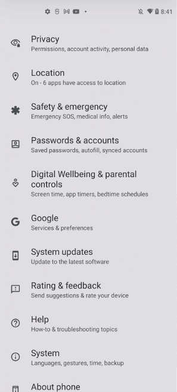
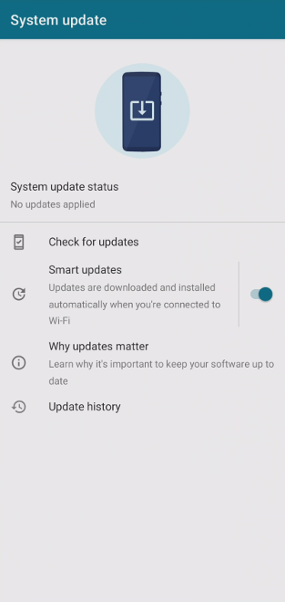
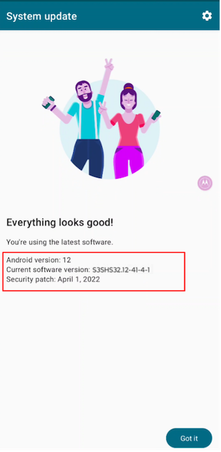
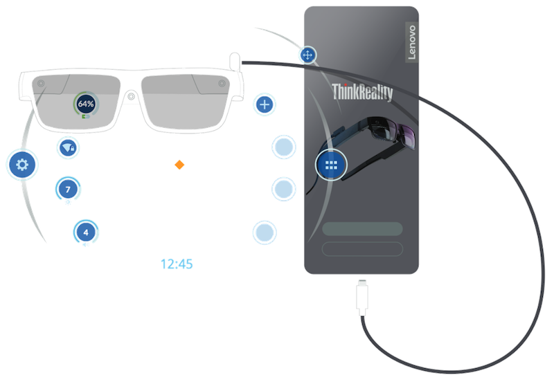
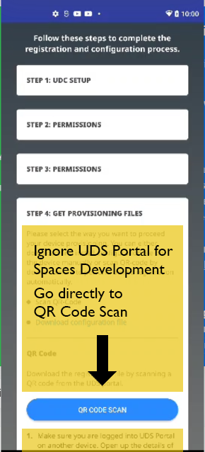
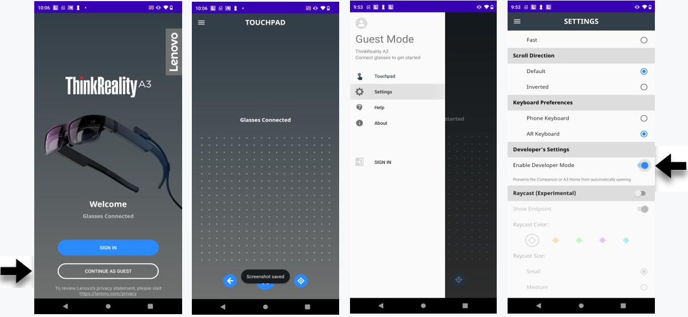

# 联想 ThinkReality A3 开发套件

该指南适用于连接到摩托罗拉 edge 30 pro 和摩托罗拉 edge+ 手机的联想 ThinkReality A3 AR 眼镜。

首次使用 A3 套件前，您需将摩托罗拉 Edge 30 Pro（摩托罗拉 Edge+）升级到最新版本，且需从联想 ThinkReality Cloud 中安装几个必要的应用程序。这些应用程序将在手机注册到 ThinkReality Cloud 后自动进行安装。最后，还需进行眼镜固件升级；眼镜固件将会在以下步骤完成后，进行自动安装。

## 第一步：开箱并进行手机设置

按照标准的安卓步骤进行手机设置，将手机连接到可访问互联网的 Wi-Fi 网络。

## 第二步：下载所有系统更新

手机设置完成后，请查看 `设置 -> 系统更新 -> 检查更新` ，确保必要更新已进行下载并完成安装。手机系统软件的最低可运行版本为 `S3SH32.12-41-4.` .

> **注意**
因不同地区可用的手机型号版本差异，实际的手机系统版本会略有不同。
手机图像：
S1SH32.55-78-**8** （摩托罗拉 edge 30 pro）或
S1SH32.55-78-**10** （摩托罗拉 edge+）
> 

## 第三步：链接 A3 眼镜和摩托罗拉手机

将 USB Type-C 数据线的一端插入摩托罗拉手机充电口。接下来，将数据线的另一端插入 A3 设备的数据线接口。

## 第四步：启动 Lenovo Universal Device Client（UDC）应用程序

A3 眼镜首次连接到摩托罗拉手机时，将自动启用并启动 **UDC** 应用程序。

> **警告**
> 
> **不要** 从 **Google Play 商店** 中下载 Lenovo UDC App，这个版本中不包括 Snapdragon Spaces 开发组件。
> 

> **注意**
> 
> UDC 应用启用后，请断开与 A3 眼镜的连接。在后续设置过程中接收其他眼镜固件更新时，再与 A3 眼镜进行重连。
> 

## 第五步：接受 UDC 条款和权限（应用程序中的步骤 1、2 和 3）

## 第六步：扫描下方二维码，注册您的摩托罗拉手机

您可通过扫描下方二维码来注册您的摩托罗拉手机：

> **注意**
> 
> 如果注册时出现错误，可能是因为该设备以前注册过，您需从后端门户清除您的序列号。
>
> 如若如此，请前往 [https://spaces.qualcomm.com/settings/](https://spaces.qualcomm.com/settings/)，必要情况下请先登录。按照 `手机序列号` 部分下的说明进行操作，并选择“清除我的注册”，提交您的序列号以进行清除。后端处理完成后，将发送一封电子邮件来确认清除状况，届时需重复步骤，重新提交序列号。
> 

## 第七步：接受应用程序安装提示

注册后，以下应用程序将自动安装在您的摩托罗拉手机上。部分地区的应用程序名称会与下列名称有所出入。

- A3 Home
- Companion
- App Space 服务
- Mobile App Launcher
- AR Cast

> **注意**
确保接受摩托罗拉手机上的全部应用安装请求。此外，部分应用会请求 `在其他应用之上显示` 。这些应用是联想 ThinkReality 套件的一部分，不会用于 Snapdragon Spaces 的实际开发，但我们推荐在一般情况下使用设备时，同意这些应用的请求。

还有一些连接 ThinkReality 时的步骤，比如连接眼镜时提示自动打开“伴侣”应用程序、完成眼镜的“新手教程”。再次声明，（当前）这些应用仅关联 ThinkReality 平台，该平台完全独立于 Snapdragon Spaces 平台，同时（目前）在该设备上并存。

点此可查看 ThinkReality 应用程序视频教程：**[https://support.lenovo.com/us/en/videos/nvid500337](https://support.lenovo.com/us/en/videos/nvid500337)**

## 第八步：完成全部 A3 眼镜的固件更新

如果 A3 眼镜有可用的固件更新，更新将自动应用至摩托罗拉手机，并自动安装在 A3 眼镜上。查看摩托罗拉手机的安卓通知栏，可以看到 A3 上的安装进度。固件安装期间，眼镜需与手机保持连接，更新完成后将自动重启。

为了获得最新的眼镜固件，可能需要依次安装多个更新。每当更新完成时，眼镜将断开连接，联想 UDC 的屏幕将报告“眼镜未连接”，需要手动拔掉并重新插上，以进行下一个固件的迭代更新。重新插上眼镜后，点击“检查更新”以重复该过程，直到完成为止。

眼镜固件以其原始格式显示在 Lenovo Universal Device Client（UDC）应用程序的底部。请注意，为了显示眼镜版本，眼镜必须插入并完全连接。

> **注意**
> 
> 随着固件更新随时间推出，正确的 A3 眼镜固件可能略有不同。此框表示最低可用的 A3 固件版本，以便进行后续操作。请注意，需要查找的关键版本是 S1040，而不是较低版本，如 D983、D914等。
>
> 当前最低固件版本：A3_user_S1040001_2208180059_sdm710_postcs8
> 

## 可选步骤：打开开发者模式

我们强烈推荐您做这一 **可选** 步骤。ThinkReality A3 与摩托罗拉手机连接后，它将自动启动联想伴侣应用程序。要禁用这一功能：

- 打开 “Companion” 应用
- 选择 “以访客身份继续”
- 点击左上角三条横线图标，拉出侧边栏菜单
- 选择 “设置”
- 向下滑动，在 “开发者设置” 标题下，切换滑块 “启用开发者模式”
- ThinkReality A3 与摩托罗拉手机连接后，“Companion” 应用将不会再自动启动

## 第九步：Spaces 软件设置

开发者需要按照 [在 A3 运行应用程序](./LaunchingSpacesAppsA3.md) 中的指示，通过从其各自的 SDK 下载文件，并使用 Android 开发工具安装（例如 adb install 方式）Snapdragon Spaces Services APK，以及 Unity 或 Unreal Sample。

> **非开发人员：提供手机序列号**
>
> 建议下载 Android 开发工具，以便安装Snapdragon Spaces Services 和 Sample APK。对于没有开发团队或开发工具访问权限的用户，这些 APK 可以通过各种手动方式安装。
>
> 要使用此方法，请按照以下步骤提交设备序列号：
>
> 前往 https://spaces.qualcomm.com/settings/
>
> 按照“手机序列号”部分下的说明，并选择“管理我的设备”。
>
> 审核和处理完成后，您将通过电子邮件收到通知。

## 完成设置

联想 ThinkReality A3 现已准备就绪。

