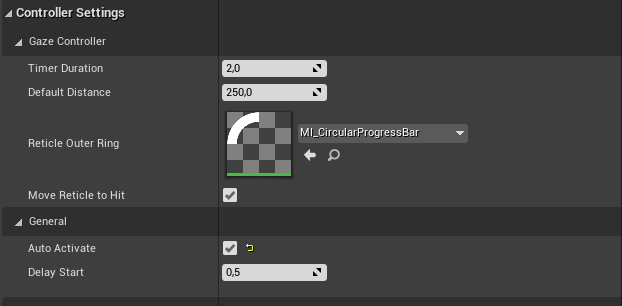
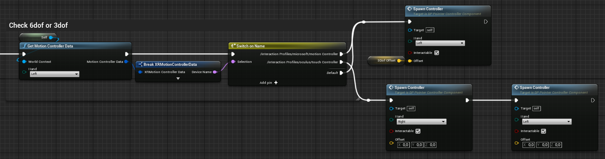
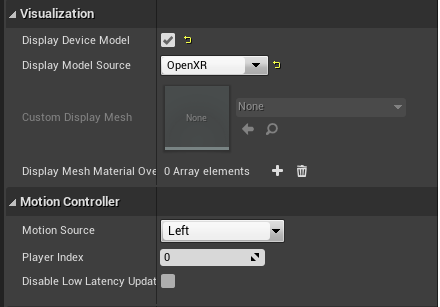

# 交互

## 控制器蓝图（Controller blueprints）

不同控制器的实现是在组件中完成的，以便在 Actor 中轻松扩展或替换。

父组件类 `BP_ControllerComponent` （位于  `Content > SnapdragonSpaces > Common > Core > Components`）具有注视和指针控制器的访问权限。该蓝图还建立了管理交互的基础，还包括一些在所有派生控制器（derived controllers）中，可以由开发人员进行自定义的选项。

- **自动激活（Auto Activate）**：用与指示控制器是否默认启用。
- **延迟启动（Delay Start）**：应用程序启动或加载新地图时，应经过多长时间才能启用交互。
- **标签组件（Tag Component）**：父组件（来自 pawn 角色）上的标签名称，以供稍后从控制器组件实现中引用。

与控制器组件交互或创建自己的子控制器组件时，需考虑以下功能：

- **开始（Start）**：此事件仅应在初始化控制器时调用一次，不支持覆盖。最好从 `Begin Play` 节点开始。
- **开始实现（Start_Implementation）**：此函数包含每个子组件的特定初始化。
- **设置默认控制器（Set Default Controller）**：配置组件是否在初始化后激活。因此，只有在 `Start` 函数之前调用才有用。
- **启用（Enable）**：启用组件。
- **禁用（Disable）**：禁用组件。
- **判断启用（Is Enable）**：返回组件是否已启用。
- **按下/释放按钮（Press/Release Button）**：使用 `Widget Interaction Component` 管理按钮交互。
- **Is Over Interactable Widget**：返回 `Widget Interaction Component` 是否指向一个 widget。

> **提示**
> 
> XR 项目控制器的关键元素是 `Widget Interaction Component`。我们的组件或派生应该只根据控制器类型建立交互规则。有关此组件的基本信息，请参阅 [虚幻引擎文档](https://docs.unrealengine.com/4.26/en-US/API/Runtime/UMG/Components/UWidgetInteractionComponent/)。

### 凝视控制器（Gaze Controller）

注视控制器 `BP_GazeControllerComponent` （位于 `Content > SnapdragonSpaces > Common > Core > Components` ）负责管理射线检测、与场景中的各 widget Actor 进行交互以及指针（pointer）的延迟交互功能和“点击”功能。

> **注视射线的局限性**
> 
> 目前，注视射线只能与场景中的 Widget Actor 进行交互，而射线控制器可以与 Widget 和 3D Actor 进行交互。

开发人员可以对部分选项进行自定义，例如：

- **移动准星并击中（Move Reticle Hit）：** 该布尔值启用后，用户看交互式 Actor 的时候，准星移动到 Actor 的交互位置。
- **计时器持续时间（Timer Duration）：** 
- **默认距离（Default Distance）：** 当 **bMoveReticleToHit** 处于激活状态时，该项能够设置注视控制器绘制的距离。
- **垂直偏差（Vertical Bias）**: 准星的垂直位置，0 表示屏幕中心，1 表示屏幕顶部，-1 表示屏幕底部。
- **准星外环（Reticle Outer Ring）**: 外环准星的材质，如果为 `NULL` 则假定外环被禁用。

最后，在准星组件示例中，用于指向世界的准星由作为静态网格组件（Static Mesh Component）的两个平面组成：其中一个带有内环的静态材质（`MI_Reticle_Inner`），另一个使用外环的动态材质（`MI_Reticle_Outer`）。这个动态材质对一个参数（**Percentage**）进行定义，以完成准星交互的视觉效果。此外，（组件蓝图中）`升级准星位置` （`Update Reticle Position`）函数使用外部纹理作为与准星相关组件的父级，并以此在交互命中时进行移动。该组件使用 **组件标签（Component Tags）**（*gaze, gaze_outerring, gaze_parent*) 来对每个纹理进行区分。

### 指针控制器（Pointer Controller）

指针控制器的主要行为是在 `BP_指针控制器组件` （`BP_PointerControllerComponent`）中实现的（位于`Content > SnapdragonSpaces > Common > Core > Components`）。其基本工作原理与其他控制器相同，但初始化（initialization）还会对其是否在支持 3DoF 或 6DoF 的设备上使用来进行管理。使用微软交互配置文件的控制器将自动启用为 3DoF 控制器，而使用 Oculus 交互配置文件的控制器将在 `Motion Controller Component` （`动作控制器组件`）中自动启用为 6DoF 控制器。

请注意，在使用 3DoF 时，所选手必须为 *左手*。使用 6DoF 时，所选手可以是 *左手* 或 *右手* ，具体选取哪只手取决于控制器设计的是哪只手。此外，开发人员还可以选择用哪个控制器来处理交互。

**产生控制器（Spawn Controller）** 函数会生成一个 `BP_PointerController` 类的子对象，并将其设置为 **Motion Controller Class（动作控制器类）** 变量。

`BP_PointerController` actor（位于 `Content > SnapdragonSpaces > Common > Placeable`）已准备好管理每个单独的控制器。

`Motion Controller Component`（`动作控制器组件`）作为根组件的子组件，添加在此以管理每个控制器。该组件的 `Visualization` （`可视化`）部分允许在虚拟世界中渲染一个 3D 模型，只需启用 **Display Device Model（展示设备模型）** 选项即可跟随现实世界中的控制器进行移动。此外，如果开发人员希望根据配置文件来显示每个设备的默认网格，则必须在 **Display Model Source（展示模型来源）** 选项中选择 **OpenXR** 。否则，开发人员可以选择 **自定义（Custom）** 以对其进行自定义，并在 **自定义展示网格（Custom Display Mesh）** 中添加网格。最后，在 `Motion Controller` （`动作控制器`）部分，开发者应该对输入类型进行分配。

只有启用交互时，`Motion Controller` 必须附加 `Widget Interaction Component` 以正确跟踪控制器在真实世界的移动，并附加一个 `Static Mesh Component` （`静态网格组件`）（在示例中称为 *激光指针网格 （Laser Pointer Mesh）*）以将指针可视化。无论是否进行交互，只要使用 6DoF 设备，父组件都需要附加一个 `子 Actor 组件`，使用 `BP_XRControllerRepresentation`（位于 `Content > SnapdragonSpaces > Common > Placeable`）来显示控制器及其动画。

## 手部跟踪控制器

手部跟踪控制器 `BP_HandTrackingControllerComponent`（位于 `Content > SnapdragonSpaces > Common > Core > Components` 下）负责生成和启用使用手部跟踪远程交互所需的 actor。这些 actor 将自动处理交互。仅当位于 `Project Settings > Snapdragon Spaces plugin` 下的 Hand Tracking 功能处于活动状态时，此控制器才会处于活动状态。该控制器将允许在场景中进行 widget actor 和手部跟踪可交互 actor 的交互。有关手部跟踪交互如何工作的更多信息，请查看 [手部跟踪示例](./samples/HandTrackingSample.md)。

> **手部跟踪控制器的限制**
> 
> 目前，手部跟踪交互无法在虚幻引擎编辑器中使用。

## 输入方式

用作输入行为的按钮：

|  | 主机控制器（Host Controller） | XR 右控制器（XR Controller Right） | XR 左控制器（XR Controller Left） |
| --- | --- | --- | --- |
| **选择（Select）**  | 轻点触控板 | 右扳机按钮 | 左扳机按钮 |
| **凝视/射线切换（Gaze/Pointer switch）** | 菜单按钮 | 无 | 左菜单按钮 |
| **触控板（Touchpad）** | 触控板 | 无 | 左摇杆 |
| **锚点位置确认（Anchor Position Confirmation）** | 轻触触板 | 任意扳机按钮 | 任意扳机按钮 |

## UI

您必须使用蓝图 `BP_3DWidget` （位于 `Content > Snapdragon > Common > UI`）以在世界中创建 3D Widget，并在 WidgetComponent 中定义 UI。注视或指针控制器必须是此类的子类，才能进行使用。
