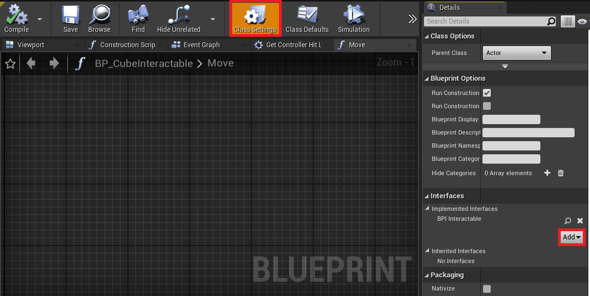
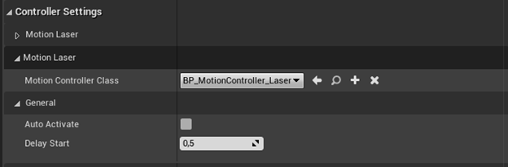
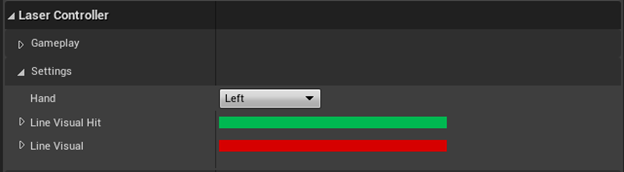

# 交互示例

此示例演示了如何在世界空间中与 3D 对象和 2D UI 进行交互。

## 示例原理

该示例演示了如何与场景中的 UI 和其他游戏对象进行交互。

浮动的 UI 面板提供了常见的 UI 元素供交互，例如按钮和滚动条。虽然按钮可以使用注视指针和设备指针一起使用，但示例中的滚动条只能使用设备指针。此外，场景中的另一个 UI 元素展示了来自主机控制器的触摸板的输入。

最后，可以使用控制器抓取交互式立方体对象，以演示 3D 对象交互。为使其成为有效的交互式 actor，它需要具有与 3DWidget 频道重叠或阻挡的碰撞，以及`BPI_Interactable`（位于 `Content > Snapdragon > Common > Placeable`）接口。要向 actor 添加接口，请转到 `Class Settings > Interfaces > Implemented Interfaces > Add` 在蓝图选项中添加。

## 设备指针控制器

设备指针控制器的实现在多个蓝图中分开描述，下面的章节中详细介绍了这些蓝图。

### 指针控制器组件

`BP_PointerControllerComponent` 蓝图文件（位于 `Content > SnapdragonSpaces > Common > Core > Components` 下）可以添加到 Pawn 类中，以使用指针与2D UI和3D进行交互。

该组件继承自父类 `BP_ControllerComponent`（请参见 [场景设置](./SceneSetup.md)），并脚本化了管理与世界进行交互的基础。唯一可自定义的选项是 **Motion Controller Class**，它指的是在激活此控制器时将生成的 actor 类。

### 指针控制器

`BP_PointerController` 蓝图文件（位于 `Content > SnapdragonSpaces > Common > Placeable` 下）管理与 widget 和 3D actor进行射线投射和交互。它使用了一个自定义的 Trace Channel，称为 **3DWidget**。最后，为了可视化设备指针控制器，从控制器原点沿控制器的前向方向渲染了一个圆柱体网格。默认情况下，它是红色的，但一旦它命中有效的交互对象，它将改变颜色为绿色。此外，通过将射线命中点作为其结束点来调整可视化的长度。

