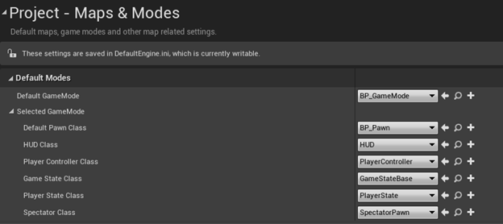
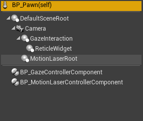
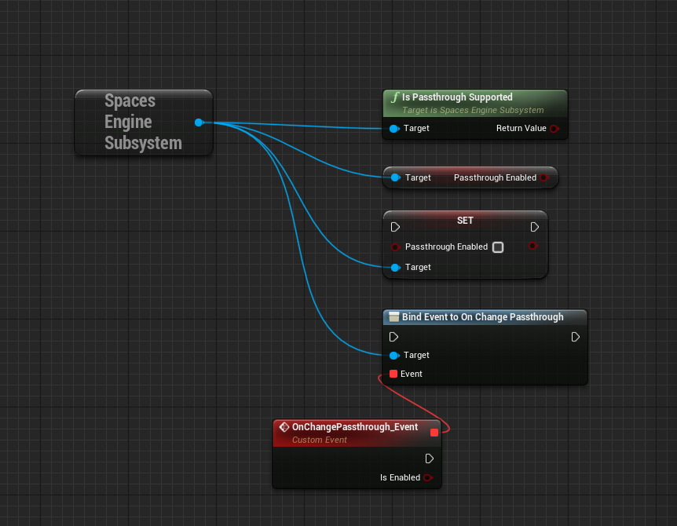

# 场景设置

> **警告**
>
> 本指南默认读者已经具备在虚幻引擎中进行 XR 开发的知识。如需更详细的概述，请访问 [虚幻引擎官方文档：XR 开发](https://docs.unrealengine.com/4.26/zh-CN/SharingAndReleasing/XRDevelopment/)。

Snapdragon Spaces 示例包含用于常见 AR 用例的即用（ready-to-use）蓝图。

## 核心蓝图

这些蓝图是我们项目的基础，已为在 AR 环境中使用做好了准备。

`BP_GameMode` 对体验的规则进行了定义（位于 `Content > SnapdragonSpaces > Common > Core`）。目前，它仅将默认 pawn 类设置为自定义 `BP_Pawn`。为了避免为每个地图对齐进行自定义，请转到 `Project Settings > Maps & Modes` 并覆盖 **Default GameMode**。

在虚幻引擎中，Pawn 是用户的物理展现，对用户如何与世界交互进行定义。自定义的 `BP_Pawn` （位于 `Content > SnapdragonSpaces > Common > Core` ）可与注视或 3DoF 控制器一起使用进行交互。此外，它还包括这些交互控制器的实现，以便在编辑器中进行测试。

`D_ARSessionConfig`（位于 `Content/SnapdragonSpaces/Common/Core`）定义了 AR 会话中使用的功能。有关此资产的基本信息，请参阅[虚幻引擎官方文档：
UARSessionConfig](https://docs.unrealengine.com/5.0/en-US/API/Runtime/AugmentedReality/UARSessionConfig/)。目前，*BP_Pawn* 定义了我们在演示中使用的会话配置。

## 透视（仅适用于 MR 设备）

**[透视](https://registry.khronos.org/OpenXR/specs/1.0/html/xrspec.html#environment_blend_mode)（Passthrough）** 是指将物理环境作为图像呈现在 VR 设备中的可能性。它可以通过一个附加到主菜单的 **透视** 复选框以启用或禁用。如果设备支持 **透视**，则用户将看到该 Widget 的激活状态。在 `BP_MainMenuWidget` 蓝图中的 `BeginPlay` 中进行检查，使用新函数 `IsPassthroughSupported()`从 `SpacesEngineSubsystem` 中检索 `bool` 值以确定是否支持 **透视**。

复选框 `WBP_Passthrough` 调用 `SpacesEngineSubsystem` 中的函数 `SetPassthroughEnabled(bool)`，该函数将设置 `bPassthroughEnabled` 的新值，从而使用户能够查看或隐藏物理环境图像。另一种调用 `SetPassthroughEnabled(bool)` 的方法是使用输入 `SwitchPassthrough`（`切换透视` ），该输入绑定到 `XRController(L) X`和 `XRController(R) A`。

可以随时使用 `GetPassthroughEnabled()` 访问 `bPassthroughEnabled` 的值，或者通过委托 `OnChangePassthrough` 在其更改时进行绑定。

