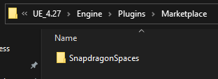
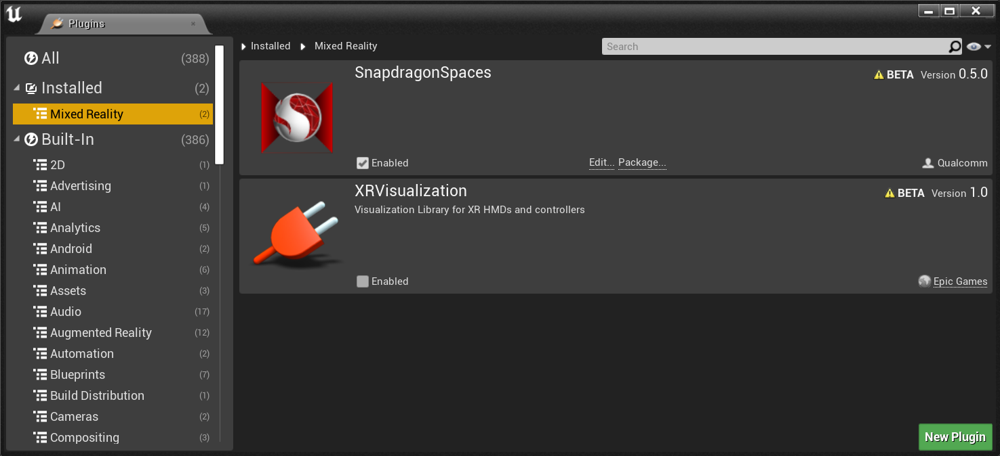
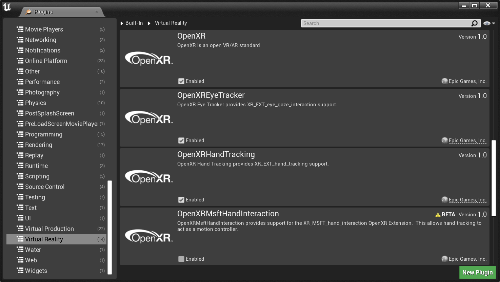
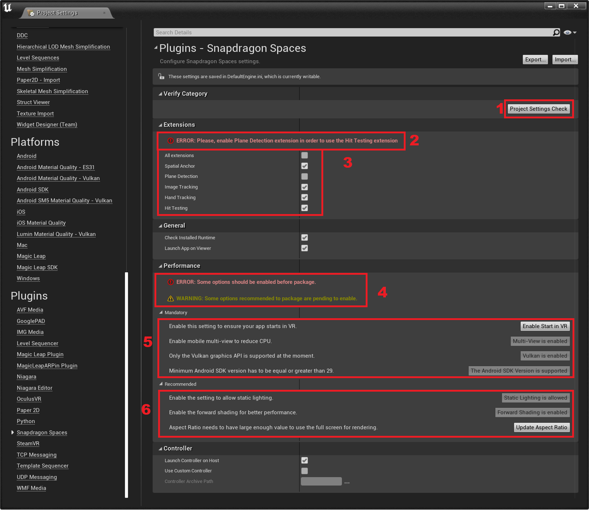

# 虚幻引擎设置指南

本指南将详细说明如何在虚幻引擎中使用 Snapdragon Spaces SDK 开始工作。

## 前提条件

请注意，Snapdragon Spaces SDK 目前支持虚幻引擎编辑器（Editor） **4.27** 版本和 Windows 作为开发平台。然而，该插件不支持虚幻引擎 5，并且虚幻编辑器（Unreal Editor）中的 OpenXR 仅支持 `Win64`。

安装虚幻引擎时必须添加安卓构建支持（Android Build Support）才能导出 .apk 文件。请按照 [虚幻引擎官方文档：设置虚幻的 Android SDK 和 NDK](https://docs.unrealengine.com/4.27/en-US/SharingAndReleasing/Mobile/Android/Setup/AndroidStudio/) 对 Android SDK 和 NDK 进行设置。

## 步骤 1：创建项目

要创建新的虚幻引擎项目，请按照 [虚幻引擎官方文档：Setting Up a New AR Project](https://docs.unrealengine.com/4.27/en-US/SharingAndReleasing/XRDevelopment/OpenXR/XRSharedExperiences/ARPins/SettingUpANewARProject/) 文章中的 `Setting Up a Blank Project`（`设置空白项目`）步骤进行操作。如果您正在导入我们的示例，请忽略 `Adding a Pawn and Game Mode`（ `添加 Pawn 和游戏模式` ）和 `Creating an AR Session`（`创建 AR 会话`）部分。

## 步骤 2：导入插件

要将 Snapdragon Spaces 插件导入到引擎中，只需从`SnapdragonSpaces_Plugin` 归档文件中提取 `SnapdragonSpaces` 文件夹，并将其复制到引擎安装路径中的 `Engine/Plugins/Marketplace` 文件夹中。

>**警告**
>
>如果您未在引擎中创建 `Marketplace` 文件夹，您可以在 `Plugins` 文件夹内进行创建，然后复制到 `SnapdragonSpaces` 文件夹。请注意，虚幻引擎仅会在遵守建议的路径处检测得到该插件。

## 步骤 3：导入示例

要将 Snapdragon Spaces 示例导入您的项目中，只需打开 *Snapdragon Spaces_示例（SnapdragonSpaces_Samples）* 压缩文件并将 `Config` 和 `Content` 文件夹复制到您项目的根目录下，**覆盖您现有的文件**。Content 子文件夹包括示例文件夹以及一个 common 文件夹。公共文件夹包含使用 AR 设备的基本蓝图。

## 步骤 4：更改项目设置

要启用 Snapdragon Spaces OpenXR 插件，请转到项目设置下的 `编辑 > 插件 > 混合现实` （ `Edit > Plugins > Mixed Reality` ）并启用 **SnapdragonSpaces** 插件。

再到 `编辑 > 插件 > 虚拟现实` （ `Edit > Plugins > Virtual Reality` 下，检查是否启用了 **OpenXR** 插件。

构建软件包有一些设置是强制要求的。请检查您的项目是否在 `Project Settings > Snapdragon Spaces` 下进行了正确配置。

以下是屏幕截图中各点的描述：

1. 刷新设置验证。请在应用此选项卡中的更改后再执行此操作。
2. 在启用的扩展出现问题时，显示错误消息。
3. 展示可以启用的扩展。
4. 展示项目设置中的错误和警告消息。
5. 展示强制要求的设置。您必须在这些选项都启用后才能继续进行构建。
6. 展示推荐设置以获得更佳性能。

## 可选项：自定义控制器设置

通过使用 Snapdragon Spaces 虚幻引擎插件，您可以在应用程序启动时在主机设备上生成控制器。该功能在插件设置中默认启用，位于 `编辑 > 项目设置 > 插件 > Snapdragon Spaces` （ `Edit > Project Settings > Plugins > Snapdragon Spaces` ）（通过单击齿轮）。

如果您想要自定义外观和功能都略有不同的控制器，可以按照 [**自定义控制器部分**](./../designux/CustomControllerProject.md) 中描述的步骤进行构建以替代控制器存档。

这些步骤的结果存档可以链接到项目设置中。必须启用 **使用自定义控制器（Use Custom Controller）** 开关（这也需要启用 **Launch Controller On Host** 选项），以用于选择替代控制器存档的路径。

## 可选项：添加新的交互配置文件

如果您不想使用 Snapdragon Spaces 插件中包含的配置文件，而要使用并创建一个新的交互配置文件，您可以创建一个新的类（class）。该类可以继承 `IModuleInterface` 和 `IOpenXRExtensionPlugin` 接口，并实现 `StartupModule` （`启动模块`）、`ShutdownModule` （`关闭模块`）、`GetDisplayName` （`获取展示名称`）和 `GetInteractionProfile` （`获取交互配置文件`）函数。在 `启动模块` 中必须创建必要的键，在 `获取交互配置文件` 中必须配置所需的交互配置文件，您可以参考我们的 `FSpacesInputExtension` 类中的实现方式。确保这个新模块在 `PostConfigInit` 加载阶段完成加载。最后，您可以使用在上一个类中创建的键（keys）来创建所需的操作和轴映射，并在项目中使用输入。
