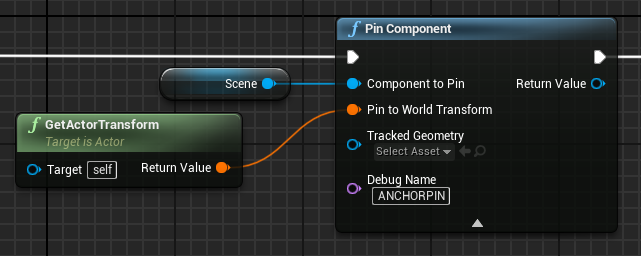

# 锚点示例

**锚点（Anchor）** 示例演示了如何创建和销毁本地和保存的锚点，以对现实世界中的点进行精确跟踪。有关 [锚点和虚幻引擎 ARPin 的基本信息](https://docs.unrealengine.com/4.27/zh-CN/SharingAndReleasing/XRDevelopment/OpenXR/XRSharedExperiences/ARPins/ArpinOverview/)，并参阅文档了解 [ARPin 本地储存（ARPin Local Storage）](https://docs.unrealengine.com/4.27/zh-CN/SharingAndReleasing/XRDevelopment/OpenXR/XRSharedExperiences/ARPins/ArpinQuickStartGuide/) 的工作原理。

使用此功能，必须先打开 `Project Settings > Snapdragon Spaces plugin`，找到 OpenXR 插件设置并启用该功能。

# **示例的工作原理**

在默认情况下打开样本，一个白色的 gizmo 会出现在相机前方 1 米处，但如果在相机前方检测到命中，则 gizmo 将变为黄色，并放置在命中位置。在此示例中，用户有两种方法将 gizmo 放置在当前位置：通过在控制器上点击选择，或使用启用注视控制器（gaze controller）时出现的浮动的 UI **创建按钮**。

放置 gizmo 时，会出现一个简单的白色  gizmo，表示它既不是 ARPin，也没有被跟踪。一旦底层功能（underlying feature）报告了任何一个跟踪锚点，就会出现红色、绿色和蓝色的 gizmo，也会同时在对象上附加一个 ARPin。如果跟踪的 gizmo 不再跟踪，或 ARPin 创建失败，gizmo 将变为红色。如果将锚点保存到本地锚点存储（local anchor store）中，gizmo 中心将出现一个立方体网格组件。

用户在此示例中可用的选项包括：

- **销毁所有锚点（Destroy all anchors）**：一个按钮，用于删除在世界中放置的所有本地 gizmo。此操作不会销毁存储中保存的锚点。
- **加载所有已保存的锚点（Load all saved anchors）**：一个按钮，用于加载所有已保存的锚点，并显示为放置在世界中的本地 gizmo。
- **清除存储（Clear store）**：一个按钮，用于从存储中删除所有已保存的锚点。此操作不会清除放置在世界中的本地 gizmo。
- **将创建的锚点保存到本地存储中（Save created anchor to local store）**：一个复选框，用于创建时将本地 gizmo 保存为已保存的锚点。

### 锚点管理器

`BP_AnchorManager` 蓝图文件位于 `Content > SnapdragonSpaces > Samples > Anchor > Placeable`，集中了创建和销毁 gizmo 的操作。该蓝图将来自 pawn 的事件绑定到与示例交互的控制器上（这种情况下，是控制器上的点按（tap）选择）。此外，在 `BP_Pawn` 中添加了一个场景组件（SceneComponent） 作为未放置的 gizmo 的根。开发人员可以自定义未放置的 gizmo 的部分选项，例如：

- **锚点标签（AnchorTag）**：在 **`BP_Pawn`** 中定义到场景组件中的标签名称，用作未放置的 gizmo 的根。
- **DistanceGizmo**：未放置的 gizmo 到相机的距离。

要放置 gizmo，管理器会将 gizmo 从根分离，并对其进行变换以创建 ARPin gizmo。

此外，您还可以学习如何将锚点实现（anchor implementation）与命中测试在 `Update Hit` 函数中结合到一起。

### Gizmo

`BP_Gizmo` 蓝图文件（位于 `Content > SnapdragonSpaces > Samples > Anchor > Placeable` 下）负责创建 ARPin。如下图所示，使用 **[PinComponent](https://docs.unrealengine.com/4.26/en-US/BlueprintAPI/ARAugmentedReality/ARPin/PinComponent/)** 节点来完成此操作。

> **警告**
>
> 对于 Snapdragon Spaces 插件，您必须添加应被固定的组件（**Component to Pin**）和组件应被固定的位置（**Pin to World Transform**），如果其中一个输入为空，则 ARPin 将创建失败。
>
> 

如果 gizmo 启用了 `bAutoSave` 变量，则在分配 ARPin 后将其保存到锚点储存（Anchor Store）中。

Pin 状态的管理在此蓝图的 tick 中进行处理。

最后，gizmo 被销毁且具有有效的 ARPin 时， Pin 会被手动删除。

## 加载和保存锚点

> **警告**
>
> 请确保环顾四周环境，以生成更好的跟踪地图并减少保存和加载时间。同时保存多个锚点会阻塞主线程，因此应使用回调函数来保存任何后续的锚点。

OpenXR 接口提供了从本地存储加载和保存 ARPins 的功能，使用 Snapdragon Spaces 插件实现时，这些操作将在异步线程中进行，以避免应用程序出现冻结问题。因此，开发者必须考虑以下事项：

- `从本地存储加载 ARPins（Load ARPins from Local Store）`
  
    - 从本地存储加载所有 ARPins。此节点返回名称和 ARPins 的映射。这些 ARPins 未完成加载时，状态为 “未跟踪”（Not Tracked），直到从本地存储加载所有 ARPins 的异步线程已完成。完成后，ARPins 的状态将自动进行更改。
    
    
    
- `将 ARPin 保存到本地存储`
  
    - 将 ARPin 保存到本地储存。该节点将使用名称作为 ID（将由加载节点返回）来保存 ARPin，开发者应使用我们的 `On Spaces Anchor Is Saved` 委托来了解保存是否成功完成。Snapdragon Spaces 插件提供了其他函数来帮助从蓝图管理保存的锚点：
        
        
        
- `获取保存的锚点名称`
  
    - 返回存储中保存的所有锚点名称。
  
- `获取 ARPin 的保存的锚点名称`
  
    - 返回用于在存储中保存的 ARPin 的名称。
        
        
