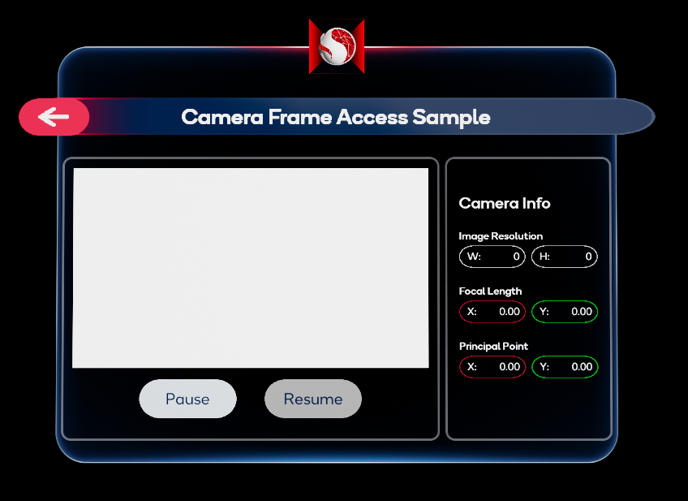
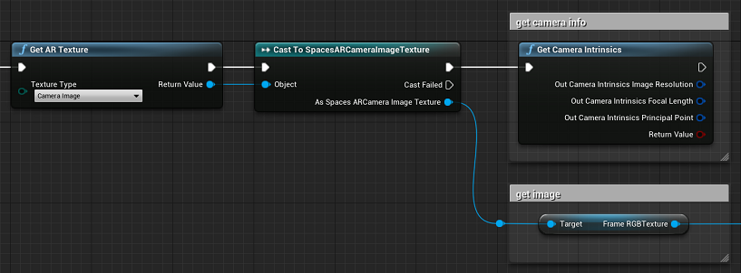
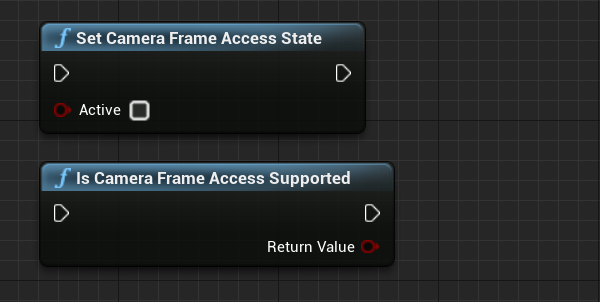

# 相机帧访问示例

> **警告**
>
> 相机帧访问功能为实验性功能，因为目前插件和 Snapdragon Spaces Services 方面的优化，会破坏向后兼容性。

**相机帧访问（Camera Frame Access）** 示例演示如何从支持的设备访问相关的相机信息，在本例中为相机图像和内参。目前此功能仅限于 RGB 相机。

## 示例工作原理

默认情况下，当示例运行时，UI 会显示设备捕获的 RGB 图像以及与之相关的内参值。用户可以使用相应按钮来暂停和恢复帧捕获。

如果设备未授予 **相机访问权限**，则图像、按钮和相机信息将被替换为警告消息，提示用户启用权限。

### 相机帧访问 AR 管理器

该示例使用位于 `Content > SnapdragonSpaces > Samples > CameraFrameAccess > Placeable` 下的 `BP_CameraFrameAccessARManager` 蓝图资产来启动和停止相机捕获，使用 `Toggle AR Capture`（`切换 AR 捕获`) 时，如果要开始捕获，必须设置为 **开启（ON）**，如果要停止捕获，则设置为 **关闭（OFF）**。此功能支持任何 `SpacesSessionConfig` 资产的配置。

### 相机捕获库（Camera capture library）

虚幻引擎的 AR 接口提供了从相机获取信息的功能。

- `获取 AR 纹理` （`Get AR Texture`）
    - 返回相机帧。Snapdragon Spaces 插件将信息扩展为 **2D 纹理**，以 `Spaces AR Camera Image Texture`（`Spaces AR 相机图像纹理`）类进行转换以获取 **帧 RGB 纹理**。此外，**相机图像** 必须设置为该节点的纹理类型。
- `获取相机内参` （`Get Camera Intrinsics`）
    - 返回相机的 **图像分辨率（Image Resolution）**、**焦距（Focal Length）** 和 **主点（Principal Point）**。

Snapdragon Spaces 插件提供额外功能，来帮助管理从蓝图捕获的相机：

- `Set Camera Frame Access State` （`设置相机帧获取状态`）
    - 要暂停使用相机捕获，请将 `Active`（`激活`）设置为 **FALSE**。要恢复相机捕获，请将 `Active` 设置为 **TRUE**。
- `Is Camera Frame Access Supported` （`是否支持相机帧获取`）
    - 如果可以使用捕获，则返回 **TRUE**，否则返回 **FALSE**。如果应用程序使用捕获，建议在 **Tick** 时检查结果。

> **提示**
>
> 示例的行为已在 `WBP_CameraFrameAccess` 蓝图资产中实现（位于 `Content > SnapdragonSpaces > Samples > CameraFrameAccess > UI`）。

