# 手部跟踪示例

**手部跟踪（Hand Tracking）** 示例演示了如何启用手部跟踪功能并使用 SpacesHandTracking extension（Spaces 手部跟踪扩展）返回的数据。使用此功能，必须先打开 `项目设置 > Snapdragon Spaces 插件` （`Project Settings > Snapdragon Spaces plugin`），找到 OpenXR 插件设置并启用该功能。

> **警告**
>
> 确保禁用 **OpenXRHandTracking（OpenXR 手部跟踪）** 插件，以便标准手部跟踪不会覆盖 Spaces 手部跟踪。
> 
> 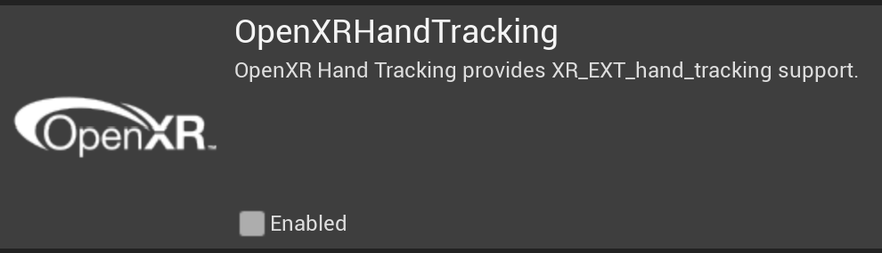

## 示例的工作原理

打开示例后，用户将双手放入头戴式显示器相机的视野范围内时，手部跟踪就开始了。默认情况下，用户将看到代表每只手的网格，如果手部网格化被停用，则会在每个手部关节上放置球体。您还可以在场景镜像（scene mirror）中看到自己和双手的反射展现。此外，您还可以看到您用每只手做出的手势。

### 手部跟踪管理器

示例使用 `BP_HandTrackingManager` 蓝图资产（位于 `Content> SnapdragonSpaces> Samples> HandTracking> Placeable`），该资产集中了检索和渲染手部的操作。

要启用和禁用手部跟踪，有两个选项：

**从一开始就使用手部跟踪**：在 `Project Settings > Plugins > Snapdragon Spaces > General > Hand Tracking` 下找到此选项。启用此选项后，手部跟踪将从一开始就被激活。当使用手部跟踪作为输入模式时，建议选择此选项，就像在示例项目中使用的一样。

**按需启用或禁用手部跟踪**：必须使用 `Toggle Spaces Feature` 方法，并将 **手部跟踪** 作为扩展功能进行启用。使用此方法时，可以在项目的某些部分按需启动和停止手部跟踪，以便在不需要手部跟踪时使用。

启用 **手部网格（Head Meshing）** 本身是通过将 `Toggle AR Capture with Hand Meshing` 作为捕获类型来启用的

> **警告**
>
> 在 Snapdragon Spaces 版本 0.12.1 之前的版本中，手部网格可以通过使用**Set Hand Mesh Status** 来启用。通过使用 **Get Hand Mesh Status** 检查状态来管理网格的可见性。

两只手被表示为 **Motion Controllers（动作控制器）**，可以通过 **Get Motion Controller Data（获取动作控制器数据）** 以获取数据。在获取动作控制器数据后，我们需要检查手是否可见，然后渲染手的虚拟形象，这可以使用手部网格或手部关节来完成。

如果禁用了手部网格，则使用 **Draw Joints（绘制关节）** 来显示手部关节。我们从 **Motion Controller Data（动作控制器数据）** 中提取相应的信息，特别是每个手部关节的位置和旋转，以正确放置每个关节的展现（representation）。对于这一展现，我们使用 Actor `BP_HandJointRepresentation`）。

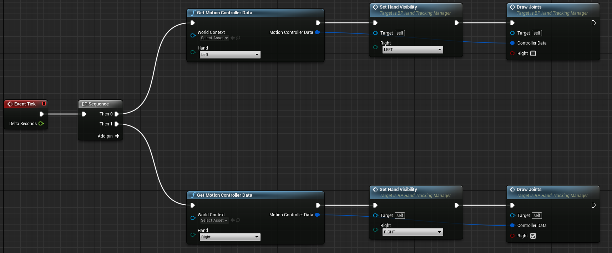

渲染手部网格时，使用 `HGestures Blueprint Library` 中的 **Render Hand Mesh** 来进行，在库中我们决定要渲染哪只手和使用哪种材质，还必须传递表示手部网格的 Actor 的引用（reference）以及表示原始顶点数（vertices）的另一个变量。

### 手部网格查看器

`BP_HandMeshingViewer`位于 `Content > SnapdragonSpaces > Samples > HandTracking > Placeable`，将来自 [AR 可跟踪通知（Trackable Notify）节点](https://docs.unrealengine.com/4.27/en-US/API/Runtime/AugmentedReality/UARTrackableNotifyComponent/) 的事件绑定到对 AR 可跟踪几何图形（AR trackable geometry）更改的反应，这里是为了渲染手部网格。调用 **On Add/Update Tracked Geometry** 事件，并且由于不同类型的对象可以注册为`UARTrackedGeometry`，因此要验证跟踪的几何形状是否为手部网格，对象分类必须为 `EARObjectClassification::HandMesh`。如果手部跟踪是输入模式，则会在 `BP_HandTrackingControllerComponent` 中生成 `BP_HandMeshingViewer` 并用作手部网格渲染器。

可以使用 `GetObjectClassification` 函数来检查分类。

> **警告**
>
> 在 Snapdragon Spaces 版本 0.13.0 之前的版本中，`BP_HandMeshingViewer` 不存在，该功能在 `BP_HandTrackingManager` 中实现。在 Snapdragon Spaces 版本 0.12.1 之前的版本中，为了呈现手部网格，使用了`HGestures Blueprint Library` 中的 **Render Hand Mesh** 方法，该方法在 Snapdragon Spaces 版本 0.13.0 中已弃用。
>
>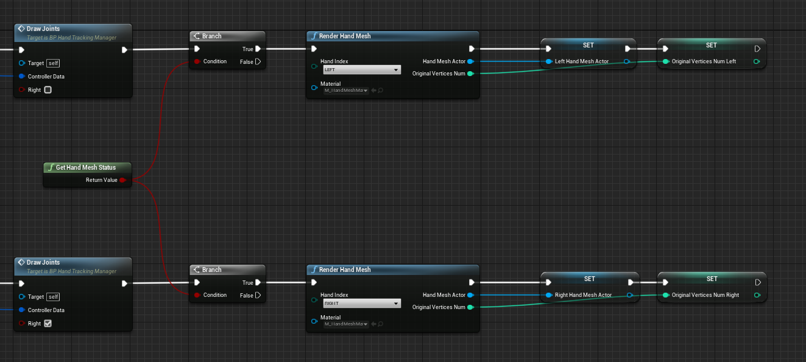
>
>> **警告**
>>
>> 在蓝图节点中，虚幻引擎将参数按引用显示为返回值。务必传递表示手部网格的 Actor 的引用和表示顶点数的变量，否则将会创建多个 Actor 。

请注意，手部网格被注册为 `UARTrackedGeometry`，要验证它是否为手部网格，其对象分类应为 `EARObjectClassification::HandMesh`。请使用 `GetObjectClassification` 函数以进行确认。

 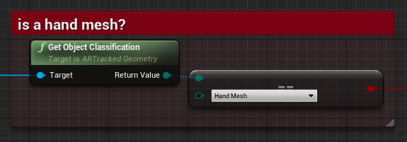

> **提示**
>
> 手部网格材质已适应新的手部网格系统，这会导致平面着色效果

> **提示**
>
> 为了进行简单的手动渲染测试，可以使用 **XRVisualization（XR 可视化）** 插件，并将 **Motion Controller（动作控制器）的** 数据连接到 **Render Motion Controller（渲染动作控制器）** 函数。

### 镜像和镜像 Pawn

`BP_Mirror` 和 `BP_Mirror_Pawn` Actor（位于 `Content > SnapdragonSpaces > Samples > HandTracking > Placeable`），用于创建代表玩家及其手部的位置和旋转的虚拟映射（reflection）。**Mirror Pawn** Actor 负责定位玩家身体和手关节的镜像展现（representation），如下图所示。

 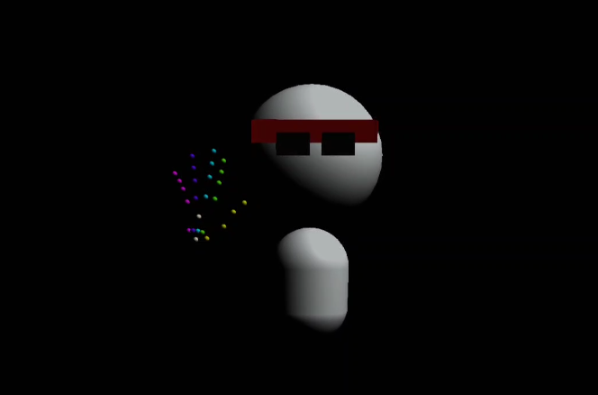

### 手势状态

示例的用户界面 `WBP_HandTrackingSample`（位于 `Content > SnapdragonSpaces > Samples > HandTracking > UI`）用于在手部网格化和手部关节可视化之间进行切换，并将每帧中识别到的手势进行可视化。对于这一功能，我们使用 `HGestures Blueprint Library` 类的函数来进行实现。在每个帧中，我们检查两只手是否被跟踪，并检查正在使用的手势，对于这一功能，我们使用  `Get XRHand Gesture Data` （`获取 XR 手部手势数据` ）和 `Is Hand Tracked`（`手部是否被跟踪`）这两种方法来进行实现。

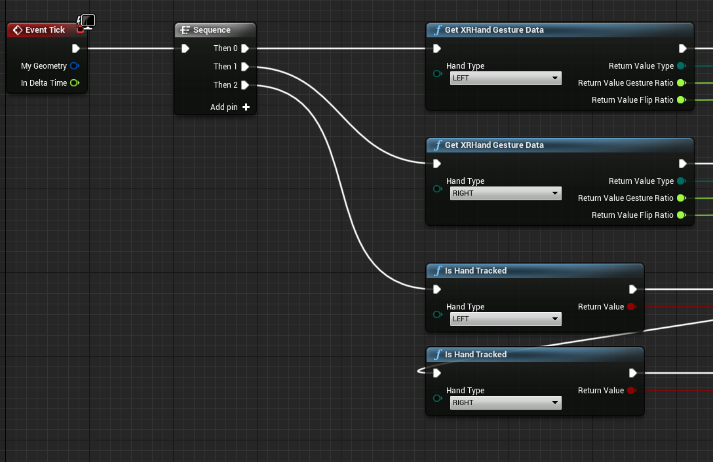

手势数据由以下参数组成：

- **类型（Type）：** 枚举值，指示检测到的手势类型。它可以是以下手势之一：`{ UNKNOWN，OPEN_HAND，GRAB，PINCH，POINT，VICTORY，METAL，ERROR }`。
- **手势率（GestureRatio）：** 介于 0 和 1 之间的浮点值，表示手势的应用程度。
- **翻转率（FlipRatio）：** 介于 -1 和 1 之间的浮点值，指示手势是从背面（-1），前面（1）还是中间检测到的。

以下是显示左手检测到的手势类型和比率的 UI 结果样式。

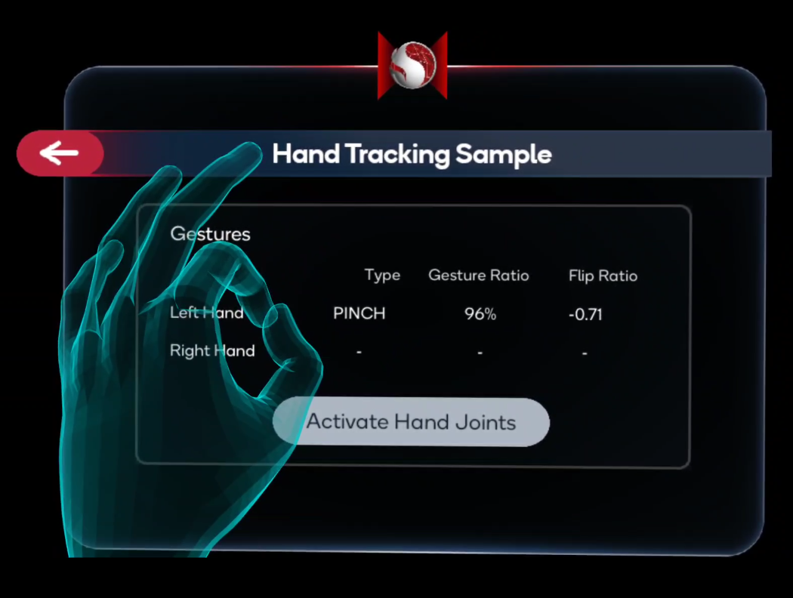

# 手部跟踪交互

本节介绍使用手部跟踪交互所需的不同 actor 和组件。

> **警告**
> 
> 手部跟踪交互不仅用于手部跟踪示例，而且用于项目中的所有示例。这使用户能够与可与手部跟踪交互的 widget actors 和 3D actors 进行交互。

## Spaces 手势输入管理器 Actor

要使用手部跟踪交互，此 actor 是最重要的 actor。为了将手部跟踪作为输入模式使用，需要将此 actor 添加到级别中。建议使用 `Spawn Actor of class` 节点来生成此 actor。

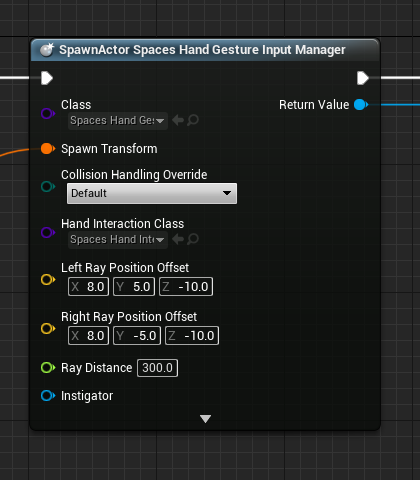

> **警告**
>
> 在将此 actor 添加或生成到级别中之前，需要检查手部跟踪是否可用。
> 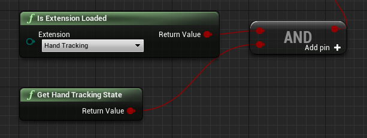

Hand tracking

Spaces 手势输入管理器 Actor 负责实时监听手势，并使用委托根据这些手势报告操作。它生成并拥有两个 `ASpacesHandInteraction` 类的 actor，每个手都需要进行交互。以下各节列出了可访问和使用的不同变量和函数。

### 变量
- `FOnSpacesHandPinch OnSpacesHandPinchLeft` 和 `FOnSpacesHandPinch OnSpacesHandPinchRight`: 委托，用于通知捏手势的状态。
- `FOnSpacesHandOpen OnSpacesHandOpenLeft` 和 `FOnSpacesHandOpen OnSpacesHandOpenRight`: 委托，用于通知张开手势的状态。
- `FOnSpacesHandGrab OnSpacesHandGrabLeft` 和 `FOnSpacesHandGrab OnSpacesHandGrabRight`: 委托，用于通知抓取手势的状态。
- `FOnSpacesHandInteractionStatusUpdated OnSpacesHandInteractionStatusUpdated`: 当手部交互状态更新时触发的委托，用布尔值表示状态。
- `TSubclassOf < ASpacesHandInteraction > HandInteractionClass`: Spaces 手部交互 actor 的子类，用于生成手部交互 actors。
- `FVector LeftRayPositionOffset` 和 `FVector RightRayPositionOffset`: 两个手部交互 actors 的射线偏移量。
- `float RayDistance`: 两个手部交互 actors 的射线距离。

### 函数
- `ASpacesHandInteraction* GetHandLeftInteraction() const` 和 `ASpacesHandInteraction* GetHandRightInteraction() const`: 用于获取左右手手部交互的 actors.
- `void SetHandInteractionState(bool active)`: 用于启用或禁用手部交互，此函数将影响所有手部交互系统。默认情况下，手部交互处于禁用状态。
- `void GetHandInteractionState() const`: 返回手部交互系统的状态。

> **提示**
>
> 请查看 `BP_HandTrackingControllerComponent`（位于 `Content > SnapdragonSpaces > Common > Core > Components`），以查看 Spaces 手势输入管理器 actor 的使用方式。

## Spaces 手部交互 actor
`Spaces 手部交互（Spaces Hand Interaction）` actor 负责与级别中存在的不同手部交互元素进行交互，例如 3D widget 和其他类型的 actor。 Spaces 手部交互 actor 仅限于远端手部交互，对场景元素执行射线投射。 Spaces 手部交互 actor 将以在用户指定的手中开始的射线表示。只有在场景中进行射线投射到任何手部交互 actor 时，Spaces 手部交互 actor 才会可见。要与 UI 进行交互，请使用捏手势。

> **提示**
>
> 在 Snapdragon Spaces 的虚幻引擎示例项目中，`Hand Gesture Input Manager` 生成了两个 `Spaces Hand Interaction` 类型的 actor，分别代表左右手，这意味着将 `Hand Gesture Input Manager` 添加到场景中就足够了。

>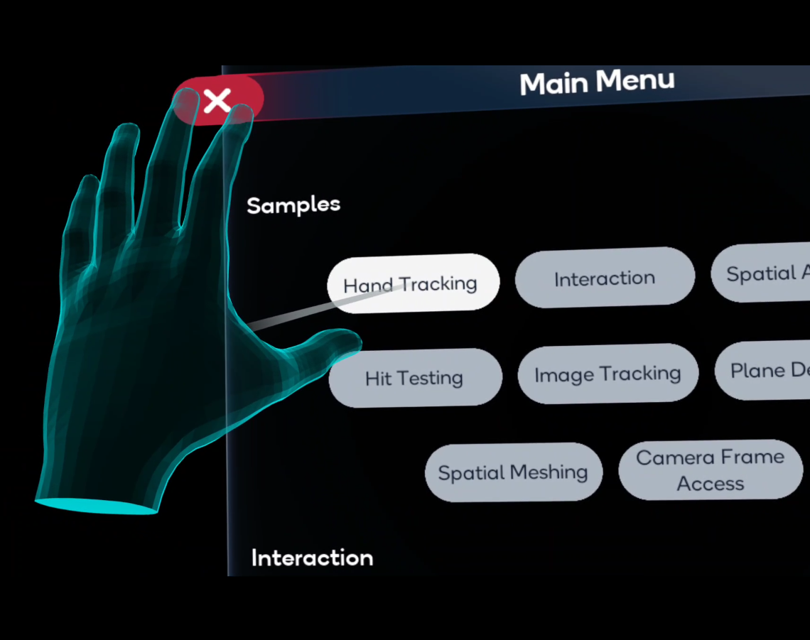

Spaces 手部交互 actor 可以使用以下变量和函数进行自定义

### 变量
- `EControllerHand HandType`: 指示手的左右。
- `FVector RayPositionOffset`: 调节射线的位置，它是从肩膀位置的偏移量。
- `float RayDistance`: 以厘米为单位的射线投射距离。
- `float SnappingDistanceTolerance`: 停止在 `Spaces Snapping Volume` 组件上对齐效果的距离容差。
- `UStaticMesh* RayMesh`: 表示手部射线的网格，在 [Unreal Engine Spline Mesh 组件](https://docs.unrealengine.com/4.27/en-US/API/Runtime/Engine/Components/USplineMeshComponent/) 中使用此网格.
- `UMaterialInterface* RayMaterial`: 射线网格的材质，必须与 [Unreal Engine Spline Mesh 组件](https://docs.unrealengine.com/4.27/en-US/API/Runtime/Engine/Components/USplineMeshComponent/) 兼容.
  
> **提示**
>
> 对于 [Unreal Engine Spline Mesh 组件](https://docs.unrealengine.com/4.27/en-US/API/Runtime/Engine/Components/USplineMeshComponent/)，建议在中间使用具有足够几何形状的网格，以便在有足够的样条点创建弯曲效果的情况下弯曲。
要使材质与 Spline Mesh 组件兼容，请确保在材质中将选项 `Used with Spline Meshes` 设置为 `true`（可在 `Details > Usage` 中找到该选项）。

### 函数

- `FTransform GetRayEndTransform() const`: 返回射线投射射线的端点变换，而不是射线表示的端点。
- `void SetHandInteractionState(bool active)`: 启用或禁用此 actor 的交互状态。

> **提示**
>
> 请查看 `SpacesHandInteractionBP`（位于 `SnapdragonSpaces Content > HandTracking > Actors`）以了解如何自定义此 actor。还可以基于此类创建蓝图 actor，并将其用作手部交互 actor。

## Spaces 手部可交互组件

将 Spaces 手部可交互（Hand Interactable）组件添加到一个 actor 中，将使该 actor 与手部交互兼容。可以使用捏和抓取手势来使用此组件抓取 actor。目前仅支持平移。可以调节以下两个变量来自定义其行为。

### Variables

- `float LerpFactor`: 调节 actor 的平移速度。
- `bool bApplyTranslation`: 指示是否平移 actor。

此组件的使用示例在 `Content > SnapdragonSpaces > Samples > HandTracking > Placeable > InteractableObjects` 下的`BP_PandaInteractable` 蓝图 actor 中。

>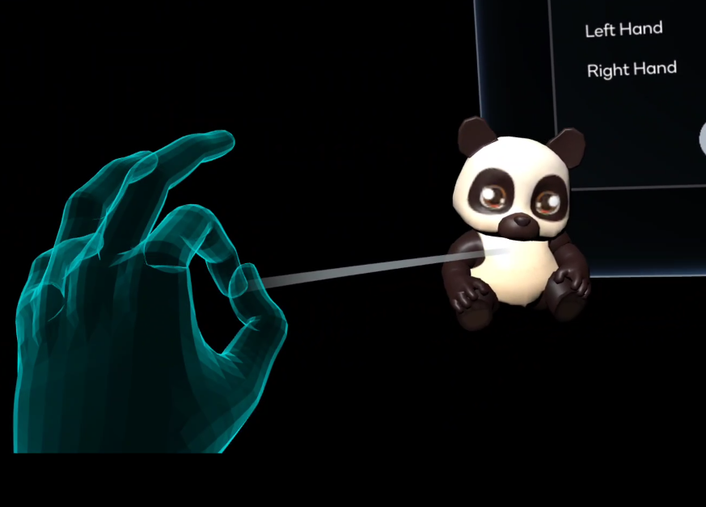

## Spaces Snapping Volume 组件

Spaces Snapping Volume 组件继承自 [Unreal Engine Box 组件](https://docs.unrealengine.com/4.27/en-US/API/Runtime/Engine/Components/UBoxComponent/)。它主要用于将 `SpacesHandInteraction`  actor 的射线端点捕捉到另一个 actor 中的所需位置。这对于可交互的 3D（例如按钮、复选框或滑块）特别有用，但也可用于任何类型的 3D actor。该组件可以添加到一个 actor 中，并且必须手动放置在所需的位置，例如在 3D widget 中的按钮上方，如下图所示。

>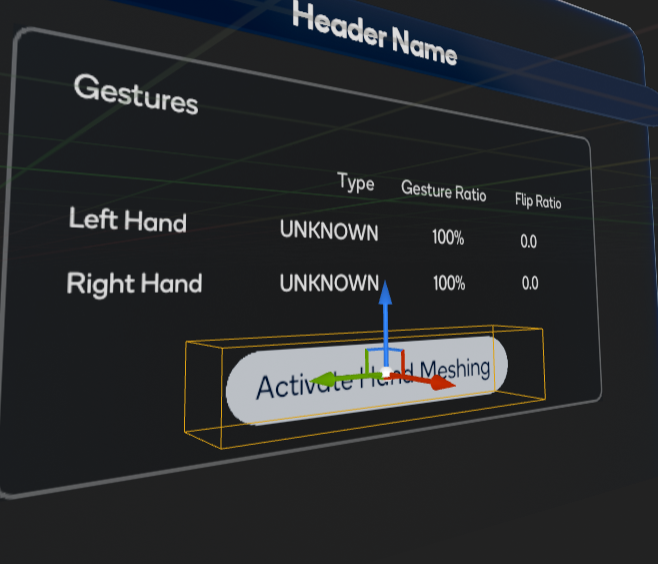

> **警告**
>
> 与 UI 一起使用该组件时，请遵循以下重要准则：
> 
> 盒子的位置和大小必须与 3D widget 组件的形状匹配，否则可能会出现意外效果，例如射线投射到 3D widget actor 外时出现闪烁。
> 组件的 X 轴方向必须与 3D widget 组件的方向匹配。这是为了正确交互 widget 组件所必需的。

要自定义此组件的行为，可以使用不同的变量和函数。

### 变量

- `bool bSnap`: 确定组件是否用于捕捉。可能使用此组件而不启用捕捉的一种情况是 3D widget 滑块。在这种情况下，无法将射线端点捕捉到滑块手柄，但需要手部射线的可视化以提高用户体验。
- `bool bIsUI`: 在组件用于 3D widget UI 组件交互时，必须启用此选项。可以在任何其他 actor 中禁用它。
- `bool bIsDisabled`: 确定组件碰撞是否从开始时处于活动状态。默认情况下为 false。

### 函数

- `void SetCollisionDisabledState(bool disabled)`: 用于设置`bIsDisabled` 的值。
- `void UpdateCollisionStatus(bool active)`: 更新组件的碰撞状态。如果 `bIsDisabled` 为 `true`，则无论函数的输入值如何，碰撞都将被禁用。