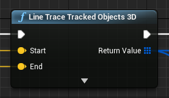

# 命中测试示例

**命中测试（Hit Testing）** 示例演示如何对现实世界中的点和平面进行命中测试。有关命中测试以及虚幻引擎的 `Line Trace Tracked Objects 3D` 节点（如下图所示）的基本信息，请参阅 [虚幻引擎官方文档：Line Trace Tracked Objects 3D](https://docs.unrealengine.com/4.26/en-US/BlueprintAPI/ARAugmentedReality/TraceResult/LineTraceTrackedObjects3D/)。

使用此功能，必须先打开 `Project Setting > Snapdragon Spaces plugin` ，找到 OpenXR 插件设置并启用该功能。此外，还必须启用 `平面检测（Plane Detection）` 功能才能使命中测试正常工作。为获得更精确的命中结果，在 `AR 会话配置（AR Session Config）` 中启用平面检测功能的 **使用凸包检测**（**Use Convex Hull Detection**）选项。

## 示例的工作原理

示例打开后，一个 gizmo 会一直在用户面前，并在每个 tick 上发射一次射线检测。如果返回一个成功的命中结果，则该 gizmo 会移动至命中姿态并显示为青色、黄色和洋红色。如果没有检测到命中，则该 gizmo 会向头部姿势前方移动一米并变成红色。

### 命中管理器

该示例使用 `BP_HitManager` 蓝图资产（位于 `Content > SnapdragonSpaces > Samples > HitTesting > Placeable` 下）来处理示例映射中的命中测试。有几个选项可供开发者对命中测试的射线进行自定义：

- **射线检测距离（Distance Ray Cast）**：射线的长度。
- **Gizmo 标签（GizmoTag）**： `BP_Pawn` 中用于放置的场景组件中定义的标签名称，即示例中的白色 gizmo。
- **Gizmo 距离（Distance Gizmo）**：从头部姿势到放置对象的距离。
