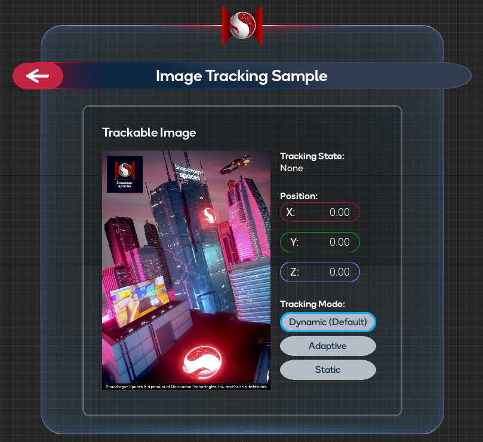
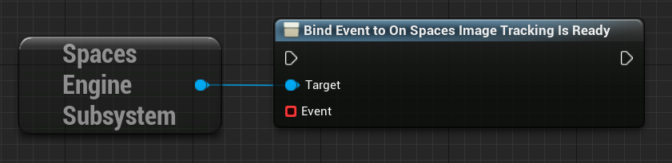
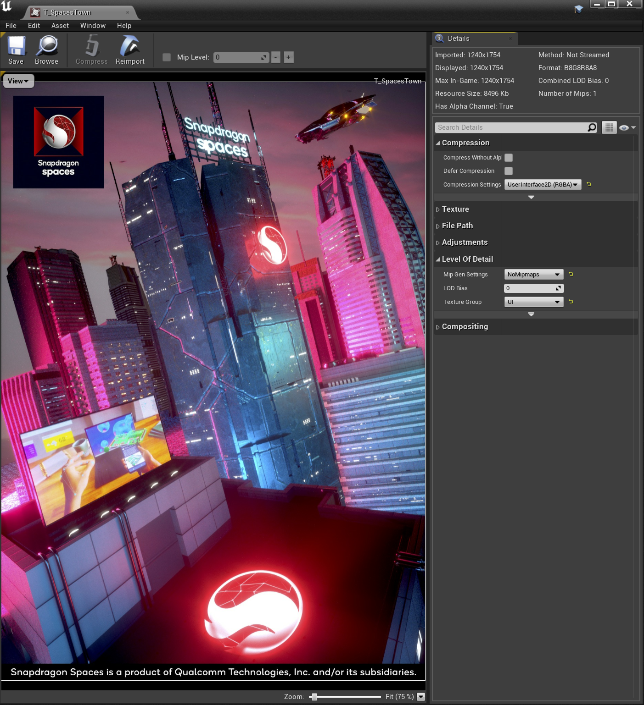
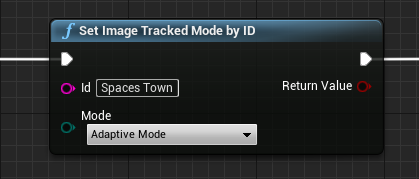
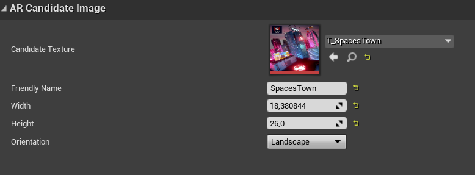

# 图像跟踪示例

**图像跟踪（Image Tracking）** 示例演示了如何检测并增强在现实世界中发现的图像目标。

有关自定义可跟踪对象更新以及虚幻引擎的 `AR Trackable Notify`（`AR 可跟踪通知`）组件的基本信息，请参阅 [虚幻引擎官方文档：UARTrackableNotifyComponent](https://docs.unrealengine.com/4.26/en-US/API/Runtime/AugmentedReality/UARTrackableNotifyComponent/)。

为使用此功能，必须先打开 `Project Settings > Snapdragon Spaces plugin`，找到 OpenXR 插件设置并启用该功能。

## 示例的工作原理

默认情况下，示例正在运行并识别图像时，它会在物理目标上生成一个增强效果。目前该示例仅识别一个图像，并在地图（map）中包含的 UI 面板上显示其世界位置。

### 图像 AR 管理器

`BP_ImageTrackingManager` 蓝图资产（位于 `Content > SnapdragonSpaces > Samples > ImageTracking > Placeable` 下）通过事件系统处理创建和销毁 `BP_AugmentedImage` 对象。它将来自 [**AR Trackable Notify 组件**](https://docs.unrealengine.com/4.27/en-US/API/Runtime/AugmentedReality/UARTrackableNotifyComponent/) 的事件进行绑定，以对 AR 可跟踪图像的更改做出反应。当系统正在检测图像时，它会调用 **On Add/Update/Remove Tracked Image（开启增加/更新/移除跟踪图像）** 事件。在示例蓝图中，如果要开始检测，则必须将 `Toggle AR Capture` 设置为 **ON**，如果要停止检测目标并销毁所有生成的 AR 图像，则设置为**OFF**。此外，该节点的捕获类型必须设置为 **Scene Understanding**。

### 图像 AR 会话配置

系统使用 `D_SpacesSessionConfig_ImageTracking` 资产（位于`Content > SnapdragonSpaces > Samples > ImageTracking > Core`）来检测图像。该资产是从 `SpacesSessionConfig` 类派生的数据资产。

会话配置文件提供了三个字段：一个字段用于定义图像大小，一个字段用于指定应跟踪的最大同时图像数量，一个字段用于引用候选要跟踪的图像的。

为了避免需要跟踪的图像数量过高以出现冻结问题，图像跟踪器的创建发生在异步线程中。因此，有时图像跟踪可能会延迟启动。请监听 `On Spaces Image Tracking Is Ready` 委托，以了解图像在何时可以进行跟踪。

#### AR 候选图像

虚幻引擎使用 [AR 候选图像（AR Candidate Image）](https://docs.unrealengine.com/4.27/en-US/BlueprintAPI/ARSettings/AddCandidateImage/) 这个专门的资源类型，来创建 XR 系统应跟踪的图像的引用。开发人员可以添加任意数量的 `AR 候选图像`，并将它们分配到 `AR Session Config（AR 会话配置）` 中指定的数组中。

要创建 `AR 候选图像` ，首先必须将要跟踪的图像作为纹理资源导入到项目的 *Content* 文件夹中。创建的纹理资源必须在压缩设置中设置为 **UserInterface2D (RGBA)** ，并建议关闭 mip maps。

> **提示**
>
> 您可以在 [测试部分的图像目标（Image Targets for Testing section）](./../../designux/ImageTargetsToTry.md) 中找到使用的参考图像。

下一步是创建 `AR 候选图像` 资源，**Candidate Texture（候选纹理）** 字段引用了创建的纹理资源。每个 `AR 候选图像` 都应该有一个唯一的标识符，可以在 **Friendly Name** 字段中设置。否则，在同一个 `AR Session Config（AR 会话配置）` 中使用的不同候选者中具有相同名称的任何内容，都将导致哈希码冲突（hash code collision）。

最后一步是通过 **宽度/高度** 字段用厘米来定义图像的物理大小。正确的测量数据对于正确的姿态估计和随后的增强放置非常重要。在考虑到图像的比例以及在 **方向** 字段中定义的方向后，此数据会自动填充。不幸的是，虚幻引擎目前的方向是反向的，因此开发者必须 **水平（Landscape）** 处理纵向图像，**垂直（Portrait）** 处理横向图像。

Snapdragon Spaces 插件提供了在 AR Candidate Image 资产父级为 `Spaces AR Candidate Image` 的情况下选择不同 **Tracking Mode（跟踪模式）** 的可能性。

- **Dynamic mode（动态模式）**：每帧更新跟踪图像的位置，并适用于移动和静态目标。如果找不到跟踪图像，则不报告位置或姿势。默认情况下使用。
- **Adaptive mode（自适应模式）**：如果静态图像略微移动，则定期更新其位置（大约每 5 帧更新一次）。这在静态图像的功耗和精度之间找到了平衡。
- **Static mode（静态模式）**：适用于已知为静态的图像跟踪。在检测到时，以此模式跟踪的图像的位置固定，并且永不更新。这会导致更少的功耗和更好的性能，但如果跟踪图像受到任何漂移的影响，则其位置不会更新。

可以使用 `Set Image Tracked Mode by ID` 节点在应用程序运行时更改跟踪模式，而无需停止或重新启动 AR 会话。

示例使用 `D_ARCandidateImage_SpaceTown` 蓝图资产（位于 `Content > SnapdragonSpaces > Samples > ImageTracking > Placeable` 下）。此外，（在 DIN A4 或 US 信纸上打印时）目标图像的高度为 26 厘米。

`BP_AugmentedImage` 蓝图资产（位于 `Content > SnapdragonSpaces > Samples > ImageTracking > Placeable` 下）在识别和跟踪时会在物理图像目标上呈现候选图像纹理。

