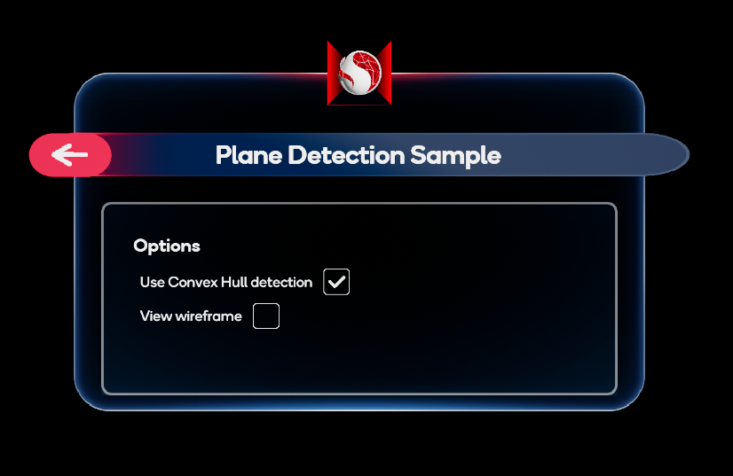
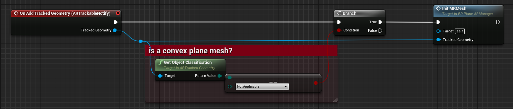

# 平面检测示例

平面检测（Plane Detection）示例演示了如何对现实世界中找到的跟踪平面进行可视化。有关自定义可跟踪对象更新以及虚幻引擎的 `AR Trackable Notify（AR 可跟踪通知）` 组件的基本信息，请参阅 [虚幻引擎官方文档：UARTrackableNotifyComponent](https://docs.unrealengine.com/4.26/en-US/API/Runtime/AugmentedReality/UARTrackableNotifyComponent/)。

使用此功能时，有两个选项会在形状和平面数量方面产生不同的结果，这两个选项为 `平面检测（Plane Detection）`或 `空间网格（Spatial Meshing）`。必须在 OpenXR 插件设置中启用其一，入口位于 `Project Settings > Snapdragon Spaces plugin`。如果两者都启用，则 `平面检测` 将具有优先用作平面检测源；如果未启用 `平面检测` ，则将使用 `空间网格` 作为平面检测源。

## 示例的工作原理

默认情况下，当打开示例时，它会为检测到的平面生成简单的形状。启用 **Use Convex Hull detection（使用凸包检测）** 选项时，示例将使用检测到的平面的凸包生成复杂的形状。

示例还可以显示这些几何图形的线框。

### 平面 AR 管理器

`BP_PlaneARManager` 蓝图文件（位于 `Content > SnapdragonSpaces > Samples > PlaneDetection > Placeable` 下）通过事件系统对于平面作为增强几何体的操作进行集中创建和销毁。该蓝图将来自 [AR Trackable Notify 组件](https://docs.unrealengine.com/4.27/en-US/API/Runtime/AugmentedReality/UARTrackableNotifyComponent/) 的事件绑定到 AR 可跟踪平面更改的反应（react to AR trackable planes changes）。以下事件与平面检测相关：

- **在添加/更新/移除跟踪平面时**: 当系统使用简单平面几何时调用这些事件。
- **在添加/更新/移除跟踪几何时**: 当系统使用复杂平面几何时调用这些事件。
    - 与其他情况不同，不同类型的对象可以注册为 `UARTrackedGeometry`。为了验证它是一个凸面，它的对象分类应该是 `EARObjectClassification::NotApplicable`。请使用 `GetObjectClassification` 函数进行确认。

> **警告**
>
> 记得更改 **切换 AR 捕获（ToggleARCapture）** 的状态以重新启动检测，在 Actor 行为开始时选择 ON，并在完成后选择 OFF 停止检测，以销毁所有生成的 AR 几何体。

### 复杂 AR 会话配置

当用户启用凸包选项时，系统开始使用 `D_ConvexHullSessionConfig` 资产（位于 `Content > SnapdragonSpaces > Samples > PlaneDetection > Core` 下）来检测复杂平面。

与平面检测相关的选项包括：

- **Use Convex Hull Detection（使用凸包检测）**
- **Horizontal Plane Detection（水平平面检测）**
- **Vertical Plane Detection（垂直平面检测）**
