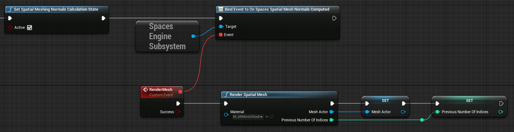

# 空间网格示例

> **警告**
>
> 空间网格化功能为实验性功能，因为目前软件包和 Snapdragon Spaces Services 方面的优化，会破坏向后兼容性。此外，网格法线尚未实现。

**空间网格示例（Spatial Meshing Sample）** 演示了如何生成和可视化近似真实世界环境的空间网格。有关自定义可跟踪对象更新以及虚幻引擎 `AR Trackable Notify（AR 可跟踪通知）` 组件的基本信息，请参阅 [虚幻引擎官方文档：UARTrackableNotifyComponent](https://docs.unrealengine.com/4.26/en-US/API/Runtime/AugmentedReality/UARTrackableNotifyComponent/)。

要使用此功能，必须在 `Project Setting > Snapdragon Spaces plugin` 下进行启用。

## 示例的工作原理

默认情况下，打开示例时，它会生成几何图形，其多边形适应于检测到的环境。当启用 **Compute Normals（计算法线）** 选项时，示例会根据网格的法线生成几何图形，以避免出现视觉伪影。虽然会增加计算成本，但这是为了可视化目的而推荐的选项。

### 空间网格 AR 管理器

`BP_SpatialMeshingARManager` 蓝图文件（位于 `Content > SnapdragonSpaces > Samples > Spatial Meshing > Placeable` ）通过事件系统集中了创建和销毁增强几何体作为空间网格的操作。该蓝图将来自 [AR 可跟踪通知组件](https://docs.unrealengine.com/4.27/en-US/API/Runtime/AugmentedReality/UARTrackableNotifyComponent/) 的事件进行绑定，以对 AR 可跟踪几何变化做出反应。当系统不使用法线来检测几何体时，它会调用 **开启添加/更新/删除跟踪的几何图形（On Add/Update/Remove Tracked Geometry）** 事件。与其他情况不同，不同类型的对象可以注册为 `UARTrackedGeometry`，要验证它是否是空间网格，其对象分类必须为 `EARObjectClassification::Unknown`。可以使用 `GetObjectClassification` 函数来检查分类。

`Render Spatial Mesh（渲染空间网格）` 节点返回一个 Actor，包含检测到的带有应用法线的几何体。由于虚幻引擎将参数通过引用作为返回值显示，因此必须传递表示几何体的 Actor 的引用和表示先前索引编号的变量的引用。否则，将会多次创建多个 Actor。可以监听 `On Spatial Mesh Normals Computed（关于计算的空间网格法线）` 委托，以避免不必要的调用，并仅在法线计算完成后（使用 `Render Spatial Mesh（渲染空间网格)` 节点）更新网格的可视化。以获得更佳性能，该计算在异步线程中完成，并在完成时调用委托。

`Set Spatial Meshing Normals Calculation State（设置空间网格法线计算状态）` 节点用于启用或禁用 CPU 计算法线。此外，如果启用了法线计算， `Get Spatial Meshing Normals Calculation State（获取空间网格法线计算状态`）返回 true。

在示例蓝图中，要开始检测，请将 `Toggle AR Capture（切换 AR 捕捉）` 设置为 **ON**。要停止检测，请将其设置为 **OFF**。停止检测将销毁所有生成的 AR 几何体。此外，必须将 **Scene Understanding** 设置为该节点的捕获类型。

### 空间网格化 AR 会话配置

系统开始使用 `D_SpacesSessionConfig_SpatialMeshing` 资产（位于 `Content > SnapdragonSpaces > Samples > Spatial Meshing > Core` 下）来检测几何形状。此资产是从 `SpacesSessionConfig` 类派生的数据资产。

会话配置文件提供了一个字段来添加 **边界（bounds）**。每个边界表示一个体积，完全在该体积外部的几何形状不会进行显示。边界数量必须大于零才能跟踪网格。
